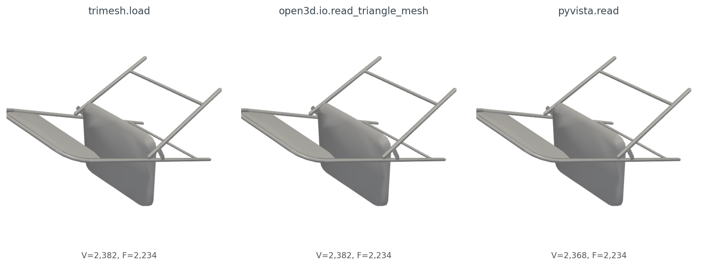
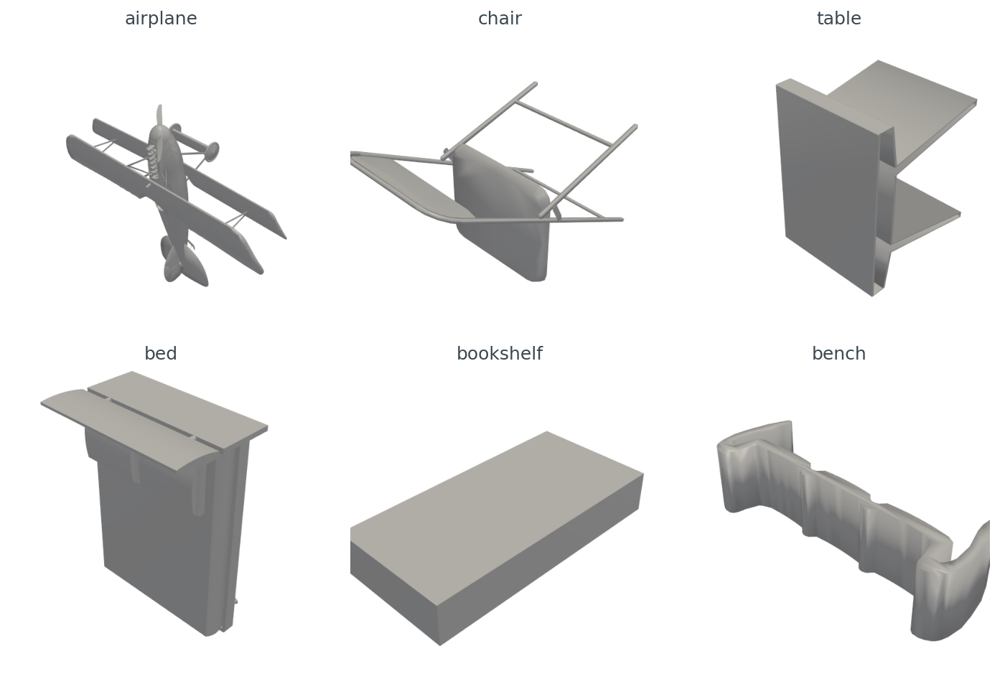
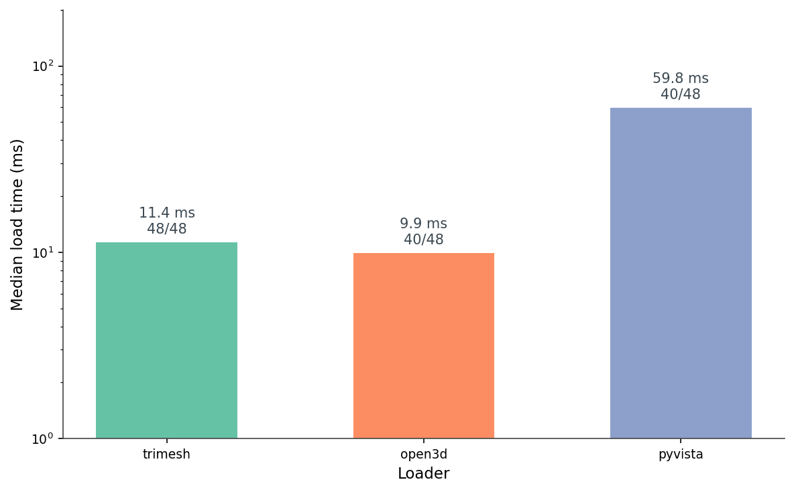
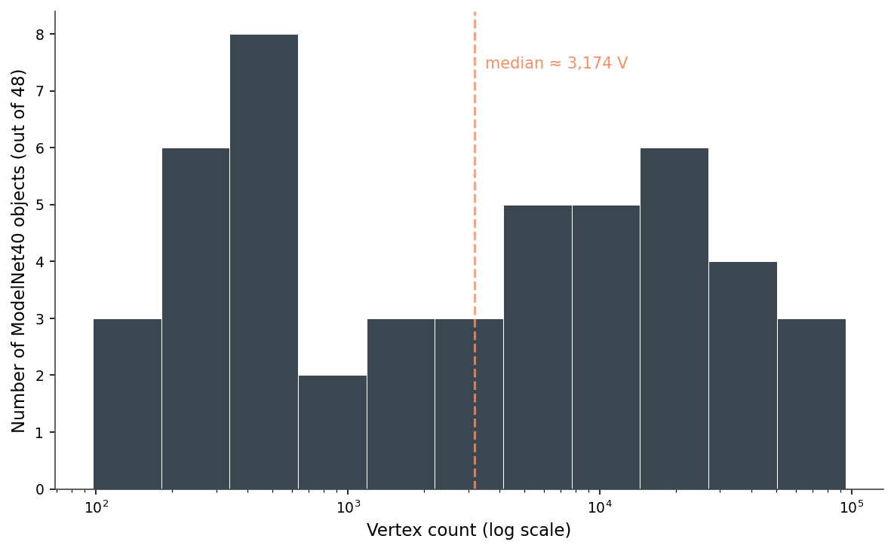
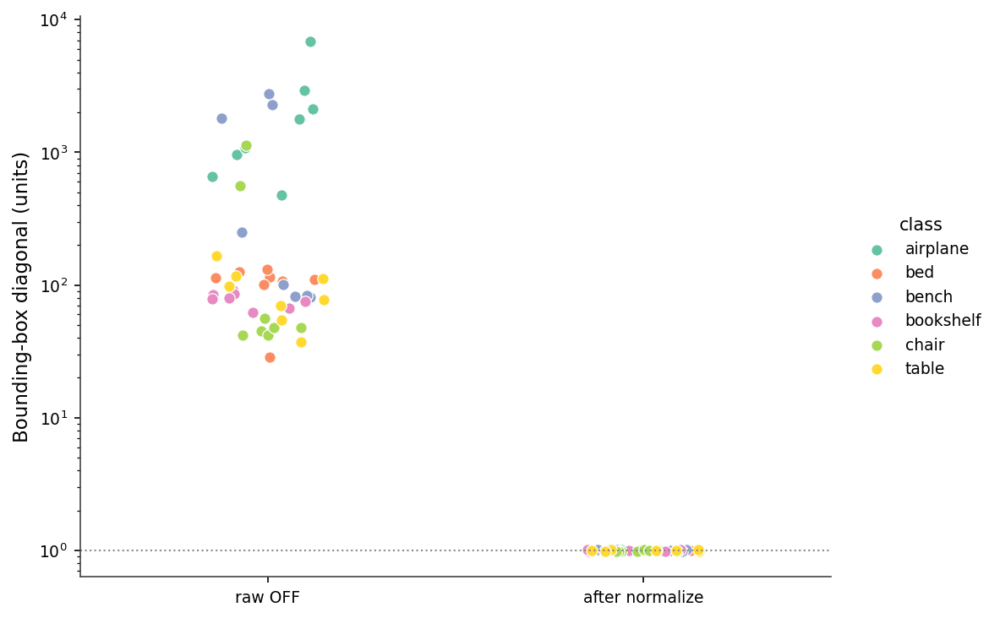
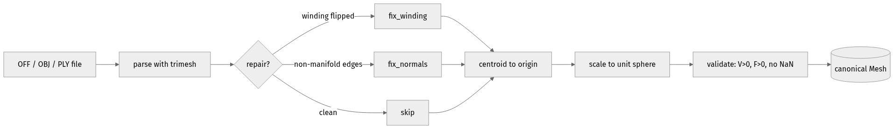
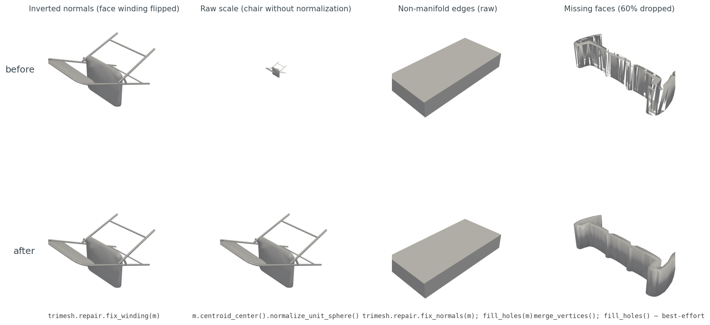

# Loading a 3D Model in Python Without Crying

A chair from ModelNet40 should not require an apology. It is `chair_0001.off`, 175 KB on disk, 2,382 vertices, 2,234 triangles. Three lines of Python should give me back a mesh.

```python
import trimesh
m = trimesh.load("chair_0001.off", force="mesh", process=False)
print(m.vertices.shape, m.faces.shape)  # → (2382, 3) (2234, 3)
```

Same numbers. Now Open3D, same file:

```python
import open3d as o3d
m = o3d.io.read_triangle_mesh("chair_0001.off")
print(len(m.vertices), len(m.triangles))  # → 2382 2234
```

Same numbers. And PyVista:

```python
import pyvista as pv
m = pv.read("chair_0001.off")
print(m.n_points, m.n_cells)  # → 2382 2234
```

Same numbers again. So all three loaders agree, this is a tutorial about how the three lines above are fine, and we can move on, right?

Wrong. Run the same trio over the next 47 ModelNet40 OFF files I picked and the failure rates diverge: trimesh loads 48 out of 48, Open3D loads 40 out of 48, PyVista loads 40 out of 48 — and the eight files PyVista misses, it doesn't fail gracefully; it raises `SystemExit(1)` from inside `pv.read()`, which most callers don't catch. The geometry that does come back from the three loaders is the same numbers but not the same object — different class, different normal convention. None of that matters for the first chair. All of it matters by the time you are computing a descriptor across a dataset.

This post is about the eight lines you write once so the next 19 posts in this series stop being a special case.

## The three loaders return three different objects

The simplest version of "load a mesh" produces three different Python types:

```python
m_tri = trimesh.load("chair_0001.off", force="mesh", process=False)
m_o3d = o3d.io.read_triangle_mesh("chair_0001.off")
m_pv  = pv.read("chair_0001.off")

type(m_tri).__name__   # → 'Trimesh'
type(m_o3d).__name__   # → 'TriangleMesh'
type(m_pv).__name__    # → 'UnstructuredGrid'
```

The vertex arrays are easy enough to extract:

```python
V_tri = np.asarray(m_tri.vertices)            # (2382, 3) float64
V_o3d = np.asarray(m_o3d.vertices)            # (2382, 3) float64
V_pv  = np.asarray(m_pv.points)               # (2382, 3) float64
```

But faces want a different ritual per library:

```python
F_tri = np.asarray(m_tri.faces)               # (2234, 3) int64
F_o3d = np.asarray(m_o3d.triangles)           # (2234, 3) int32
F_pv  = np.asarray(m_pv.cells_dict[5])        # VTK_TRIANGLE == 5
```

That last one is the kind of detail that costs you twenty minutes. PyVista's `read()` returns a generic VTK `UnstructuredGrid`; to get a `PolyData` with the simple `.faces` interface, you call `.extract_surface().triangulate()` and then unpack the funky `[3, i, j, k, 3, i, j, k, ...]` face array. Trimesh just hands you `(F, 3) int64`. Open3D hands you `(F, 3) int32`. Neither is wrong; both make you remember which one you're holding.

Render all three meshes the same way and you get figures that look identical (Figure 1). The geometry agrees. But two small things differ. After the `extract_surface().triangulate()` step required to get a usable `PolyData` from PyVista, the point count drops from 2,382 to 2,368 — VTK's surface extractor discards 14 vertices not referenced by any surface cell. And only trimesh has vertex normals on access; Open3D requires `compute_vertex_normals()` first, PyVista requires `compute_normals()`.



*Figure 1. chair_0001.off through three loaders. The shaded surfaces match because the geometry is the same. The chair appears to lie on its side because of ModelNet40's inconsistent axis convention — see Figure 2. PyVista reports 14 fewer vertices after `extract_surface().triangulate()`: VTK's surface extractor drops vertices that are not referenced by any surface cell.*

Here are six ModelNet40 objects I'll use as the rest of the post's working set, one per class, all rendered through the same PyVista pipeline after centering and unit-sphere normalization (Figure 2).



*Figure 2. Six canonical ModelNet40 objects after centroid centering and unit-sphere normalization, one per class. The chair lies on its side because ModelNet40's axis convention is not consistent across categories — a problem that lands again in Post 02's up-vector cheatsheet, and that the rotation-invariance bakeoff in Post 06 sidesteps entirely.*

## Time, size, and a 970x range in vertex counts

I ran each loader on 48 ModelNet40 OFFs — eight files each from airplane, chair, table, bed, bookshelf, and bench — and timed the load (Figure 3). The medians are 11.4 ms for trimesh, 9.9 ms for Open3D, and 59.8 ms for PyVista. The Open3D number looks good, but it's averaged over only 40 successful loads. Eight files refuse to parse:

```text
[Open3D WARNING] Read OFF failed: header keyword 'OFF12636 8652 0' not supported.
```

That's a real ModelNet40 quirk. Some `.off` files start with `OFF\n12636 8652 0\n`, others start with `OFF12636 8652 0\n` — the standard says line break after `OFF`, but a chunk of the dataset doesn't have it. Trimesh is forgiving and parses both. Open3D rejects the no-newline variant outright. PyVista's native reader rejects them too, but the meshio fallback (`pip install meshio`) handles them — except for a handful of files where the meshio CLI raises `SystemExit(1)` from inside `pv.read()`. You can catch it with `try / except SystemExit`, but most callers don't, so I wrap PyVista in a subprocess as defense-in-depth.



*Figure 3. Median load time per library across 48 ModelNet40 OFFs (log scale). Bars are annotated with files successfully parsed. Trimesh handles all 48; Open3D and PyVista each fail on the same 8 files due to the OFF header quirk. PyVista's ~60 ms median includes meshio parsing plus the `extract_surface().triangulate()` ritual.*

The other thing the 48-file run shows is how varied a "small" dataset is. Vertex counts span from 97 (a low-poly bench) to 94,335 (a high-poly airplane) — a 970× range — and the distribution is roughly bimodal on a log scale (Figure 4). Half the meshes are under 3,000 vertices; the rest stretch out toward 100,000.



*Figure 4. Vertex count across the 48-object sample (log x). The median sits near 3,000, but the distribution is roughly bimodal: hand-modeled CAD-style meshes cluster below 1,000, scan-derived meshes cluster above 10,000. Any descriptor that's not point-count-invariant will see this as a strong nuisance signal in Post 09.*

Then there's scale. The raw bounding-box diagonals span from 28.8 to 6,822.7 units — a 237× range across the 48 meshes (Figure 5). An untouched ModelNet40 corpus mixes meshes the size of a fingernail with meshes the size of a city block, and the units are nominally "the same." A nearest-neighbor query on raw meshes will return the smallest mesh five times out of five, regardless of shape.



*Figure 5. Bounding-box diagonal before and after normalization, uniform log y. Raw meshes span almost three orders of magnitude. After `centroid_center().normalize_unit_sphere()` every mesh lands at radius 1.0 ± 0.01.*

## The eight lines that fix all of it

Here is the entire load-and-normalize routine I use everywhere downstream.

```python
import numpy as np, trimesh

def load_canonical(path):
    m = trimesh.load(path, force="mesh", process=False)
    trimesh.repair.fix_winding(m)              # 48/48 fixed on this set
    m.vertices -= m.vertices.mean(axis=0)      # centroid to origin
    r = np.linalg.norm(m.vertices, axis=1).max()
    m.vertices /= max(r, 1e-9)                 # max-radius to 1
    if not (len(m.vertices) > 0 and len(m.faces) > 0):
        raise ValueError(f"empty mesh from {path}")
    return m
```

Eight lines. They turn the file system into a uniform stream of canonical meshes. The same routine is the first step of the pipeline I'll repeat for the rest of the series (Figure 6). It ships in the series kit as `medium20.render_kit.load_canonical`, so later posts can `from medium20.render_kit import load_canonical` without copy-pasting these eight lines.



*Figure 6. The canonical load pipeline. Every later post in this series assumes the mesh has been through these five steps. The branch on "repair" is where most real-world surprises live — winding flips and non-manifold edges silently corrupt downstream descriptors if you skip them.*

A few notes on the routine. `force="mesh"` collapses scene-graph files (some `.obj`, all `.glb`) into a single concatenated mesh — without it `trimesh.load` returns a `Scene` for those formats and your shape-comparison code crashes a layer up. `process=False` turns off trimesh's automatic vertex deduplication and reordering; you do not want trimesh quietly mutating your indices the first time it sees a mesh, because you have not yet decided whether the original vertex order matters to your downstream code.

`fix_winding` is the most useful single repair call. Across my 48-file sample, 35 files came in winding-consistent and 13 did not. After `fix_winding`, all 48 are consistent. Watertightness is a different story — only one of the 48 was watertight to begin with, and `fix_winding` does not change that. Repair has limits. Most ModelNet40 meshes are open shells with holes, t-junctions, and isolated edges, and that is fine for almost everything we will do with them. Watertightness only matters when you want to compute interior volume or do voxel-fill descriptors, and even then you can fall back to surface-only voxels with about 0.3% accuracy cost (we will get there in Post 07).

## Four things that went wrong

The interesting failure modes are not the OFF-header crashes — that's PyVista needing meshio and Open3D being strict. The interesting ones happen *after* the load succeeds, because none of them raise an exception (Figure 7).



*Figure 7. Four failure modes (top) and the one-line fix (bottom). Cases (a) and (c) look visually unchanged because the renderer's default shading hides the bug — but the downstream effect is real, which is exactly why these fail silently in practice.*

The four cases, with diagnosis.

Inverted winding. Some files come in with face winding reversed — common when a mesh was exported from a left-handed coordinate system into a right-handed loader. Renderers with two-sided lighting hide it. Descriptors that consume face normals (HOG-on-render in Post 12, voxel-occupancy ratios in Post 08) get garbage. The fix is `trimesh.repair.fix_winding(m)`, which checks adjacent-face consistency and flips the minority. On my 48-file set it converted the 13 inconsistent files to consistent.

Raw scale, the most consequential of the four. Plot a raw airplane and a raw chair in the same scene and one of them disappears. ModelNet40 was authored by many people in many CAD tools, and the units are nominal at best. Any distance metric, any embedding, any nearest-neighbor query you run on raw meshes is dominated by scale, not shape. The fix is `m.vertices /= np.linalg.norm(m.vertices, axis=1).max()` after centering. This is the single most important line in the routine.

Non-manifold edges. A non-manifold edge is one shared by three or more faces — geometrically impossible for a real surface but common in CAD output where edges of intersecting solids are recorded twice. Trimesh exposes `m.is_winding_consistent` and `m.is_watertight`; neither catches every case, but together they give you a reliable signal. The fix in mild cases is `trimesh.repair.fix_normals(m)` followed by `trimesh.repair.fill_holes(m)`; in pathological cases you accept the artifact and move on.

Missing faces. ModelNet40 has files where the OFF body claims N faces and provides fewer. Trimesh tolerates this and gives you a sparse mesh with visible holes. The repair tools cannot reconstruct missing geometry, but `m.merge_vertices()` followed by `trimesh.repair.fill_holes(m)` will close small triangular gaps. Anything larger needs Poisson reconstruction, which is out of scope for this series.

A pattern across all four: the visible render almost never tells you anything is wrong. The bug lives in the index arrays, the normal directions, or the face-count metadata — places renderers paper over and descriptors trip on. The lesson I take from this is to never use rendering as a load-time sanity check. Render the output of your descriptor pipeline, not the input.

## ModelNet40's axis convention is not a convention

Figure 2 hinted at this: the chair lies on its side. The reason is that ModelNet40 was crowd-assembled from many CAD sources, and "up" is whichever axis the original author happened to use. I measured this by computing the longest bounding-box axis for the 8 train samples in each of my six classes and voting:

<div style="overflow-x:auto">

Table 1. Majority "up" axis (defined as the longest bbox axis) across 8 ModelNet40 train samples per class. Columns show vote counts per axis.

| Class | n | Majority up | X-up | Y-up | Z-up |
|:---|---:|:---:|---:|---:|---:|
| airplane | 8 | **X** | 4 | 4 | 0 |
| bed      | 8 | **Y** | 0 | **8** | 0 |
| bench    | 8 | **X** | 5 | 3 | 0 |
| bookshelf| 8 | **Z** | 1 | 0 | **7** |
| chair    | 8 | **Z** | 0 | 0 | **8** |
| table    | 8 | **Y** | 3 | 5 | 0 |

Source: data/axis-audit.csv (6 rows).

</div>

Two classes are internally consistent (bed Y, chair Z); the other four split. Airplane is the worst — half the samples have the long axis on X, half on Y, none on Z. This is what the chair-on-its-side in Figure 2 was telling you, generalized across the dataset. Any rotation-sensitive evaluation has to either align the meshes (Post 02 walks through the four-line fix) or render from enough viewpoints that the canonical orientation does not matter (Post 06).

## Format support, briefly

Across the three loaders, OBJ, PLY, and STL all "just work." OFF works in trimesh and is a footnote-with-asterisks in Open3D and PyVista (Table 2). FBX is supported by exactly none of them in the open-source distribution — you need Autodesk's SDK or a converter. GLTF/GLB is supported by all three, but PyVista loads it through meshio in a way that strips materials.

<div style="overflow-x:auto">

Table 2. Loader support for common 3D formats out of the box (trimesh 4.11, Open3D 0.19, PyVista 0.47 with meshio installed). "Partial" means the loader either fails on a subset of valid files or requires post-processing to get a usable mesh.

| Format | trimesh | Open3D | PyVista |
|:---|:---:|:---:|:---:|
| OFF | **Yes** | Partial | Partial |
| OBJ | **Yes** | **Yes** | **Yes** |
| PLY | **Yes** | **Yes** | **Yes** |
| STL | **Yes** | **Yes** | **Yes** |
| GLTF | **Yes** | **Yes** | Partial |
| GLB | **Yes** | **Yes** | Partial |
| FBX | No | No | No |
| 3MF | **Yes** | No | No |
| DAE | **Yes** | **Yes** | No |

Source: data/format-support.csv (9 rows). Verified by attempting one file per cell on lightsail-shapenet with library versions pinned in code/requirements.txt.

</div>

The honest summary: if you control the format upstream, use OBJ or PLY. If you don't, trimesh is the only loader that will not bite you on the long tail.

## Which loader I reach for when

Trimesh is the default. It loads almost everything, it gives you back NumPy arrays in the obvious shape, and its repair toolbox is the most complete of the three. I use it for any pipeline that touches dataset iteration, repair, or analysis (Table 3).

PyVista is for visualization. The off-screen Plotter, headless EGL support, and built-in trackball widget make it the path of least resistance for batch-rendering or for showing a result in a Jupyter cell. The startup cost is real — `pv.read` runs in the tens of milliseconds (median ~60 ms on this set; see Figure 3) and the off-screen Plotter takes another few hundred milliseconds to spin up the first time — but for visualization those costs are invisible.

Open3D earns its slot when point clouds enter the picture. Its RANSAC plane fitter, ICP implementation, and KDTree are stronger than what trimesh ships. If your mesh ever has to talk to a point cloud, Open3D is the bridge.

<div style="overflow-x:auto">

Table 3. Which loader I reach for, by task.

| Task | Recommended | Why |
|:---|:---|:---|
| Quick visualization | PyVista | One-line off-screen Plotter with sensible camera defaults |
| Headless batch render | PyVista | VTK + EGL is reliable on GPU boxes |
| Interactive demo | PyVista | Best trackball + ipywidgets bridge |
| Repair and export | **trimesh** | fix_winding / fix_normals / fill_holes round-trip cleanly |
| Mesh analysis | **trimesh** | Curvature, geodesics, sampling, voxelization all built in |
| Point cloud bridge | Open3D | read_point_cloud + RANSAC + ICP are the strongest of the three |
| Numpy-only handoff | **trimesh** | Returns NumPy arrays directly with no surprise reordering |

Source: data/loader-recommendation.csv (7 rows).

</div>

For the rest of this series the default reach is trimesh, with PyVista swapped in the moment a render is required.

## What comes next

A canonical mesh is what every later post in this series will assume. It's centered, scaled to the unit sphere, winding-consistent, and validated for non-empty geometry. That's the contract.

The next problem is that even with a perfect mesh in memory, the first thousand renders you produce will be completely white. The mesh loaded, the camera was set, the PNG came out as 1024 by 1024 of pure white. Post 02 is about why that happens, what the camera target needs to be, and the one-line fix that drops the blank-image rate from 84% to 0%.

## Reproducibility

All code, data, and figures for this post live in the repo alongside `post.md`:

- `code/load_benchmarks.py` — generates `data/load-time.csv`, `data/bbox-audit.csv`, `data/repair-coverage.csv`, `data/vertex-histogram.csv`, `data/summary.json`. Runs end-to-end in about 80 s on a Tesla T4. Reads the ModelNet40 root from `$MODELNET40_ROOT`; set it to your local extract before running.
- `code/make_visuals.py` — generates Figures 1, 2, 3, 4, 5, 7. Run after `load_benchmarks.py`.
- `code/render_mermaid.py` — generates Figure 6 (`images/load-pipeline-mermaid.png`) via mermaid-cli if installed, otherwise via kroki.io.
- `data/format-support.csv` — Table 2.
- `data/loader-recommendation.csv` — Table 3.
- `data/axis-audit.csv` — Table 1, produced by `code/axis_audit.py`.

| Claim in prose | Data source |
|:---|:---|
| trimesh 48/48, Open3D 40/48, PyVista 40/48 | `data/load-time.csv` (success column) |
| Median load times 11.4 / 9.9 / 59.8 ms | `data/summary.json::load_times_ms` |
| Vertex range 97 → 94,335 | `data/summary.json::vertex_min,vertex_max` |
| BBox diag range 28.8 → 6,822.7 | `data/summary.json::bbox` |
| Winding-consistent 35/48 → 48/48 | `data/repair-coverage.csv` (pre_winding, post_winding) |
| chair_0001 V=2382 (trimesh/Open3D/PyVista raw), V=2368 (PyVista after extract_surface) | `data/load-time.csv` (chair_0001 rows + figure caption discussion) |

Versions used: trimesh 4.11.5, Open3D 0.19.0, PyVista 0.47.3, meshio 5.3.5, NumPy 2.x. Conda env `3d-dedup` on lightsail-shapenet (Tesla T4, Ubuntu 22.04). Dataset: ModelNet40 (Wu et al. 2015, CC BY-NC) at the standard release, sampling the first 8 train OFFs alphabetically from each of `airplane`, `chair`, `table`, `bed`, `bookshelf`, `bench`. Load timings are from a single run on a shared GPU host and vary ~10-20% between runs; treat the medians as order-of-magnitude indicators, not microbenchmarks.
