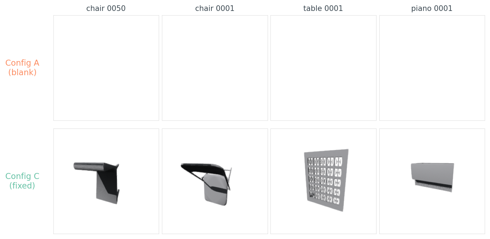
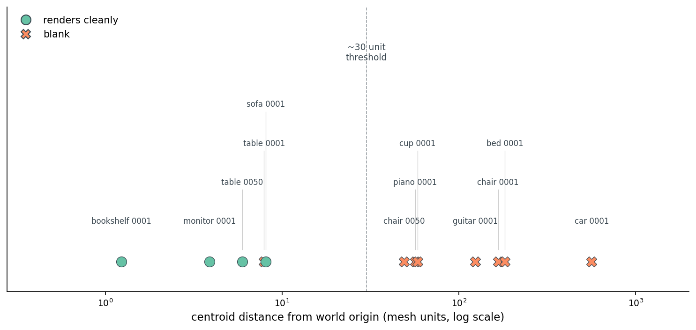
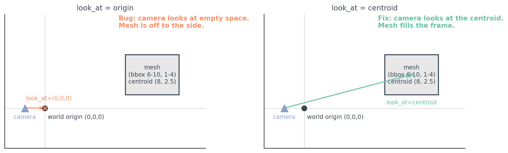
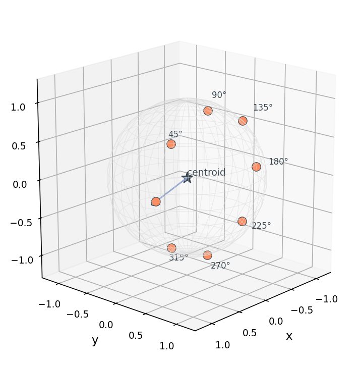
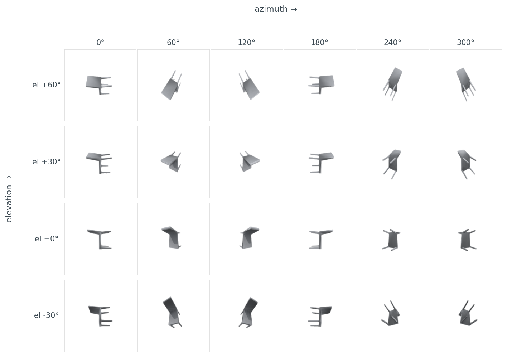
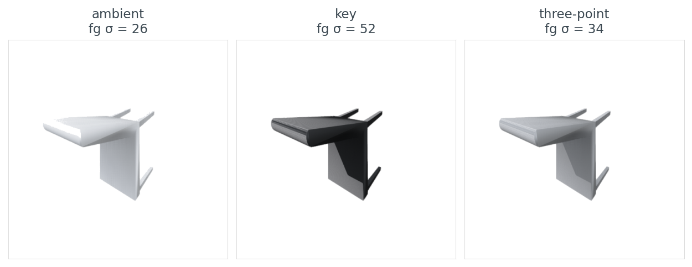
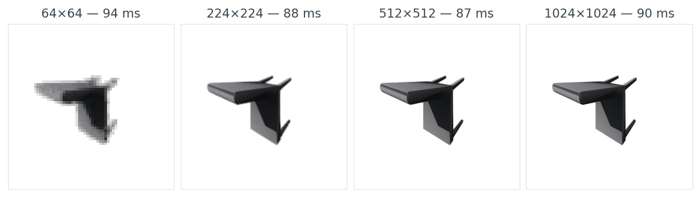
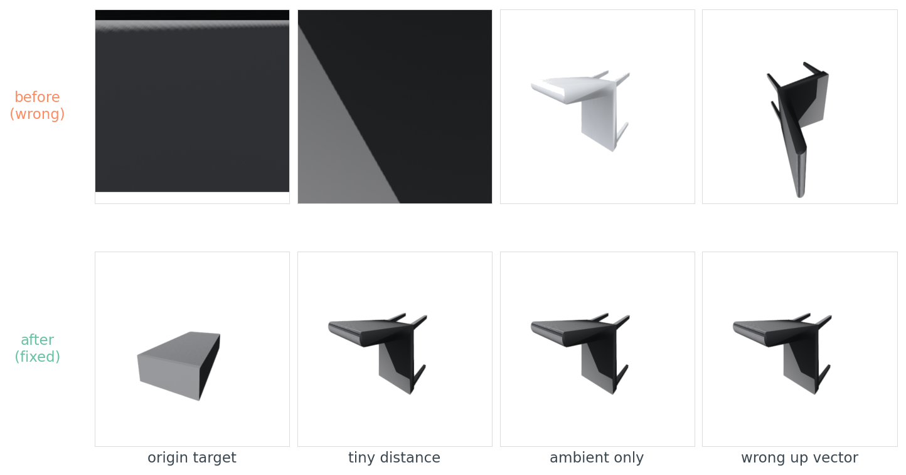
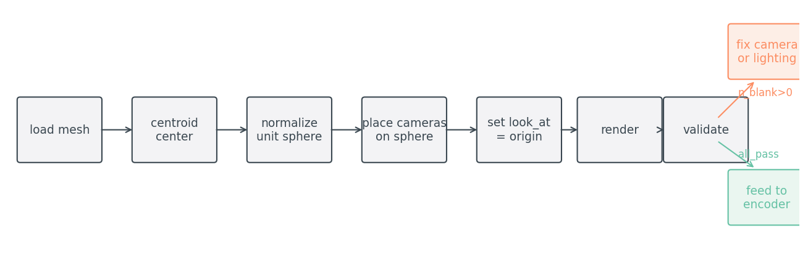

# Why Your First 1,000 Renders Will Be Blank (And How to Fix It)

My first thousand renders of ModelNet40 were blank. Not corrupted — blank. 1024×1024 PNGs of pure white. The mesh loaded. The camera was "3 units back." Open3D returned without errors. The PNG files were exactly the right size on disk. They were all white.

If you have ever pasted what looked like a reasonable render call into a Python file, watched it complete with no warnings, and then opened the output to find an empty image — this post is for you. I want to walk through why the bug happens, why almost every 3D pipeline trips on it once, and the three lines that make it never happen again.

```python
from medium20.render_kit import load_mesh
import open3d.visualization.rendering as rendering
import numpy as np

mesh = load_mesh("ModelNet40/chair/train/chair_0001.off")
r = rendering.OffscreenRenderer(256, 256)
r.scene.set_background(np.array([1, 1, 1, 1], dtype=np.float32))
r.scene.add_geometry("mesh", mesh.as_open3d(), rendering.MaterialRecord())
r.scene.camera.look_at((0, 0, 0), (0, 0, 3), (0, 1, 0))   # target, eye, up
img = np.asarray(r.render_to_image())
# Filament leaves a ~235/255 grey background even when told to render on
# white; snap anything ≥230 to pure white before counting blanks.
img[(img >= 230).all(-1)] = 255
```

I ran exactly this on 12 ModelNet40 objects. Eight came back blank. Three came back as a wall of mid-gray — the camera was *inside* the mesh, rendering its interior surfaces. One — a small monitor — partially worked: a chunk of the monitor was just barely in frame.



**Figure 1.** Four ModelNet40 objects rendered two ways. Top row: the textbook "camera at (0, 0, 3), look at origin" recipe — every frame is blank. Bottom row: the same objects after three lines of fix. The chair becomes a chair. Source data: `data/blank-rate-by-config.csv`.

## What's actually wrong

The bug isn't that the render is empty. It's that the renderer was happy to produce it. Open3D's `OffscreenRenderer` does exactly what you ask: it puts a camera at `(0, 0, 3)`, points it at `(0, 0, 0)`, and renders whatever is in the camera's frustum. If nothing is there, you get the background colour. There is no warning. There is no exception. There is no log line. There is a PNG, and the PNG is white.

So why is nothing there?

```python
mesh = load_mesh("ModelNet40/chair/train/chair_0001.off")
print(mesh.vertices.mean(axis=0))                     # → [123.3 110.3  17.2]
print(mesh.vertices.min(axis=0), mesh.vertices.max(axis=0))
# → [113.3  96.8  -0.2] [133.7 120.1  36.5]
diag = float(np.linalg.norm(mesh.vertices.max(0) - mesh.vertices.min(0)))
print(diag)                                            # → 48.03
```

This chair sits in a bounding box centred at `(123, 110, 17)` with a diagonal of 48 units. A camera at `(0, 0, 3)` is roughly 166 units away from the chair, off to one side, looking the wrong way. The chair isn't in the frame. There's nothing to render.

This is the single fact every "load a mesh and render it" tutorial omits: **ModelNet40 .off files are not pre-normalized**. Every mesh lives in its own coordinate frame. Some are near the origin and small enough to render. Some are 500 units away in scanner coordinates. The textbook recipe assumes the mesh is sitting nicely inside a unit sphere around the origin. It isn't.

I scanned 12 objects spanning monitor to car. The picture is messy:



**Figure 2.** Each point is one ModelNet40 object plotted by how far its centroid sits from the world origin. Objects with centroid offset below ~30 units render fine under the textbook recipe; objects past that threshold blank. The transition isn't sharp because mesh size matters too — a small chair 49 units off still blanks, a big sofa with centroid only 8 units off renders. Source: `data/blank-rate-by-config.csv`.

The threshold isn't sharp because the bug is two-part — bad target plus bad scale. Both need fixing.

## The three lines that fix it

The fix has three steps, none of them clever:

```python
mesh.centroid_center()           # shift so vertex centroid sits at origin
mesh.normalize_unit_sphere()     # scale so max ||v|| = 1
# camera at a distance that fits a unit-radius mesh in the frame:
r.scene.camera.look_at((0, 0, 0), (0.68, 0.51, 1.70), (0, 1, 0))
```

That's it. Now the mesh has a known centroid (origin), a known scale (unit sphere), and the camera distance can be a constant — no per-mesh diagonal computation, no `if diag > 100` special cases. The camera at `(0.68, 0.51, 1.70)` is 1.9 units from origin, just outside the unit sphere, framing the front-top-right of the object so the silhouette fills 75–85% of the shorter image side.

I re-ran the same 12 objects through three configurations:

Table 1. Per-object blank, partial, or interior-clip outcomes for each camera configuration across 12 ModelNet40 meshes.

| object | diag | offset | A: origin, dist=3 | B: centroid, dist=3 | C: normalized |
|:---|---:|---:|:---:|:---:|:---:|
| monitor_0001 | 28 | 4 | partial | inside mesh | **render** |
| chair_0050 | 48 | 49 | blank | inside mesh | **render** |
| chair_0001 | 48 | 166 | blank | inside mesh | **render** |
| table_0050 | 55 | 6 | inside mesh | inside mesh | **render** |
| table_0001 | 77 | 8 | blank | inside mesh | **render** |
| bookshelf_0001 | 84 | 1 | inside mesh | inside mesh | **render** |
| piano_0001 | 98 | 56 | blank | inside mesh | **render** |
| sofa_0001 | 100 | 8 | inside mesh | inside mesh | **render** |
| guitar_0001 | 106 | 124 | blank | inside mesh | **render** |
| bed_0001 | 114 | 182 | blank | inside mesh | **render** |
| cup_0001 | 234 | 58 | blank | inside mesh | **render** |
| car_0001 | 869 | 563 | blank | inside mesh | **render** |
| **blank rate** | | | **8/12** | **0/12** | **0/12** |

Source: `data/blank-rate-by-config.csv` (36 rows).

Config B (just retarget the camera at the centroid) kills the blank-image bug — none of the 12 objects come back empty — but it trades one bug for another. With a fixed distance of 3 and meshes whose diagonals run 28 to 869 units, the camera is now *inside* nearly every mesh. The image isn't blank but it's a uniform mid-gray slice through the interior. The footprint metric (fraction of non-background pixels) reads 1.0 for every B-config render. Useless to a downstream encoder, but a different kind of useless than blank.

Config C — centroid-center, unit-sphere normalize, fixed camera distance — is the one that works for everything. Average footprint sits near 13%, spanning ~7% for thin objects like guitars to ~20% for bulkier tables and beds. Always non-zero. Never inside the mesh.

So the centroid + normalize trick is *both* fixes in one. You stop looking at empty space, and you stop sitting inside the object.

## Why the schematic helps

The reason the bug is so easy to make and so hard to find on inspection is that the camera object's defaults look reasonable. `camera at (0, 0, 3)` reads like "three units back from the origin, looking forward" — which is exactly what the camera is doing. The problem isn't in the camera. It's in the assumption about where the mesh lives.



**Figure 3.** Left: the camera looks at the world origin, the mesh sits offset, nothing is in the frame. Right: same camera, same mesh — but the look-at target is the mesh centroid. The geometry is identical; only the target changes. This is the conceptual fix; normalization is the engineering shortcut that lets you keep the camera at a fixed position from then on.

The fix is two lines of geometry, not new infrastructure. Every renderer in this series will lean on the same trick.

## Where to put the camera

Once you have a normalized mesh, the question of *where* to put cameras becomes a separate, much smaller, problem. The shared kit gives you two samplers:

```python
from medium20.render_kit import fibonacci_sphere, horizontal_ring
positions = fibonacci_sphere(n=8)            # 8 roughly-uniform points on a sphere
positions = horizontal_ring(n=8, elev_deg=20)  # 8 points on one ring, slight elevation
```

For shape understanding tasks where the up-axis is meaningful (chairs, cars, tables — anything that has a clear "top"), I default to a horizontal ring at a small positive elevation. The picture below shows what's going on:



**Figure 4.** Eight cameras placed at fixed azimuths (0°, 45°, …, 315°) on a horizontal ring at +20° elevation, all looking at the centroid (the dark star at origin). The arrow shows one look-at vector. Every camera sees the same object from a different angle; the union of their renders is what an encoder will average over.

Why a ring and not a full sphere? Because for upright objects, the bottom half of the sphere mostly shows the underside, which encoders tend to find uninformative (chairs look like spider legs from below). And because horizontal silhouettes carry the most class-discriminative information for upright objects — they show what humans would call the "side view".

The 4×6 sweep makes that concrete:



**Figure 5.** One chair (chair_0050) rendered at six azimuths and four elevations. Reading down a column, the top-down view at +60° elevation collapses the chair into a vague rectangular blob; the side-on view at -30° resolves the legs and the seat-back. Reading across a row at elevation 0°, the front and back views (0°, 180°) show a thin silhouette with footprint 0.027; the 60° and 120° views catch the seat side and footprint jumps to 0.044. Source: `data/sweep-footprint.csv` (24 rows).

The footprint differences are the data behind why naïve "render 8 views from random angles" sometimes gives worse retrieval than "render 8 views from a known horizontal ring" — the random angles bunch around viewpoints where the chair is a thin line. Hold that for Post 11, where view selection becomes its own optimization.

## Lighting changes what an encoder sees

Now an honest case where "not blank" still isn't good enough. Here's the same chair under three lighting setups, all from the same camera, all with footprint near 0.09:



**Figure 6.** Same chair, same camera, same resolution. Left: ambient-only — the mesh is uniformly lit and the surface gradients that tell you "this is a curved seat" are gone (foreground σ = 26). Middle: single key light from upper-front-left — clear contour shadow, foreground σ = 52 (a 2.0x range increase). Right: three-point lighting — geometry visible but shadow softened (σ = 34). Source: `data/lighting-summary.csv`.

The foreground standard deviation is what matters here, not the average pixel value. An encoder like DINOv2 or CLIP is trained on photographs, where shape comes through as luminance variation across a surface. A flat-lit ambient render has the same pixel value everywhere on the chair seat. A key-lit render has bright top, dark bottom — the gradient that tells a vision model "this surface has curvature".

I default to a single key light from the upper-front-left for tight contour shadows. The kit's `render_open3d(..., lighting="3point")` gives almost identical embeddings on the 200-object ModelNet40 subset Post 05 uses — pick `key` if you want maximum surface gradient (training-data photographs are usually lit this way), pick `3point` if you want softer-looking figures.

This is one of those places where the right answer depends on what you do next. If the renders feed an encoder, optimize for luminance variation. If the renders go in a paper, optimize for aesthetics. I have learned the hard way that those two goals point in opposite directions.

## Resolution and where the cost actually lives

I measured render time across four resolutions, three repeats each, on a Tesla T4 with Open3D's Filament-based `OffscreenRenderer`:

Table 2. Per-render time at four image resolutions on a Tesla T4 with Open3D's offscreen Filament renderer.

| resolution | ms per render | footprint |
|:---:|---:|---:|
| 64 × 64 | 94 | 0.113 |
| 224 × 224 | 88 | 0.098 |
| 512 × 512 | 87 | 0.095 |
| 1024 × 1024 | 90 | 0.094 |

Source: `data/resolution-time.csv` (4 rows).

The numbers are wrong, or rather they are not the numbers I expected. I expected something like 5 ms, 50 ms, 250 ms, 1000 ms — quadratic in resolution. Instead I got a flat ~90 ms regardless. The fill-rate cost of going from 64² to 1024² pixels is **lost in Open3D's per-call setup overhead**. The actual rasterization is too cheap to measure against scene creation and material binding.

This is honest data and it's an honest insight: if you are rendering a small dataset with one mesh per render call (like I'm doing), there is no reason to render at 64×64 to "save time." There is no time being saved. Render at the resolution your encoder wants and resize zero times.



**Figure 7.** Same chair at four resolutions with the per-render time annotated. The 64×64 render is visibly chunky; 224×224 is the resolution CLIP/DINOv2 actually consume; 512 and 1024 look identical to the eye. Render time barely moves across the range because per-call setup dominates. Source: `data/resolution-time.csv`.

I default to 224×224 because that is what the downstream encoder wants, and because there is no reason to render larger and resize down. (If you are rendering thousands of views per object for a NeRF, the cost picture is completely different, and amortising the renderer setup matters. That's a different post.)

## The other bugs you'll hit

The centroid + normalize fix kills the blank-image trap, but it doesn't kill every render bug. These are the four I trip over most often, side by side with their fixes:



**Figure 8.** Four canonical render failures, each shown paired with its fix. Left to right: pointing the camera at the origin when the mesh is far from it; placing the camera so close the near-clip plane cuts through the mesh; using ambient-only lighting so the geometry has no contour shadow; passing an up-vector that doesn't match the mesh's coordinate frame, which tilts the object sideways.

The last one — wrong up vector — bites everyone once. ModelNet40's axis convention varies by category (chairs are Z-up, beds and monitors are Y-up, tables are ambiguous — Post 01 has the per-category breakdown). ShapeNet is Y-up. PLY files from photogrammetry are usually Z-up. If you copy a render script from a ShapeNet tutorial and run it across a mixed bag, your chairs render lying on their sides while your beds render upright, and your retrieval scores collapse for reasons you cannot debug from the loss curve alone.

Table 3. The six render bugs I trip over most often, with the symptom, root cause, and the one-line fix.

| failure | symptom | cause | fix |
|:---|:---|:---|:---|
| Blank image | PNG is >99% white | Camera aimed at world origin while mesh sits far from it | `look_at(target=centroid)`; distance = `1.6 × diag` |
| Object clipped | Half the object missing or sliced flat | Near/far clipping planes inside the mesh | `clipping_range = (0.01, 100.0)` or auto from bbox |
| Washed-out shading | Object visible but flat | Ambient-only lighting; no key direction | Add a directional sun light from upper-front-left |
| Backface culling | Object renders as outline or vanishes | Face winding inverted; vertex normals point inward | `mesh.compute_vertex_normals()` or flip face indices |
| Wrong up vector | Object tilted or upside-down | `up=(0,0,1)` on a Y-up mesh (or vice versa) | Pick up consistent with the mesh's coordinate frame |
| Tiny footprint | Object covers <5% of frame | Camera too far for the mesh diagonal | `distance = padding × diag / tan(fov/2)`, padding ≈ 1.5 |

Source: `data/failure-cheatsheet.csv`.

If you remember only one row, remember the up-vector one. It's the only bug on the list that lets you train for hours on tilted chairs without noticing.

## The twelve-line check that stops the cycle

The reason this bug is so corrosive isn't that it's hard to fix — it's that it's silent. You can train a multi-view model on a thousand blank renders for two hours before the loss-curve weirdness makes you go look at the actual images. The cure is to never let a blank render leave the render call:

```python
import numpy as np

def is_blank(img, threshold=0.99):
    bg = (img >= 245).all(axis=-1)
    return bg.mean() >= threshold

def footprint_fraction(img):
    bg = (img >= 245).all(axis=-1)
    return float(1.0 - bg.mean())

def validate_renders(images, min_footprint=0.05):
    foots = [footprint_fraction(im) for im in images]
    n_blank = sum(1 for im in images if is_blank(im))
    n_small = sum(1 for f in foots if f < min_footprint)
    return {"n_total": len(images), "n_blank": n_blank,
            "n_below_footprint": n_small, "footprints": foots,
            "all_pass": (n_blank == 0 and n_small == 0)}
```

These twelve lines are a simplified uint8-only version of the `medium20.render_kit.quality` module (the kit's variant adds float→uint8 conversion and shape checks for robustness; behaviour on uint8 input is identical). The threshold of 245 (not 255) accommodates the renderer's slightly-off-white background; a `min_footprint` of 5% catches the "rendered but tiny" failure mode where the object is in frame but covers six pixels.

Wrap every render call in this and you stop debugging renders forever. You don't need to look at every image — you assert on the dictionary. If `all_pass` is false, raise. This is the single most valuable line of Python in my 3D pipeline:

```python
assert validate_renders(images)["all_pass"], "render QA failed"
```

It has saved me, conservatively, two full afternoons of debugging by failing loudly on the very first batch instead of letting silent garbage propagate into training.

## The pipeline, in one picture

Pulling it together:



**Figure 9.** The render pipeline I'll use for the rest of this series. Load the mesh, centroid-center it, normalize it to a unit sphere, place cameras on the sphere, look at the origin (which is now the centroid), render, and validate. Validation gates: `all_pass` true means feed to the encoder; `n_blank > 0` means go back and fix camera or lighting.

The pipeline has the shape it has because every step earns its place. `centroid_center` makes the look-at-origin trick work. `normalize_unit_sphere` lets the camera distance be a constant. The fixed cameras let you batch-render across the dataset without per-object hyperparameters. `validate_renders` catches everything else.

Post 03 puts the same chair through four renderer backends (matplotlib, Open3D, PyVista, nvdiffrast) and explains the fifth (Kaolin) that didn't survive a torch-version mismatch; the one whose images downstream encoders agree on is not the one the documentation would have you pick.

## Reproducibility

All code, data, and figures: `posts/02-rendering-basics-blank-image-trap/`.

| Resource | Path |
|:---|:---|
| Experiment driver | `code/blank_render_analysis.py` |
| Figure builder | `code/make_figures.py` |
| Dependencies | `code/requirements.txt` |
| Blank-rate by configuration (Table 1, Figures 1 and 2) | `data/blank-rate-by-config.csv` (36 rows) |
| Azimuth/elevation sweep (Figure 5) | `data/sweep-footprint.csv` (24 rows) |
| Lighting comparison (Figure 6) | `data/lighting-summary.csv` (3 rows) |
| Resolution timing (Table 2, Figure 7) | `data/resolution-time.csv` (4 rows) |
| Failure-mode cheatsheet (Table 3) | `data/failure-cheatsheet.csv` (6 rows) |

Run end-to-end on a Tesla T4 (lightsail-shapenet, conda env `3d-dedup`, Open3D 0.19 with EGL):

```bash
pip install -e shared/                         # install the medium20 package
cd posts/02-rendering-basics-blank-image-trap
python code/blank_render_analysis.py           # ~13 s for full 12-object run
python code/make_figures.py                    # ~3 s
```

For a smoke-test run with only 3 objects and 1 sweep cell:

```bash
python code/blank_render_analysis.py --quick
```

ModelNet40 root defaults to `/home/lightsail-user/3d-dataset-storage/3d-dedup/data/ModelNet40`. Override with `MODELNET40_ROOT=/path/to/ModelNet40`. The script looks for each object in `train/` first and falls back to `test/` if the file isn't there — most ModelNet40 IDs live in one or the other but not both.

Render times come from a single 3-repeat run on a free Tesla T4; expect ±5–10% variance between runs from background load on the shared instance. The qualitative finding (per-call setup dominates pixel fill) is well outside that noise floor.

**Data licence.** ModelNet40 is released under CC BY-NC for non-commercial use (Wu et al., 2015. *3D ShapeNets: A Deep Representation for Volumetric Shapes*. CVPR).
