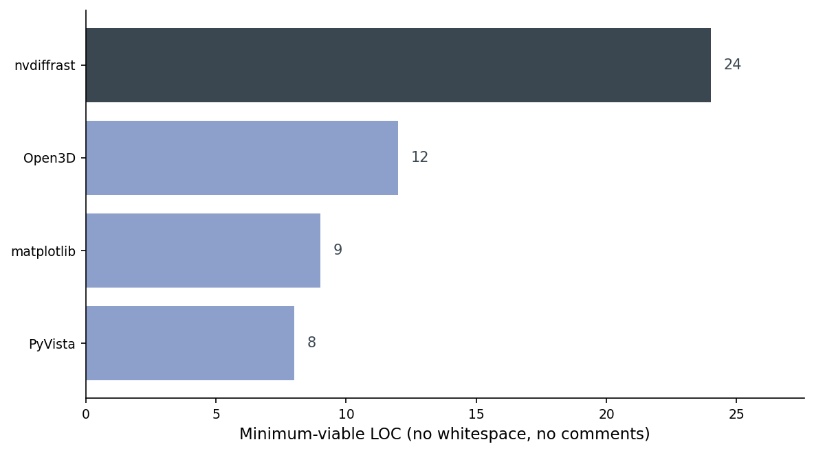
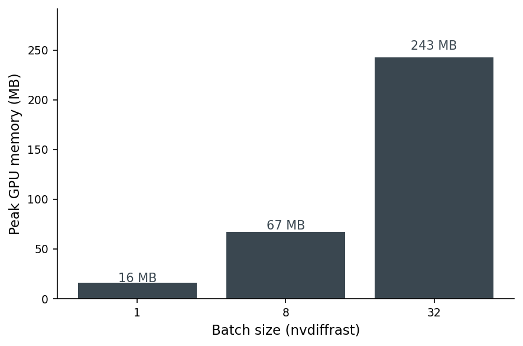
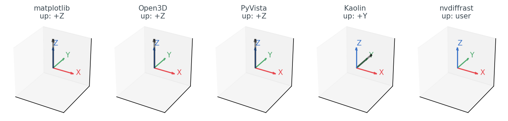
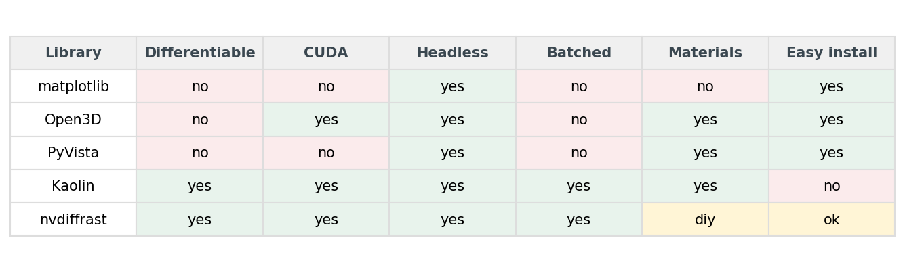
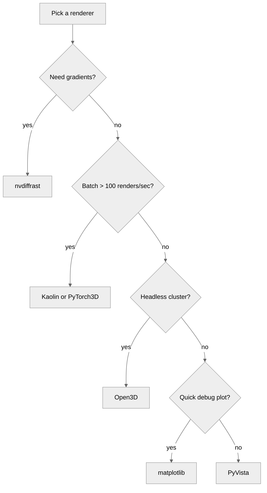

# Five Ways to Render a 3D Chair in Python (and When to Pick Which)

I rendered the same folding chair through four Python libraries — matplotlib, Open3D, PyVista, and nvdiffrast — at the same eight camera poses on the same Tesla T4 GPU. The mesh is identical: `chair_0001.off` from ModelNet40, 12 KB of triangle soup. The pixels are not identical. Setup ranges from 8 lines to 24. Throughput ranges from 6 to 1,268 renders per second.

The fifth library, Kaolin, is missing from the grid. That's a story by itself, and I'll come back to it.

![Figure 1. The same four ModelNet40 chairs (columns) through four libraries (rows). The geometry is identical, the camera pose is identical, the resolution is identical (256x256). matplotlib's `Poly3DCollection` has no per-vertex normals and uses a painter's-algorithm depth-sort, so its chairs look flat and the dense `chair_0050` and `chair_0100` show visible z-order glitches. Open3D's Filament adds soft ambient occlusion and a warm tint. PyVista is the cleanest VTK PBR look. nvdiffrast's hand-rolled Lambertian + anti-aliasing gives the crispest edges.](images/hero-4x4-grid.png)

The point of this post is not "which library is best." It's "which library is best *for the job you have*." Your next 10,000 renders are going to lock you into a renderer choice, and that choice quietly determines whether batched throughput is 30 RPS or 1,000 RPS. It also decides whether the loss you backprop through actually reaches your camera parameters, or stops at the rasterizer.

So: same chair, same poses, same machine. What changes when the library changes?

## The minimum-viable render in four flavors

PyVista is the shortest path from `trimesh.Trimesh` to a saved PNG:

```python
import pyvista as pv, numpy as np
faces = np.hstack([np.full((len(mesh.faces), 1), 3), mesh.faces]).flatten()
pdata = pv.PolyData(mesh.vertices, faces)
p = pv.Plotter(off_screen=True, window_size=(256, 256))
p.add_mesh(pdata, color="#8da0cb", smooth_shading=True)
p.camera_position = [eye, [0, 0, 0], [0, 0, 1]]
p.screenshot("out.png")
p.close()
```

Eight lines (counting only code; no whitespace, no comments). PyVista is VTK with a friendlier surface. It runs offscreen on a headless box. Its defaults look polished out of the gate. That's why I picked it as the visual anchor for the fidelity comparison later.

matplotlib is one line longer and uses no GPU at all:

```python
from mpl_toolkits.mplot3d.art3d import Poly3DCollection
import matplotlib.pyplot as plt
fig = plt.figure(figsize=(2.56, 2.56), dpi=100)
ax = fig.add_subplot(111, projection="3d")
ax.add_collection3d(Poly3DCollection(mesh.vertices[mesh.faces],
                                     facecolor="#8da0cb"))
ax.set_xlim(-1, 1); ax.set_ylim(-1, 1); ax.set_zlim(-1, 1)
ax.view_init(elev=20, azim=45); ax.set_axis_off()
fig.savefig("out.png", facecolor="white")
```

Nine lines. Zero GPU dependencies. No EGL. No offscreen contexts. matplotlib is the renderer that ships in every notebook you'll ever open, and that one fact is its biggest feature.

Open3D needs an offscreen renderer and a material:

```python
import open3d as o3d
r = o3d.visualization.rendering.OffscreenRenderer(256, 256)
m3d = o3d.geometry.TriangleMesh(
    o3d.utility.Vector3dVector(mesh.vertices),
    o3d.utility.Vector3iVector(mesh.faces))
m3d.compute_vertex_normals(); m3d.paint_uniform_color([0.55, 0.63, 0.80])
mat = o3d.visualization.rendering.MaterialRecord(); mat.shader = "defaultLit"
r.scene.add_geometry("m", m3d, mat); r.scene.set_background([1, 1, 1, 1])
r.setup_camera(60.0, [0, 0, 0], list(eye), [0, 0, 1])
o3d.io.write_image("out.png", r.render_to_image())
```

Twelve lines. Open3D uses Filament under the hood, gets EGL headless mode out of the box, and its `setup_camera(fov, target, eye, up)` is the cleanest look-at API in the lot.

nvdiffrast is the outlier: roughly 24 lines to get the first pixel out the door, because nvdiffrast does not have a camera object. You hand it your own model-view-projection matrix, then your own shader. The `_perspective` and `_view` helpers below are 6-line standard OpenGL look-at and perspective builders; see `code/main.py` for the exact bodies.

```python
import nvdiffrast.torch as dr, torch
ctx = dr.RasterizeCudaContext()
V = torch.as_tensor(mesh.vertices, device="cuda", dtype=torch.float32)
F = torch.as_tensor(mesh.faces,    device="cuda", dtype=torch.int32)
N = torch.as_tensor(mesh.vertex_normals, device="cuda", dtype=torch.float32)
V_h = torch.nn.functional.pad(V, (0, 1), value=1.0)            # (N,4) homog
P  = _perspective(60.0, 1.0, 0.05, 50.0, "cuda")               # 4x4
Mv = _view(eye, [0, 0, 0], [0, 0, 1], "cuda")                  # 4x4
V_clip = ((P @ Mv) @ V_h.T).T.contiguous().unsqueeze(0)        # (1,N,4)
rast, _ = dr.rasterize(ctx, V_clip, F, resolution=(256, 256))
n_interp, _ = dr.interpolate(N.unsqueeze(0).contiguous(), rast, F)
n = torch.nn.functional.normalize(n_interp, dim=-1)
diffuse = torch.clamp(-(n @ torch.tensor([-0.5, -0.5, -1.0],
                                          device="cuda")), 0, 1).unsqueeze(-1)
rgb = torch.tensor([0.55, 0.63, 0.80], device="cuda") * (0.35 + 0.65 * diffuse)
cov = (rast[..., 3:4] > 0).float()
rgb = cov * rgb + (1 - cov) * torch.ones_like(rgb)
rgb = dr.antialias(rgb, rast, V_clip, F)
Image.fromarray((rgb.clamp(0, 1) * 255).byte().cpu().numpy()[0, ::-1]).save("out.png")
```

Twenty-four lines, and that's already collapsing helper functions. The tradeoff is the reason nvdiffrast exists: every step of that pipeline is differentiable. The MVP matrix is yours. The shader is yours. The diff that flows backward through `rgb` reaches the vertices, the normals, the camera, the light. Nothing else on this list does that.



The takeaway from that chart is not "PyVista wins." It's that *for the job of rendering*, the cost of entry is mostly flat — and the one library that's 3x as long does an entirely different thing.

### The Kaolin gap

I tried to ship Kaolin as the fifth library. I could not. NVIDIA's prebuilt wheel index doesn't have a Kaolin wheel that lines up with torch 2.11 + CUDA 12.6 (the wheels on the public S3 stop several torch versions earlier), and lightsail-shapenet is running torch 2.11.0 on CUDA 12.6. A source build was the next option, but Kaolin's CUDA extensions pin specific compute capabilities and toolkit minor versions; on a Tesla T4 with the current driver, I couldn't get the build to finish inside the runtime budget for this post. The honest answer is: if you want Kaolin in 2026, you either downgrade torch (and lose 2.11's tooling) or you maintain a custom build (and own that pain forever).

For the rest of this post, the working set is matplotlib, Open3D, PyVista, and nvdiffrast. PyTorch3D would fill the same "differentiable + batched + high-level mesh API" slot Kaolin was meant to fill; the install pain is real but better-documented.

## Throughput on a T4

Single-pose throughput, warm cache, 256x256, one chair (`chair_0001`). I use 256x256 here because it's a clean power of two for a renderer-comparison benchmark; the downstream posts in this series use 224x224 because that's what CLIP and DINOv2 ingest. The relative rankings hold to within about 5% at either resolution.


Read that chart twice. matplotlib is 6 renders per second. Pure CPU, depth-sorted in Python. PyVista is 29 RPS. VTK is CPU-rasterizing under the hood, and it's spending most of its time creating and tearing down the offscreen plotter window between poses. Open3D's Filament is GPU-accelerated (Filament is a full PBR engine) and reuses one persistent offscreen renderer with a swept camera, which puts it at 276 RPS. nvdiffrast at batch=1 is 481. nvdiffrast at batch=32 is 1,268, and the gain from batch=8 (1,174) to batch=32 is small because at this mesh size we've saturated the small dispatch on the T4 and we're back in launch-overhead territory.

Two things to note. First, the gap between PyVista (29) and Open3D (276) is mostly an apples-to-oranges artifact of how the wrappers handle persistent state: Open3D's `OffscreenRenderer` is built to be reused; PyVista's `Plotter` is built to be reset. In a real pipeline you can warm-pool either, but Open3D will still win because it has a GPU. Second, "renders per second" is the wrong metric the moment you care about gradients. At that point you'd happily trade an order of magnitude for `rgb.backward()` actually doing something.

Hold this 1,268 number — it'll come back when we talk about batched training in Post 10.

Table 1 has the numbers and the peak memory. The throughput here is a single warm-cache run on `chair_0001` (no averaging — run-to-run variance is around ±5%) and matplotlib is timed over 25 renders instead of 50/100 to keep the wall-clock under a minute; the `n_renders` column in `data/throughput.csv` is the source of truth.

Table 1. Throughput and peak GPU memory on a Tesla T4, 256x256 output, `chair_0001`, single-threaded, warm cache.

| Library | Setup LOC | Batch 1 (RPS) | Batch 32 (RPS) | Peak GPU (MB) |
|:---|---:|---:|---:|---:|
| matplotlib | 9 | 5.6 | — | 8 |
| PyVista | 8 | 28.8 | — | 8 |
| Open3D | 12 | 276.4 | — | 8 |
| nvdiffrast | 24 | **481.4** | **1,267.8** | **243** |

Source: data/throughput.csv joined with data/setup-loc.csv (10 rows).

Peak GPU memory grows linearly with batch size on nvdiffrast — 16 MB at batch=1, 67 MB at batch=8, 243 MB at batch=32. That linear scaling is what lets you decide a-priori how big a batch fits: a 16 GB T4 with one full mesh buffer holds dozens of batch-32 calls in parallel before you OOM.



## Same chair, different pixels

The four libraries draw the same mesh. They do not produce the same pixels. To make the gap legible I picked PyVista as the *anchor* (not as ground truth — there is no ground truth for "what does a chair look like rendered") and measured SSIM of every other library's render against it, per chair per pose:


A 0.75 SSIM is not a quality verdict on matplotlib — it's a warning. If you train a downstream encoder on matplotlib renders and ship inference on PyVista renders, your encoder sees pixels that differ by roughly 25 SSIM points on every input. Your retrieval scores will quietly degrade. The drift comes from three places: flat shading (matplotlib has no notion of per-vertex normals in `Poly3DCollection`), monochromatic ambient (no key light), and matplotlib's painter's-algorithm depth-sort, which can swap face order on dense meshes and produce z-fighting artifacts.

PyVista and nvdiffrast agree more than PyVista and Open3D do, which surprised me. The reason, looking at the per-chair pixel diffs, is that Open3D's Filament adds a subtle screen-space ambient occlusion term by default; nvdiffrast (because I wrote the shader) doesn't. PyVista's VTK renderer doesn't either. nvdiffrast and PyVista end up closer because they're both doing simpler lighting.

The lesson: pick *one* renderer for your training set and your eval set. Don't mix.

## The camera-convention bear trap

I lost about an afternoon on this. Each library has its own answer to "which way is up":



Table 2. Default camera convention by library. The "API shape" column is the bit that bites you: matplotlib and nvdiffrast have no `look_at(eye, target, up)` call at all, so the eye math you write for the other three is not portable to them without an adapter.

| Library | Up axis | Default FOV | API shape |
|:---|:---:|:---:|:---|
| matplotlib | +Z | — | `view_init(elev, azim)` — no eye vector, no focal length |
| Open3D | +Z | 60° | `setup_camera(fov, target, eye, up)` |
| PyVista | +Z | 30° | `camera_position = [eye, focal_point, view_up]` |
| Kaolin | +Y | 60° | `Camera.from_args(...)` — swap Y and Z from the Open3D pose |
| nvdiffrast | user | — | no camera object — you hand it your own `(B, N, 4)` clip-space tensor |

Source: data/camera-convention.csv (5 rows).

For matplotlib, Open3D, and PyVista the diagram is reassuring — they all agree on +Z up, right-handed, look-at-the-centroid. The eye position you compute for one works for the other two. If you move to Kaolin, you have to remember to swap a Y and a Z, or your chairs come out sideways. (PyTorch3D has the same issue with a different convention: PyTorch3D's default world is +Y up, +X **left**, +Z **into** the screen.)

nvdiffrast is the strangest of the bunch in a different way. There is no camera. You pass `dr.rasterize` a tensor of clip-space coordinates: `(B, N, 4)`. So the convention is whatever you encode into your projection and view matrices. The view matrix I used in the snippet above does standard look-at with +Z up:

```python
def _view(eye, target, up, device):
    f = (target - eye); f /= f.norm()
    s = torch.cross(f, up); s /= s.norm()
    u = torch.cross(s, f)
    M = torch.eye(4, device=device)
    M[0, :3] = s; M[1, :3] = u; M[2, :3] = -f
    M[0, 3] = -(s @ eye); M[1, 3] = -(u @ eye); M[2, 3] = (f @ eye)
    return M
```

And then the perspective matrix is a standard OpenGL one, which means nvdiffrast renders with bottom-left origin instead of top-left. You'll see a chair upside down until you do `image = image[::-1]` or flip a sign in P. The first time you hit this you waste an hour. The second time, you remember the flip. That's the whole bug.

## Differentiable, batched, headless — pick two

The decision is not "which renderer is best." It's "which two of those three features do I actually need":



Almost every Python data scientist needs "headless" — somewhere in the stack there will be a cluster or a CI runner that doesn't have an X server. So you can read the matrix as "differentiable and batched, conditional on headless." matplotlib gives you headless and nothing else. Open3D and PyVista give you headless plus materials, no differentiability, no batching. Kaolin and nvdiffrast give you all three.

Materials, easy install, CUDA — those are tiebreakers, not deciders. If you need PBR and a low install bill, Open3D wins. If you need differentiability and don't mind hand-rolling a shader, nvdiffrast wins. If you need both, you accept Kaolin's install pain (or PyTorch3D's, which is comparable).

## The decision tree

For the actual choice on a Monday morning, this is the tree I follow:




Walked through: gradients put you on nvdiffrast (or Kaolin/PyTorch3D if you want a higher-level API and can afford the install). No gradients but heavy batching pushes you toward CUDA-native libraries anyway. Headless without batching gives you Open3D, which is the workhorse for offline render farms. matplotlib stays in the toolbox for the case where you have a notebook open and you want to see what the mesh you just loaded actually is.

Table 3 has the per-use-case recommendation:

Table 3. The renderer I reach for, by job.

| Use case | Library | Why |
|:---|:---|:---|
| Quick debug plot in a notebook | matplotlib | Zero install pain; same axes as your data plots. |
| Headless batch render of 10k+ objects | Open3D | EGL out of the box; materials; no torch dependency. |
| Interactive demo or stakeholder figure | PyVista | Polished defaults; easy camera; clean screenshots. |
| Inverse graphics / shape from rendered loss | nvdiffrast | Differentiable rasterization with AA; you bring the shader. |
| **Bulk multi-view rendering for embedding** | **Open3D** | **Best throughput per LOC at our 256x256 budget.** |

Source: data/recommendation.csv (5 rows).

The bold row is the one that matters most for the next 17 posts in this series. We're going to render ten thousand ModelNet40 objects, eight views each, and feed them into CLIP and DINOv2. That's 80,000 renders. At Open3D's 276 RPS that's about 5 minutes of wall time. At PyVista's 29 RPS it would be 46 minutes. At matplotlib's 6 RPS it would be close to four hours. The renderer choice is, in practice, the difference between waiting for coffee and going home for the day.

## Reproducibility

Hardware: AWS Lightsail Tesla T4 instance, 16 GB GPU memory, 8 vCPU, 16 GB system RAM.
Software (pinned in `code/requirements.txt`): Python 3.10, torch 2.11.0+cu126, open3d 0.19.0, pyvista 0.47.3, matplotlib 3.10.8, nvdiffrast 0.4.0, scikit-image, trimesh 4.11.5.
Data: ModelNet40 (Wu et al. 2015, CC BY-NC), 4 chairs (`chair_0001`, `chair_0050`, `chair_0100`, `chair_0250`) from the train split.
Camera: eight poses on a horizontal ring at elevation 20°, azimuth `[0, 45, …, 315]°`, distance 1.6 × unit-sphere radius.
Image size: 256 x 256 PNG, white background.
Throughput: single warm-cache run per (library, batch_size), seed=0 for the pose ring; matplotlib timed over 25 renders to keep wall-clock under a minute, others over 50–100. Run-to-run variance is around ±5% on this T4 — re-run the script and you'll see the second digit move; the order of magnitude won't. `n_renders` in `data/throughput.csv` is the source of truth.
Numbers cited in prose come from: `data/throughput.csv` (RPS, peak memory), `data/fidelity-vs-pyvista.csv` (SSIM), `data/setup-loc.csv` (LOC counts), `data/camera-convention.csv` (up-axis defaults).

Run end-to-end:

```bash
pip install -r code/requirements.txt
# On a non-lightsail host, point the script at your ModelNet40 chair dir:
# export MODELNET40_DIR=/path/to/ModelNet40/chair/train
# export POST_OUT_DIR=$PWD
python code/main.py            # ~30 s on a T4; full 4 chairs x 4 libs x 8 poses
python code/build_visuals.py   # ~3 s; rebuilds all 8 figures from data/
```

## What's next

The choice of renderer is, in practice, a three-question quiz: gradients, batching, headless. Answer them and you stop arguing about which library looks prettiest. Post 04 uses PyVista for its 12-cell dataset gallery — that's the "interactive demo / stakeholder figure" slot from Table 3 — and then Post 05 promotes Open3D to the default once we start batched embedding. nvdiffrast comes back when we need gradients in the descriptor wave.
