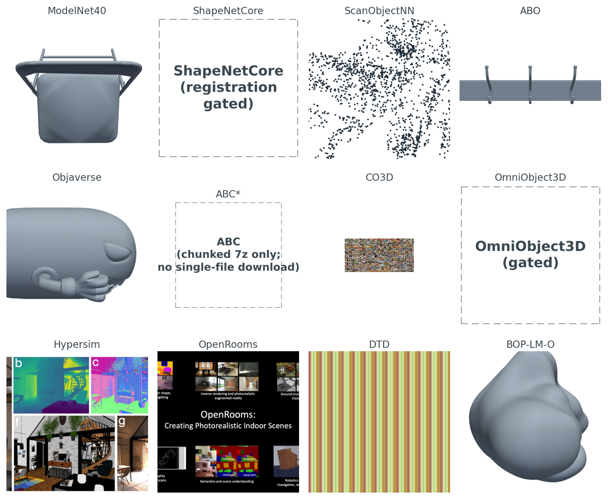
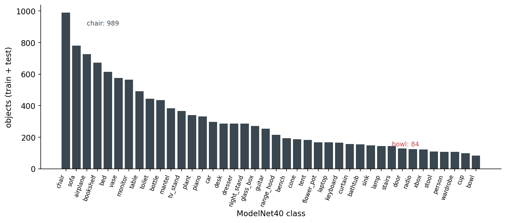
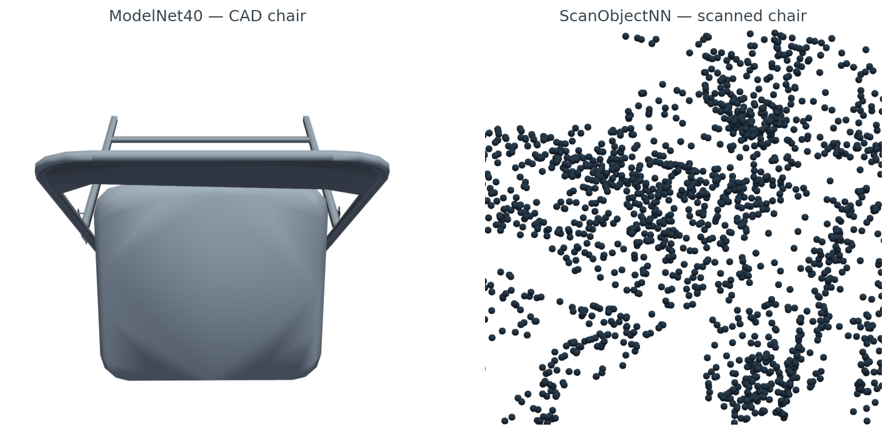
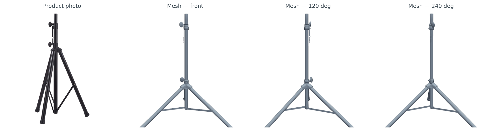
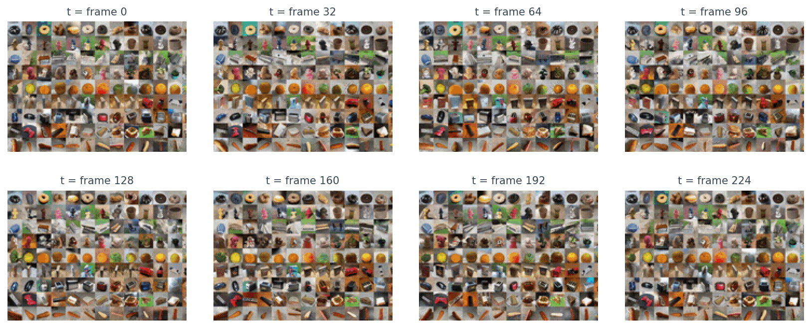
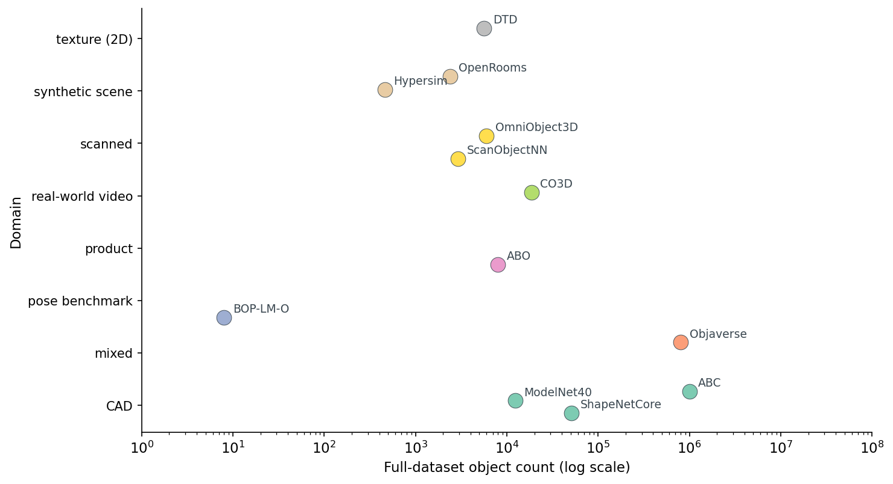
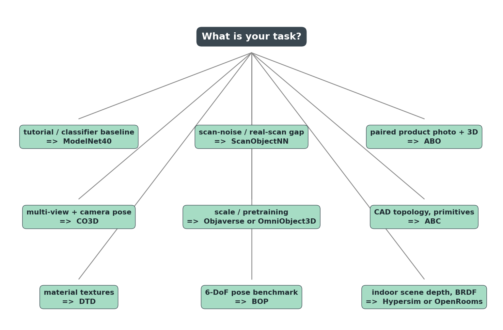

# Every Public 3D Dataset Worth Knowing, In One Notebook

A chair on the internet is twelve different things.

In ModelNet40 it is a clean CAD mesh, 2,382 vertices, no texture, sitting at the origin. In ScanObjectNN it is a 2,048-point cloud with parts of the floor still attached because someone scanned a room with a depth camera. In ABO it is a tripod-stand mesh paired with a real photograph of the same product on an Amazon listing page. In Objaverse it might be a chair, or it might be a low-poly cartoon alien — there are eight hundred thousand objects in there and the quality variance is the price of the scale. In CO3D it is not a mesh at all, it is two-hundred-and-twenty-five frames of someone walking around a real chair with their phone.

I rendered all twelve, side by side, before I started writing this post. Figure 1 is what came back.



*Figure 1. Twelve public 3D datasets, one representative sample each, rendered through the same pipeline. The three placeholders (ShapeNetCore, ABC, OmniObject3D) are not figure failures — they are honest reports that the dataset gates unattended download. License friction is part of the picture.*

The controlling question for the rest of the post: of the dozen public 3D datasets a working ML engineer might pull, which one do you actually reach for, given your task?

The short answer is at the end. The long answer is the only one worth giving, because the wrong dataset wastes weeks. A model trained on ModelNet40 chairs falls over on real RGB-D scans. A retrieval index built on raw Objaverse is full of near-duplicates because the same Sketchfab object often shows up under many uploads. A commercial product trained on ShapeNet violates the license the day it ships.

## ModelNet40, the tutorial default

You have seen ModelNet40 in every paper. Twelve thousand three hundred and eleven CAD meshes, forty classes, two hundred and fifty megabytes total, released in 2015 by Wu et al. It is small enough to fit in a laptop's RAM if you are careful, and the file format is `.off`, which trimesh has parsed correctly since I was in school.

```python
from medium20.datasets import iter_modelnet40
from medium20.render_kit import render_pyvista

for cls, path, mesh in iter_modelnet40(split="train", classes=["chair"], n_per_class=1):
    imgs = render_pyvista(mesh, image_size=1024, n_views=1)
    print(cls, path.name, mesh.vertices.shape)
# → chair chair_0001.off (2382, 3)
```

Five lines. One chair, rendered. That is why ModelNet40 is the tutorial default — the whole pipeline costs less than a second once the disk is warm. I render the gallery at 1024 because these views go in the figure, not into an encoder; flip `image_size` to 224 if you are feeding them to CLIP or DINOv2.

It also lies to you about the world. The dataset is class-imbalanced in a way that nobody who learned 3D ML on it ever forgets.



*Figure 2. ModelNet40 object count per class, train plus test, sorted descending. Chair tops the list at 989 objects, bowl bottoms it at 84 — an eleven-fold gap. Any classifier you train on raw ModelNet40 either learns to predict the top five classes well and the bottom five badly, or it spends most of its capacity on rebalancing weights.*

The other lie is more subtle. ModelNet40 meshes are CAD models — designer-built, watertight by construction, no textures, no scan noise, no occlusion, no clutter. They live in a world where every chair is a clean polygonal abstraction. The classifier you train here has never seen a chair half-occluded by a desk, never seen a chair with the legs cut off by the depth sensor's near plane, never seen a chair with the floor still attached to its feet. Which brings us to the second dataset.

## The scan-noise gap, ScanObjectNN

ScanObjectNN, from HKUST in 2019, did something that does not sound like research but is: they took a real depth camera, scanned indoor scenes, and cut out the chairs and tables and books. Then they kept the floor patches around the legs, kept the occlusion where another piece of furniture clipped the back of the seat, kept the holes where the sensor lost track of a thin armrest. The result is a point cloud, not a mesh, and it looks like this.



*Figure 3. Left: ModelNet40 chair_0001, rendered as a mesh. Right: a chair from ScanObjectNN's PB_T50_RS variant, 2,048 points. Both are "chair" to a human. To a classifier trained on the left, the right is a different distribution. Mean nearest-neighbor distance on the scan is 0.041 in unit-sphere coordinates with std 0.020 — the point density is uneven by a factor of two even within a single object (source: `data/scan-vs-cad-stats.csv`).*

ScanObjectNN is small — 2,902 objects across 15 classes. That is its point. You do not train your final model on it. You train on a clean set, then you measure the domain gap to ScanObjectNN to know how badly your model breaks when it leaves the synthetic universe. Post 17 in this series picks up that thread.

## Product photo plus 3D, ABO

Amazon Berkeley Objects came out in 2022. Seven thousand nine hundred and fifty three GLB meshes, all from Amazon's product catalog, every one paired with the actual product photograph that runs on the listing page. CC BY 4.0. Free for commercial use with attribution.

```python
import subprocess, trimesh, json
glb = "B07S74D9T7.glb"
subprocess.run(["aws", "s3", "cp", "--no-sign-request",
                f"s3://amazon-berkeley-objects/3dmodels/original/7/{glb}", "."])
mesh = trimesh.load(glb, force="mesh")
print(mesh.vertices.shape, mesh.faces.shape)
# → (12419, 3) (21294, 3)
```

The bucket is unsigned — no AWS account required. The full set is 154 GB so you cap your download to one model at a time. The catalog lives in two CSVs (`3dmodels.csv.gz`, `images.csv.gz`) plus a listings JSON per partition that wires each `item_id` to its photo IDs.



*Figure 4. ABO item B07S74D9T7. Left: the listing photo, square-padded. Right three panels: front, 120-degree, and 240-degree renders of the same mesh. The geometry is faithful; the materials are textured but flat. This is what makes ABO unique among the public 3D sets — you get the photo and the mesh together, so you can train a model that maps one to the other.*

ABO is what I reach for when the task involves catalog-scale product 3D. Nothing else public pairs them at this volume with a license you can actually ship under.

## Scale, Objaverse and OmniObject3D

Objaverse changed the scale conversation. Eight hundred thousand objects in the v1 corpus, ten million in the v2 XL release, all scraped from Sketchfab under ODC-By 1.0. The Python package handles the download.

```python
import objaverse
uids = objaverse.load_uids()           # 800K UIDs
paths = objaverse.load_objects([uids[42]])  # download one
```

Two seconds to fetch one GLB. The mesh I happened to land on in figure 1 is `6cfb55bd...` — 18,582 vertices, a cartoon alien character a Sketchfab artist made and tagged for public use. Objaverse is full of those. It is also full of broken UV maps, inside-out normals, multi-resolution duplicates of the same object uploaded by different users, and objects whose category labels were translated by the upload pipeline and not by a domain expert.

The practical advice: do not train on raw Objaverse. Use one of the curated subsets — the 800-object `objaverse-explorer` set, the 46K `objaverse-LVIS` subset where every object has a verified LVIS category, or the Cap3D + Objaverse re-annotated splits that several groups have published since 2024. The full corpus is for pretraining at large parameter counts, not for any task with a categorical label.

OmniObject3D is the cleaner alternative. About six thousand real-scanned objects with high-quality meshes, point clouds, and turntable videos. CC BY 4.0. The catch I ran into while pulling samples: the HF mirrors I tried were gated, so my download script returned the honest "(HF gated)" placeholder in figure 1. The official downloads work but require a manual access request. If your task is real-scan quality at six-thousand-object scale, OmniObject3D is worth the friction.

## The other six, one paragraph each

ABC is the CAD-precision dataset. One million CAD models with full parametric topology — edges, faces, primitive type per face, sharpness annotations. Released under MIT. If you are doing surface fitting, feature detection on B-rep, or anything where the curvature discontinuity at an edge matters more than the texture, ABC is the only public dataset that ships the underlying primitives. The catch is distribution: it ships as 7z chunks of 10,000 models each, several gigabytes per chunk. There is no per-object endpoint, which is why figure 1 has the "(chunked 7z only; no single-file download)" placeholder rather than an ABC render. The download is one-time and on-purpose.

CO3D goes the other way and gives up the mesh entirely. Eighteen thousand six hundred and nineteen real-world video sequences, each one a person walking around a single object with a phone, every frame annotated with ground-truth camera pose. Reizenstein et al. 2021 plus the v2 update from Jensen et al. 2023. CC BY-NC 4.0 — non-commercial. If you are doing NeRF, 3D Gaussian splatting, or multi-view reconstruction with real camera intrinsics, CO3D is where you start.



*Figure 5. Eight time samples across CO3D's 225-frame `grid.gif` teaser, cropped to the top-left third of the mosaic so individual sequences are visible. Each panel is itself a tile of dozens of products captured at the same instant, which is the dataset's signature — CO3D's atomic unit is not a single mesh, it is a sequence of frames around a real-world object, and the corpus is 18,619 of those sequences. What's being supervised in CO3D is camera pose, not surface geometry.*

Apple's Hypersim swings back to fully synthetic. 461 photoreal indoor scenes, 77,400 rendered images, full per-pixel ground truth — diffuse reflectance, depth, normals, semantic instances. CC BY-SA 3.0. If your task is indoor scene depth, intrinsic-image decomposition, or anything that needs a synthetic-to-real bridge for indoor scenes, this is the one.

OpenRooms is the BRDF-aware cousin. UCSD-VLLab built 2,376 indoor scenes with per-material BRDF parameters and rendered six variations per scene. Use it when the task is inverse rendering or SVBRDF estimation; the BRDF labels are what you get over Hypersim.

DTD — the Describable Textures Dataset — is 2D, not 3D. I include it because half the time when you are doing material-aware 3D work, you pretrain a material encoder on DTD and then graft it onto your 3D pipeline. Five thousand six hundred and forty textures of describable surfaces (banded, knitted, scaly, etc.), Oxford, 2014. The figure 1 cell is one of those textures.

BOP-LM-O is the smallest dataset in this tour by design. Eight CAD models, hundreds of test images with ground-truth 6-DoF poses, real cluttered scenes. It is one of seven datasets in the BOP benchmark family (LM-O, T-LESS, ITODD, HB, IC-BIN, TUDL, YCB-V), and it exists because evaluating 6-DoF pose estimation requires exact agreement between the pose and the model. There is no point training a pose estimator on Objaverse — you need a fixed, agreed-upon mesh and a fixed test set, and BOP is that.

## A picture of the scale

Two dimensions matter when you are picking: object count and domain. Here is all twelve on one chart.



*Figure 6. The full object-count for each dataset, plotted on a log x-axis against its primary domain. Note that "scale" here is the full corpus — many of these datasets you actually consume as a 1-10 percent curated subset. Note also that BOP-LM-O sits at 8 because LM-O is just one of seven benchmarks in the BOP family; the full BOP suite ships dozens of models across the seven datasets.*

Six orders of magnitude is the headline number, and it is why this post is here — pick wrong on scale and your dataset either does not fit in the pipeline or does not have enough examples to train a model worth shipping.

## Licenses you can actually ship

This is the part that bites teams six months after they ship a feature.

There are three tiers of public 3D dataset license, and you need to know which tier you are in before any of these enter your training pipeline.

<div style="overflow-x:auto" markdown="1">

Table 1. License-and-redistribution audit. Skim this before you train on any of these datasets in a commercial setting.

| Dataset | License | Redistribute? | Commercial? | Cite? |
|:---|:---|:---|:---|:---:|
| ModelNet40 | non-commercial (research/edu) | Yes, with attribution | No | Yes |
| ShapeNetCore | ShapeNet license | No (registration only) | No (research) | Yes |
| ScanObjectNN | academic only | No | No | Yes |
| **ABO** | **CC BY 4.0** | **Yes, with attribution** | **Yes** | **Yes** |
| Objaverse | ODC-By 1.0 | Per-object license | Per-object | Yes |
| ABC | MIT | Yes | Yes | Recommended |
| CO3D | CC BY-NC 4.0 | Yes, with attribution | No (non-commercial) | Yes |
| OmniObject3D | CC BY 4.0 | Yes, with attribution | Yes | Yes |
| Hypersim | CC BY-SA 3.0 | Yes, with share-alike | Yes (share-alike) | Yes |
| OpenRooms | academic only | No | No | Yes |
| DTD | academic only | No | No | Yes |
| BOP-LM-O | CC BY 4.0 | Yes, with attribution | Yes | Yes |

Source: `data/license-audit.csv` (12 rows). The bold row marks the dataset I recommend first for new commercial work — CC BY 4.0, paired image and mesh, no share-alike viral clause. ABC, OmniObject3D, and BOP-LM-O are also fully commercial-OK; Hypersim is close with the share-alike caveat.

</div>

Tier 1 — fully redistributable, commercial-use OK — has four members: ABO, ABC, OmniObject3D, BOP-LM-O. Hypersim is close, with the share-alike caveat that anything derived must be CC BY-SA too. If you are building a commercial product, those five are your safe set.

Tier 2 — research-only — covers ScanObjectNN, OpenRooms, DTD. You can train, you can publish papers, you cannot redistribute, you cannot ship in a commercial product without re-licensing.

Tier 3 — accept-license-then-download — is ShapeNetCore. You register, you accept terms, you do not get to re-host any sample. This is why the figure 1 cell for ShapeNetCore is a placeholder — I refuse to host even one chair from it, because the terms explicitly forbid redistribution.

Objaverse is its own thing. The collection is ODC-By 1.0, but each individual object on Sketchfab has its own creator license, and you have to check per-object before redistributing. The Objaverse maintainers ship a metadata table with each object's license; respect it.

The mistake teams make: they train a model on ModelNet40 plus a bit of ShapeNet plus a touch of CO3D, ship it commercially, and then a year later legal asks where the training data came from. ModelNet40 alone makes that ship illegal, and CO3D's non-commercial clause is unambiguous. Pick the dataset before you pick the model, because the dataset's license is what you ship.

## The decision tree

Once the licenses are in hand, the actual choice is almost mechanical.



*Figure 7. The dataset-per-task decision tree. Each branch maps a task to the one dataset I would reach for first. Where two datasets share a branch (Objaverse / OmniObject3D for scale; Hypersim / OpenRooms for scene) the first is bigger and noisier, the second is smaller and cleaner.*

Every dataset shows up exactly once. That is intentional. If you are building a pipeline, you should not have to evaluate three competing datasets per task — each task in 3D ML has a clear default, and the default is what the tree shows. You only deviate from the default when you have a specific reason, and the post you write about that deviation will be more interesting than this one.

Read the tree top-down. "What's your task?" is the only question. The answer picks the dataset.

## Twelve datasets, one row each

For when you need the full picture in one place.

<div style="overflow-x:auto" markdown="1">

Table 2. Twelve public 3D datasets, one row each — domain, modality, scale, license, year, typical use.

| Dataset | Domain | Modality | Objects | License | Year | Use for |
|:---|:---|:---|---:|:---|---:|:---|
| ModelNet40 | CAD | mesh | 12,311 | research/edu only | 2015 | tutorials, classifier baselines |
| ShapeNetCore | CAD | mesh + texture | 51,300 | ShapeNet (research) | 2016 | generative models, retrieval |
| ScanObjectNN | scanned | point cloud | 2,902 | academic only | 2019 | real-scan domain-gap eval |
| ABO | product | mesh + image + material | 7,953 | CC BY 4.0 | 2021 | paired image+3D, e-commerce |
| Objaverse | mixed | mesh | 800,000 | ODC-By 1.0 | 2023 | large-scale pretraining |
| ABC | CAD | mesh + STEP | 1,000,000 | MIT | 2019 | CAD topology, surface fitting |
| CO3D | real-world video | multi-view + pose | 18,619 | CC BY-NC 4.0 | 2021 | NeRF, multi-view recon |
| OmniObject3D | scanned | mesh + point cloud + video | 6,000 | CC BY 4.0 | 2023 | real-scan benchmarks |
| Hypersim | synthetic scene | image + depth + normals | 461 scenes | CC BY-SA 3.0 | 2020 | scene depth, intrinsic decomp |
| OpenRooms | synthetic scene | image + depth + BRDF | 2,376 scenes | academic only | 2021 | indoor SVBRDF, inverse rendering |
| DTD | texture (2D) | image | 5,640 | academic only | 2014 | material-texture pretraining |
| BOP-LM-O | pose benchmark | rgb-d + pose | 8 models | CC BY 4.0 | 2017 | 6-DoF pose evaluation |

Source: `data/dataset-cards.csv` (12 rows).

</div>

Sorted by year, by object count, or by license tier — the table is the same six tradeoffs in twelve different mixes. The modality your encoder sees is the second-order tradeoff after license; pick both before you pick the model.

The next post in this series takes ModelNet40 — the tutorial default — and turns rendered views into searchable embeddings. The dataset choice was easy; the embedding choice is where the interesting fights start.

## Reproducibility

Every number cited in prose comes from a CSV in the `data/` directory of this post.

| Claim | Source |
|:---|:---|
| 12,311 ModelNet40 meshes | `data/dataset-cards.csv` row 1 |
| Chair 989 / bowl 84 (ModelNet40 class extremes) | `data/modelnet-class-histogram.csv` |
| 2,048 ScanObjectNN points per object | `data/download-load-render.csv` row 3 |
| Mean NN distance 0.041 on scan | `data/scan-vs-cad-stats.csv` row 2 |
| ABO mesh B07S74D9T7, 12,419 vertices (figure 4) | re-measured via `code/build_figures.py::fetch_abo_photo` |
| ABO mesh B01N2PLWIL, 10,990 vertices (first-fetch sample, gallery cell) | `data/download-load-render.csv` row 4 |
| Objaverse uid `6cfb55bd...`, 18,582 vertices | `data/download-load-render.csv` row 5 |
| BOP-LM-O obj_000001, 5,841 vertices | `data/download-load-render.csv` row 12 |
| Full corpus sizes (Objaverse 800K, ABC 1M, etc.) | `data/dataset-cards.csv` |
| License tiers | `data/license-audit.csv` |

Code: `code/download_and_render.py` (downloads and renders one sample per dataset); `code/build_figures.py` (produces every figure from cached samples). Both runnable with `python code/<file>.py` from the post directory; environment is the `3d-dedup` conda env on lightsail (Tesla T4, Open3D + PyVista on EGL).

Three datasets in figure 1 carry placeholders rather than renders: ShapeNetCore (registration-gated; redistribution forbidden), ABC (distributed only as 10K-model 7z chunks), OmniObject3D (HF mirror gated at fetch time). These are honest reports, not pipeline bugs — the license and distribution friction is part of what determines whether a dataset is right for your job.
