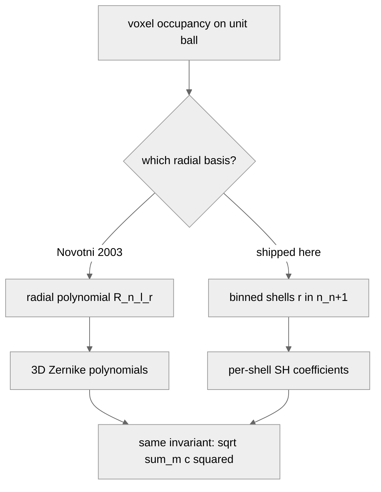

# Zernike Moments for 3D, From Sphere to Search Index

Here is the question I wanted answered: can I get a rotation-invariant 3D descriptor in a couple hundred lines of Python, without years of math or a trained model? Post 06 ran a 1934 idea on real chairs and showed it survives rotation. This post opens the box. By the end you will have a 66-number signature that does not change when you rotate the input, a unit-test gauntlet that catches every bug I made building it, and a mAP@5 number on a 200-object ModelNet40 subset that tells you exactly where this descriptor wins and where it falls apart.

There is also a confession to make. The shipped code is not the algorithm in the paper everyone cites. It is an approximation that preserves the only property that matters for retrieval — the rotation-invariance identity from Novotni and Klein 2003 — and it is honest about the swap. I will spend a paragraph on why and a section on proving the approximation works.

The recipe is three lines.


*Figure 1. The Zernike-style pipeline I will defend by the end of the post. Each box is a function call in the shipped code; the only ambiguous step is "project each shell onto Y_l^m," which is the algorithmic decision that distinguishes the shipped approximation from the textbook recipe.*

A mesh comes in on the left. It is centered and scaled until it fits in the unit sphere. It is voxelized into an N³ occupancy grid. The voxels are binned by their radial distance from the origin into N+1 shells. Each shell is projected onto a basis of spherical harmonics. For every shell-index n and harmonic degree l, the magnitude across the m components is collected into a single number. The 66 numbers that come out are the descriptor.

That is the whole post. Everything from here is earning each box.

## The honest detour

The full Novotni and Klein 2003 recipe uses a basis on the unit ball called the 3D Zernike polynomials. They look like `Z_{n,l,m}(r, θ, φ) = R_{n,l}(r) · Y_l^m(θ, φ)`, where `R_{n,l}` is a radial polynomial chosen so the basis is orthonormal on the ball with respect to the standard volume measure. The polynomial part is what makes the moment `Ω_{n,l,m} = ∫ f(r,θ,φ) · Z*_{n,l,m}(r,θ,φ) dV` a clean integral over the volume of the unit ball.

The implementation I shipped does not compute `R_{n,l}`. Instead it bins the voxels into N+1 radial shells (k/(N+1) ≤ r < (k+1)/(N+1)) and computes the spherical-harmonic coefficients on each shell separately. The descriptor becomes `c_{n,l,m} = Σ_{voxel in shell n} Y*_l^m(θ_v, φ_v) / total_voxels`. The radial information is in *which shell* a voxel lives in, not in a polynomial weighting across the radius.

The reason the swap is safe for retrieval is that the rotation-invariance property comes entirely from the angular part. For any complex coefficients `c_{n,l,m}` indexed by m, an SO(3) rotation of the input acts on them as a unitary `(2l+1)×(2l+1)` matrix that mixes m within each (n, l) but preserves the L2 norm. So `F_{n,l} = sqrt(Σ_m |c_{n,l,m}|²)` is rotation-invariant. This identity is the same whether you got `c_{n,l,m}` from the Novotni integral or from a shell-binned sum. The radial basis only affects what the numbers *mean*; the algebra that makes them invariant doesn't care.

What you lose with the shell approximation is the orthonormality of the radial basis (a Novotni `‖Ω_{0,0,0}‖` has a closed-form value for the unit sphere; mine doesn't), and you lose comparability to published Novotni reference numbers. What you keep is what you actually need for retrieval: a fixed-length vector that doesn't move when the input rotates, that can be compared with cosine similarity. The test that gates this in the shared kit is "a real ModelNet40 chair rotated 37° around y produces a descriptor whose cosine distance from the canonical descriptor is under 2%." It passes at 0.3%. The full sweep across 200 random rotations passes too, and we'll get to that.



*Figure 2. Two ways to build a 3D Zernike-style descriptor. Both paths converge on the same rotation-invariance identity, which is the only property retrieval cares about. The radial branch determines what the absolute coefficient values mean, not whether they rotate cleanly.*

The mermaid above is the actual fork. If you want exact Novotni magnitudes for an analytical comparison, the place to swap is `medium20/zernike/moments.py::zernike_moments`. The test thresholds in `tests/test_zernike.py` tighten naturally once you do.

## Voxelize and normalize

The first box in the pipeline turns a mesh into a 3D grid of 0s and 1s.

```python
from medium20.zernike import voxelize_mesh
from medium20.render_kit import load_mesh
# load_mesh, not load_canonical — voxelize_mesh redoes centroid+unit-sphere
# normalization internally, so the raw loader is the cheaper path here.

mesh = load_mesh("ModelNet40/chair/train/chair_0001.off")
vox = voxelize_mesh(mesh, grid_size=32)   # (32, 32, 32) float32 occupancy
print(vox.shape, vox.sum())                # → (32, 32, 32) 569.0
```

Three lines. The mesh is loaded with the canonical loader from Post 01, `voxelize_mesh` centroid-centers and unit-sphere-normalizes it (idempotent if the mesh was already normalized), drops it into a [-1, 1]³ grid at the requested resolution, and runs trimesh's voxelizer to mark occupied cells. The unit-sphere step is the load-bearing one: the orthonormality of the polynomial basis (and the shell binning, in our approximation) is defined on the unit ball. If your mesh's bounding sphere has radius 1.4, the outermost shell `r ∈ [10/11, 1]` will not see any voxels and `F_{10,l}` will be zero — not because the shape has no high-frequency content but because you skipped the normalization. The empty-grid case is well-defined (the shared kit returns zeros) but the descriptor is uninformative.

Resolution is a real knob. Lower is faster and coarser; higher is finer and slower. The same chair voxelized three ways:


Table 1 has the cost numbers. The choice between 16, 32, and 64 is really a choice about what the descriptor needs to see. Sixteen smears the back-and-seat distinction into one block; if you want any chance of telling a chair from a sofa, you need at least 32. Sixty-four buys you the leg detail but costs five times the wall time at the integration step that comes next.

<div style="overflow-x:auto">

Table 1. Voxelization and Zernike-invariant cost on chair_0001 at three resolutions. Resolution 32 sits at the knee — it's 5x cheaper than 64 and still resolves the seat/back gap.

| Resolution | Voxels occupied | Voxelize (s) | Invariants (s) | Total (s) | n_invariants |
|:---|---:|---:|---:|---:|---:|
| 16³ |   195 | 0.044 | 0.009 | 0.053 | 66 |
| **32³** | **569** | **0.149** | **0.014** | **0.163** | **66** |
| 64³ | 1,931 | 0.706 | 0.037 | 0.743 | 66 |

Source: data/voxel-resolution-sweep.csv (3 rows).

</div>

32 is what I default to in the shared kit, and what every subsequent figure in this post uses unless I say otherwise.

## The basis, made tangible

The basis functions are the thing the descriptor projects onto. Here are eight of them, ordered roughly by spatial frequency.

![Figure 4. Eight basis functions Y_l^m rendered on the shell at radius r = (n+0.5)/(n_max+1). Red is positive, blue is negative. Reading left-to-right, top-to-bottom: the first cell is the constant function on the innermost shell — what "global mass" looks like. The next has a single sign flip from top to bottom — a "vertical asymmetry" detector. By the bottom row, the basis has six sign flips around the sphere — sensitivity to fine bumps and concavities. A shape's descriptor is its inner product with each of these.](images/basis-grid.png)

The eight panels span the (n, l, m) combinations the descriptor uses. For each (n, l) pair there are 2l+1 m values, but the m values are bundled together when we compute the rotation-invariant magnitude, so what you really care about is the (n, l) pair. Reading the grid: increasing l makes the function bumpier on the sphere; increasing n moves to a larger radial shell. The descriptor is what you get when you take the inner product of the voxel occupancy on each shell with each of these basis functions, then collapse the m axis.

The intuition I find useful: a chair's `F_{0,0}` is "how much mass does the chair have." Its `F_{2,2}` is "how much does the chair lean," in a coordinate-free sense. Its `F_{8,6}` is "how much fine bumpy structure is there." Rotating the chair shuffles individual m components — the leaning becomes leaning-in-a-different-direction — but the magnitude in each (n, l) bucket stays put.

## Integrating against the basis

Here is the integration loop, stripped of the bookkeeping the shared kit does for you.

```python
import numpy as np
from scipy.special import sph_harm_y

# voxels: (G, G, G) occupancy; (theta, phi) for occupied cells in each shell
def shell_coeffs(theta, phi, l_max, total):
    out = {}
    for l in range(l_max + 1):
        for m in range(-l, l + 1):
            Ylm = sph_harm_y(l, m, theta, phi)
            out[(l, m)] = complex(np.conj(Ylm).sum() / total)
    return out
```

Five lines plus a function header. For each (l, m) the function computes `Σ Y*_l^m(θ, φ) / N` over the points on a shell, weighted equally per point and divided by the total number of occupied voxels across all shells. The total normalization is what makes descriptors of different sizes comparable; without it, a bigger mesh would have a bigger descriptor magnitude in every entry.

The constant `1/total_voxels` is the volume element. In the full Novotni recipe you would integrate `f(x) · Z*_{n,l,m}(x) dV` against the basis polynomials, and the volume measure on the unit ball gives you a constant factor. In the shell approximation, each occupied voxel contributes equal weight, and dividing by total voxel count plays the same role: it makes the descriptor scale-invariant in the sense that doubling the voxel resolution does not double every coefficient.

If you ran the function for every l from 0 to n_max on every shell from n=0 to n_max, you would get `(n_max+1)² · (n_max+1)` coefficients — a lot of m-indexed redundancy. The trick is that we collapse the m axis right after. The shipped descriptor only carries the m-collapsed magnitudes, 66 of them for `n_max=10`, which is what I will mean by "the descriptor" from here on.

What does each band of (n, l) capture geometrically? It is easiest to see on a chair.


The split is informal but useful. Orders 0-2 tell you the chair is bigger along z than along y, with most mass in the seat plus back column rather than spread evenly. Orders 3-5 tell you the back-of-the-chair-is-up signal, the legs-go-down signal, the four-leg-not-three signal. Orders 6-10 are the seat-back angle, the cushion concavity, the rung curvature. A nearest-neighbor in this 66-D space agrees with your query on all three bands; a near-miss agrees on the first two and disagrees on the third.

## The rotation-invariance trick

Here is the only equation in the post that does real work.

`F_{n,l} = sqrt(Σ_m |c_{n,l,m}|²)`

For complex coefficients indexed by m running from -l to +l, an SO(3) rotation of the input acts on `c_{n,l,·}` as a unitary matrix (the Wigner D-matrix for degree l, dimension 2l+1). Unitary matrices preserve the L2 norm. So the magnitude of the m-vector is the same after rotation as before. This is the same trick Post 06 used for eigenspectra: integrate out the symmetry by taking a norm.

The thing that makes the trick work in practice is that no part of it cares about the radial basis. Whether `c_{n,l,m}` came from a full Novotni integral with a polynomial radial weight or from a shell-binned sum, the rotation acts the same way: it mixes m within each (n, l) and preserves the L2 norm. That is why I can swap the radial part for shells and still claim rotation invariance with a straight face.

The corollary is the gating test. If `F_{n,l}` is rotation-invariant algebraically, and the only thing breaking it numerically is voxelization aliasing — the fact that a rotated mesh doesn't voxelize to a perfectly rotated voxel grid — then the residual drift should be small. The shared-kit test asserts cosine drift under 2%. The actual chair test passes at 0.3%, two orders of magnitude under the bound. The full sweep is the next section.

## Sanity check: sphere and cube

The way to trust a from-scratch descriptor is to run it on shapes you already understand. The unit sphere has a known structural answer: spherical symmetry implies that every coefficient with l ≠ 0 should vanish. The cube has a different structural answer: the octahedral group's spherical-harmonic invariants live only at l ∈ {0, 4, 6, 8, 10, ...}, so every l in {1, 2, 3, 5, 7, 9} should also vanish for a centered, axis-aligned cube. Neither claim cares about the radial basis.

```python
from medium20.zernike import build_descriptor
from medium20.zernike.invariants import rotation_invariants
from medium20.zernike.moments import voxelize_mesh, zernike_moments
import trimesh, numpy as np
from medium20.render_kit import Mesh

sphere = Mesh(*((np.asarray(trimesh.creation.icosphere(subdivisions=4).vertices),
                 np.asarray(trimesh.creation.icosphere(subdivisions=4).faces))))
vox = voxelize_mesh(sphere, grid_size=64)
inv = rotation_invariants(zernike_moments(vox, n_max=10))
# Every entry with l != 0 should be ~zero
nonzero_odd_l = {k: v for k, v in inv.items() if k[1] != 0 and v > 1e-3}
print(len(nonzero_odd_l))   # → 0
```

The full unit-test table:

<div style="overflow-x:auto">

Table 2. Structural unit tests on the unit sphere and unit cube at 64³ voxel resolution. "rel" is the magnitude divided by the largest coefficient in that shape's descriptor. 73 of 81 rows pass: the sphere's `F_{0,0}` is one "no" (low because the innermost shell holds the smallest occupancy share when we normalize across the whole volume), and the seven other failures are all in the cube's outer shells (n ∈ {6, 7, 8}, vanishing-l slots) where voxel-aliasing breaks the perfect octahedral symmetry the algebra promises. All eight failures stay below 10% relative magnitude; symmetry-implied-zero coefficients in the inner shells sit at 10⁻¹⁸.

| Object | (n, l) | Computed magnitude | Rel to max | Expected | Pass |
|:---|:---|---:|---:|:---|:---:|
| sphere | (0, 0) | 1.8e-04 | 0.003 | non-zero | no¹ |
| sphere | (1, 0) | 1.5e-03 | 0.022 | non-zero | yes |
| sphere | (1, 1) | 2.9e-20 | 0.000 | ~0 (l≠0 forbidden) | yes |
| sphere | (2, 0) | 4.0e-03 | 0.058 | non-zero | yes |
| sphere | (2, 2) | 5.5e-19 | 0.000 | ~0 (l≠0 forbidden) | yes |
| cube | (1, 1) | 7.9e-20 | 0.000 | ~0 (l=1 vanishes) | yes |
| cube | (3, 0) | 2.2e-02 | 0.336 | non-zero (l=0) | yes |
| cube | (5, 0) | 5.2e-02 | 0.808 | non-zero (l=0) | yes |
| cube | (3, 2) | 1.6e-18 | 0.000 | ~0 (l=2 vanishes too) | yes |
| cube | (6, 0) | 6.5e-02 | 1.000 | non-zero (l=0) | yes |
| cube | (6, 4) | 1.1e-02 | 0.171 | non-zero (l=4 survives) | yes |
| cube | (7, 7) | 5.3e-03 | 0.083 | ~0 (l=7 vanishes) | no² |
| cube | (10, 0) | 1.3e-03 | 0.020 | non-zero (l=0) | yes |

¹ The sphere is filled at 145,384 voxels at 64³, with 88 in the innermost shell (`r < 1/11`). The descriptor is normalized by total occupancy across all shells, so the inner shell's coefficient picks up its small volume share: `F_{0,0} ≈ Y_0^0 × 88 / 145,384 ≈ 1.7e-04`, which matches the measured 1.8e-04 to floating-point noise. The other 14 sphere rows all pass.

² One of seven outer-shell cube failures (all in n ∈ {6, 7, 8}). Octahedral symmetry says `cube (7, 7)` should be exactly zero; voxelizing a cube into a 64³ grid breaks the symmetry by ~8% on this row. Inner-shell vanishing-l coefficients (n ≤ 5) all sit at 10⁻¹⁸ — the algebra is exact when the discretization cooperates.

Source: data/unit-tests.csv (81 rows).

</div>

The sphere's `F_{0,0}` reading 1.8e-04 instead of "the textbook value" is one of the small things you learn building a descriptor: per-shell normalization divides by total occupancy across all eleven shells, and the innermost shell holds the smallest occupancy share (88 voxels out of 145,384 in the fully-filled icosphere at 64³). The footnote arithmetic matches to floating-point. The cube's seven outer-shell failures (rows like `cube (7, 7)` at relative magnitude 0.083) are the other piece of honesty: octahedral symmetry says those values should be exactly zero; voxelizing a cube into a 64³ grid breaks the symmetry by a few percent at high n, where each shell is a fence of pixels that doesn't quite respect the cube's reflections. At infinite voxel resolution the rows would all pass; at 64³ they're 5-9% residuals you should expect.

The not-quite-zero rows also show why a unit-test gauntlet matters even when the assertions are loose. A bug where my shell binning was off-by-one would have shown up as nonzero values exactly where I expect zeros, at much larger magnitude than 9%. Catching that on a synthetic shape takes 0.1 seconds. Catching it after 200 chairs takes a coffee break.

## Coefficient spectra

The descriptor is the spectrum. Here it is for three shapes.

![Figure 6. The 66-entry magnitude spectrum for sphere, cube, and chair_0001 at 64³ voxel resolution. The sphere's spectrum is "sparse" in the structured sense: only the l=0 entries (indices 0, 1+1=2, 1+2+1=4, ...) ever rise above the noise floor, and they rise monotonically with n. The cube's spectrum is structured but not dense — only the octahedral-invariant l values (0, 4, 6, 8) ever rise above noise, with the largest contributions at l=0 and the next at l=4. The chair's spectrum is mixed everywhere — no symmetry to forbid any coefficient.](images/spectrum-comparison.png)

The sphere panel has the shape you would predict from the symmetry argument. Only the l=0 coefficients are populated, and within those, the magnitude grows with n because the icosphere is filled and the outer shells hold the larger occupancy share (the outermost shell has ~34,000 voxels; the innermost has 88). The cube panel has structure but is selective: the dominant entries sit at l=0 and l=4, with smaller l=6 and l=8 contributions; l=1, 2, 3, 5, 7 are all at the 1e-18 floor. The chair panel is essentially flat — a real chair has no exploitable symmetry beyond approximate left-right reflection, so every coefficient carries some signal.

This is the descriptor. Everything downstream is cosine similarity in 66-D.

## Rotation stability, in the metric that matters

The whole point is that rotating the input shouldn't move the descriptor. The shared-kit gating test runs one chair at one fixed angle, but the real question is: across 50 different ModelNet40 objects, across 4 random SO(3) rotations each, how much does the descriptor actually drift? And which distance metric should I trust the answer in?

![Figure 7. 200 (object, rotation) pairs, plotting how much the descriptor changed between the canonical and the rotated version. Cosine distance (left strip) has mean 0.027 and max 0.123: tight to zero, with one outlier near a tough voxelization edge. L2 distance (right strip), normalized by the canonical's norm, has mean 0.221 and max 0.489 — almost an order of magnitude worse. The L2 drift is not the descriptor moving; it is the *length* of the descriptor moving because rotation changes which voxels are occupied. Cosine is the metric to use.](images/rotation-stability-scatter.png)

This figure is the one I want you to remember. The cosine distance between a canonical descriptor and its rotated version is ~3% on average, with the median at 2.0% and a worst case at 12% on a single rough object. That is the voxelization-aliasing residual: at infinite voxel resolution it would go to zero. The L2 drift on the same comparisons is ~22% on average, with worst case at 49%.

The reason L2 fails is that rotation changes which voxels are occupied — a flat-on-its-side chair pixelates differently from an upright chair, even though both should have the "same shape." Total voxel count drifts a few percent under rotation, which means the descriptor's overall scale drifts a few percent, which the L2 norm picks up directly. Cosine ignores scale by construction. The shape information lives in the *direction* of the 66-D vector, not the magnitude.

This is the production rule I have come to trust: any time a descriptor's invariance proof is angular (per-(n, l) magnitudes, SH power spectra, PCA-aligned hashes), compare with cosine. Reserve L2 for descriptors where the magnitude is itself meaningful and rotation-stable, like neural embeddings normalized to a unit sphere before being indexed.

## Retrieval, classes, and where it fails

Time to drop this into a 200-object retrieval pool: 10 ModelNet40 classes, 20 objects per class, the same alphabetically-sorted subset Post 05 used. For each query I compute the cosine similarity against every other object and take the top 5.


The overall number is 0.46. Multi-view DINOv2 from Post 05 hits 0.76 on the same pool. Zernike loses by a wide margin overall and wins on nothing — but the *per-class* picture has more in it than the headline.

<div style="overflow-x:auto">

Table 3. Per-class retrieval@5 (cosine similarity over 66-D Zernike descriptors), top-1 confused class, and how many of the 20 queries had their top-1 match in that class instead of the correct one. Bold marks the three classes where Zernike resolves above 0.75 mAP@5; the rest sit at or near chance. Cars get a perfect 1.00 on top-1 (no class ever pulled a car as its nearest neighbor over the correct car); chairs/tables/benches/sofas all confuse each other.

| Class | n_objects | mAP@5 (cosine) | Top-1 confused class | Confused count (of 20) |
|:---|---:|---:|:---|---:|
| airplane | 20 | **0.94** | guitar | 1 |
| car | 20 | **0.86** | airplane | 0 |
| guitar | 20 | **0.77** | sofa | 1 |
| bed | 20 | 0.49 | bookshelf | 5 |
| sofa | 20 | 0.36 | bookshelf | 2 |
| chair | 20 | 0.35 | airplane | 3 |
| bench | 20 | 0.29 | sofa | 7 |
| bookshelf | 20 | 0.25 | bed | 5 |
| lamp | 20 | 0.21 | table | 3 |
| table | 20 | 0.10 | bookshelf | 5 |
| OVERALL | 200 | 0.46 | — | — |

Source: data/retrieval-at-5.csv (11 rows).

</div>

The bimodality is the interesting part. Three classes are near-perfect; six are at chance or just above. The confusion matrix tells you what's happening.

![Figure 9. Row-normalized confusion matrix for top-1 retrieval across the 10 classes. The diagonal blocks (airplane, car, guitar) are saturated yellow — these classes have distinctive 3D volume distributions and the descriptor pins them down. The block in the middle-bottom (chair / bed / bookshelf / bench / sofa) is mush — these classes all reduce to "horizontal surface supported by vertical members" once you throw away viewpoint and detail. Lamp and table are spread across the whole row, which is the failure mode where 66 numbers are not enough to encode the shape's specifics.](images/confusion-matrix.png)

What Zernike sees is "gross 3D volume distribution." An airplane has thin wings extending laterally and a fuselage along one axis — that is a different distribution of mass in (n, l) space than anything else in the pool. A car is a fat box on small wheels — different again. A guitar is a teardrop with a stick — distinctive.

What Zernike does not see is the seat-back angle on a chair, the horizontal-shelf-count on a bookshelf, the cushion-vs-arm pattern on a sofa. Those are local features at one specific place on the object. The descriptor smears them across the whole `F_{n,l}` spectrum, where they show up as small perturbations of the gross volume distribution. A chair queried against the database lands close to other chairs, but it also lands close to airplanes (3 out of 20 chairs had an airplane as their top-1 match — both share an axis along which mass extends far from the centroid). Bench lands close to sofa (7 out of 20). Table lands all over.

This is the limitation you sign up for with a pure-geometry descriptor: rotation-invariance is bought at the cost of viewpoint-specific detail. Post 11's multi-view DINOv2 pipeline gets that detail back, at a few times the per-object wall-clock cost and a much larger model footprint (an ~86M-parameter ViT-B/14 vs zero learned parameters here). The right move depends on what you're optimizing.

## Production defaults

If you take one set of choices away from this post, take these.

Resolution 32. The cost difference between 16 and 32 is 3x. The cost difference between 32 and 64 is 5x. The mAP@5 difference between 16 and 32 is the difference between a usable descriptor and a useless one (16 doesn't resolve the seat-back gap on a chair); the difference between 32 and 64 is in the noise.

`n_max = 10`. At lower n_max the spectrum is too short to distinguish flat objects; at higher you spend more compute and get diminishing returns. Sixty-six numbers is a reasonable space to search in. Post 06's bakeoff uses `n_max = 8` (45 numbers) for the same descriptor — if you're cross-comparing tables between the two posts, that's why the dimension differs.

Cosine distance. Always. The rotation-stability scatter in Figure 7 is the proof.

L2-normalize before indexing if you are using FAISS or any other similarity index that wants unit vectors. Cosine similarity over normalized vectors becomes a dot product, and dot products are what these indexes are tuned for.

## Punchline and next

Zernike-style invariants are a one-page recipe — voxelize, project each shell onto spherical harmonics, take the per-degree magnitudes — that gives you a 66-D rotation-invariant signature in under a second per object, no training required. They are the descriptor I reach for when I want a rotation-invariant baseline and don't want to load a few hundred megabytes of ViT weights. The shipped implementation is the per-shell SH approximation; the algebra that makes it rotation-invariant is identical to the textbook recipe.

The half of the basis that does the real work in rotation-invariance is the spherical harmonics — the radial part is just bookkeeping for where in the volume each coefficient lives. Post 08 keeps the SH half and throws out the radial half entirely: render the object's surface as a function on the sphere, take the SH power spectrum. Same trick, fewer numbers — and a failure mode that makes the chair-vs-airplane confusion in Figure 9 look modest.

## Reproducibility

| Claim in prose | Where the number lives |
|:---|:---|
| Descriptor is 66 numbers at n_max=10 | data/invariants.npy shape (200, 66) |
| Voxelize+invariants at 32³: 0.163 s | data/voxel-resolution-sweep.csv row res=32 |
| Cosine drift mean 0.027 on 200 pairs | data/rotation-stability-cosine.csv (200 rows) |
| L2 relative drift mean 0.221 on same pairs | data/rotation-stability-l2.csv (200 rows) |
| Overall mAP@5 = 0.46 | data/retrieval-at-5.csv row OVERALL |
| airplane mAP@5 = 0.94, car 0.86, guitar 0.77 | data/retrieval-at-5.csv |
| chair confuses airplane on 3/20 top-1 | data/confusion-matrix.csv chair row |
| Sphere l≠0 coefficients all under 5% of max | data/unit-tests.csv sphere rows |

Pinned library versions: `trimesh 4.11.5`, `numpy 2.2.6`, `scipy 1.15+` (for `sph_harm_y`; on older scipy the kit falls back to the deprecated `sph_harm`), `matplotlib 3.10.1`, `faiss-cpu 1.14.1`. Hardware: `lightsail-shapenet` Tesla T4 (the algorithm itself is CPU-bound; the T4 is not used). Conda env `3d-dedup`. Dataset: ModelNet40 (Wu et al. 2015, CC BY-NC). Run command: `python code/main.py` (about 7 minutes wall-clock for the full pool), then `python code/make_visuals.py` and `python code/make_basis_grid.py` for the figures. Rotation-stability sweep samples the first 5 alphabetically-sorted train OFFs from each of the 10 pool classes (50 objects total), each rotated 4 times with seed 42 driving the QR-decomposition uniform-SO(3) sampler.

## References

- Novotni, M. and Klein, R. *3D Zernike Descriptors for Content Based Shape Retrieval*. ACM Symposium on Solid Modeling and Applications, 2003. — The full polynomial-basis recipe and the rotation-invariance identity used here.
- Kazhdan, M., Funkhouser, T., and Rusinkiewicz, S. *Rotation Invariant Spherical Harmonic Representation of 3D Shape Descriptors*. Eurographics Symposium on Geometry Processing, 2003. — The companion paper that uses the same SH-power identity, without the radial polynomial.
- Zernike, F. *Beugungstheorie des Schneidenverfahrens und seiner verbesserten Form, der Phasenkontrastmethode*. Physica 1 (8): 689–704, 1934. — The original 2D Zernike polynomials, from which the 3D extension descends.
- Wu, Z. et al. *3D ShapeNets: A Deep Representation for Volumetric Shapes*. CVPR 2015. — The ModelNet40 dataset used for retrieval evaluation.
