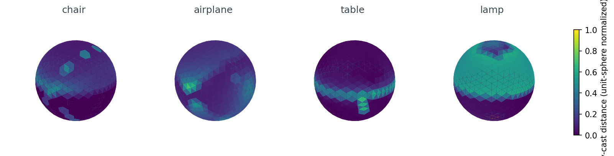
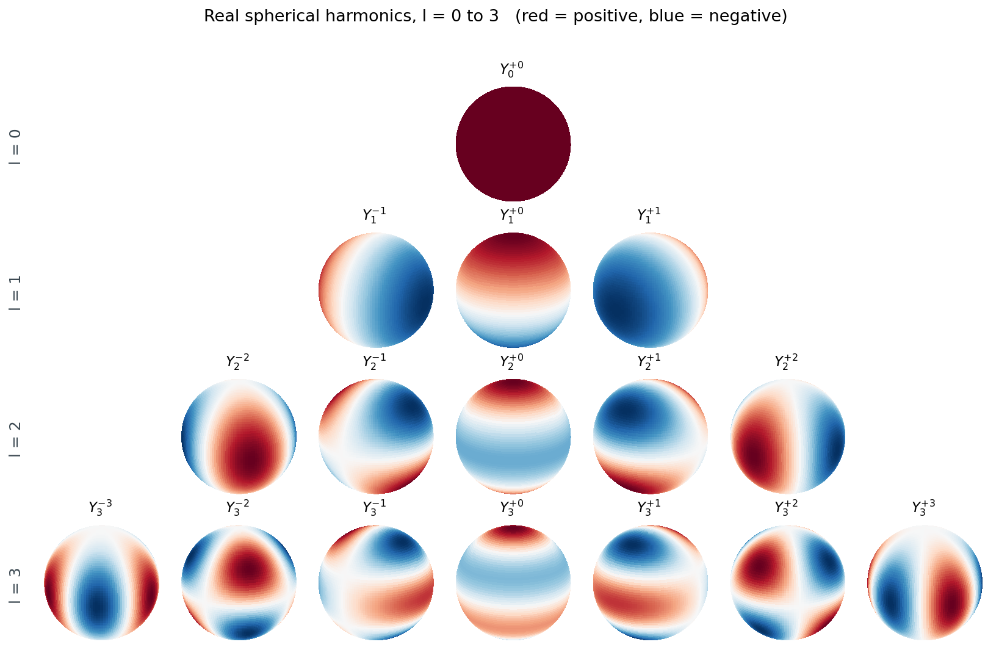
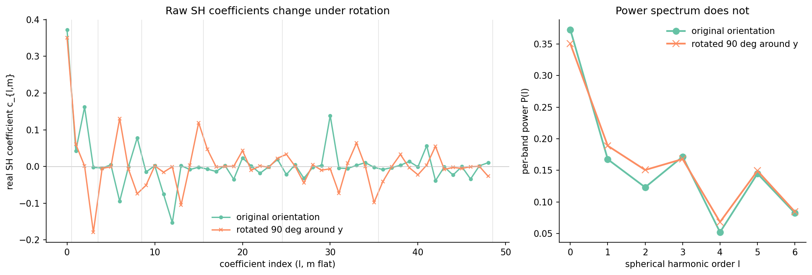
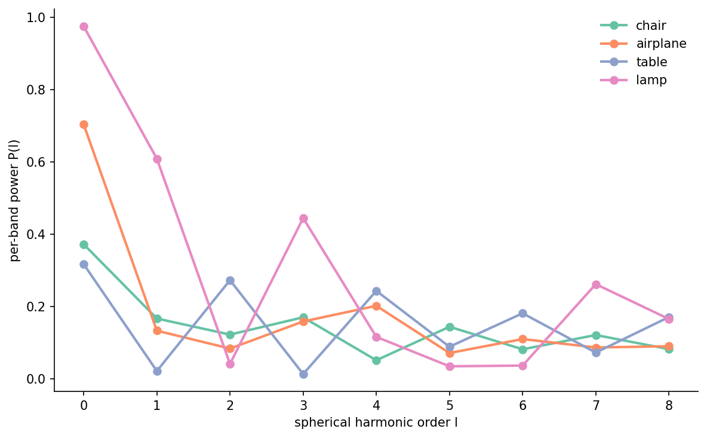
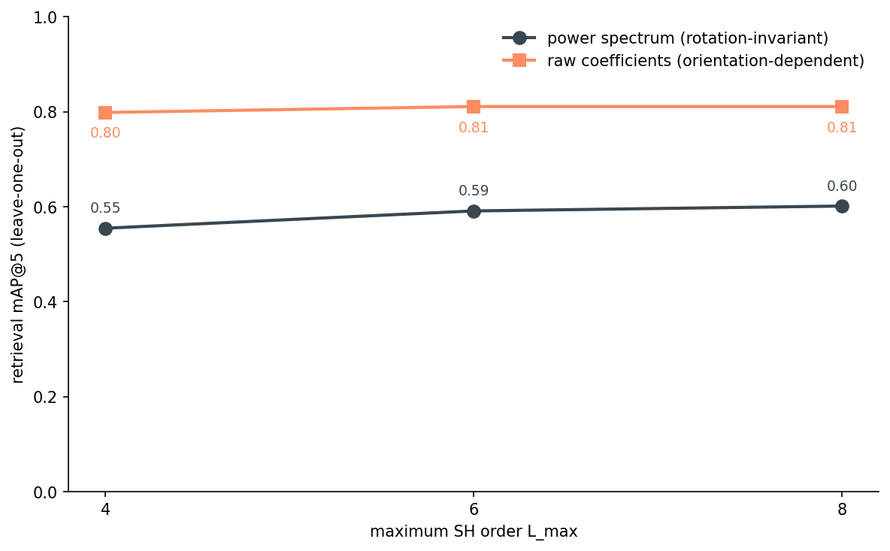
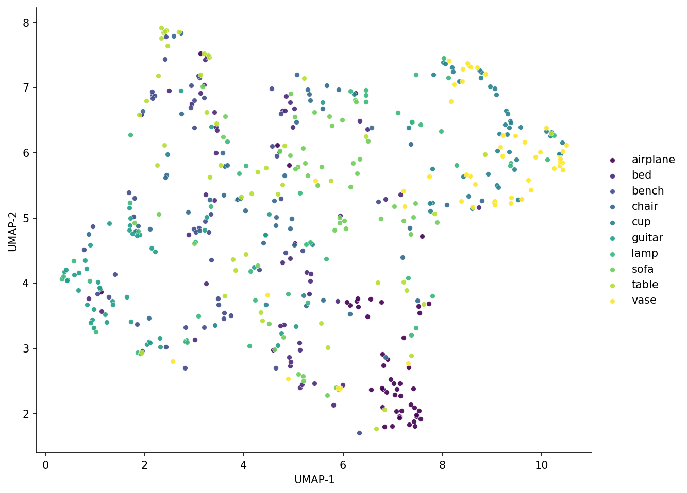
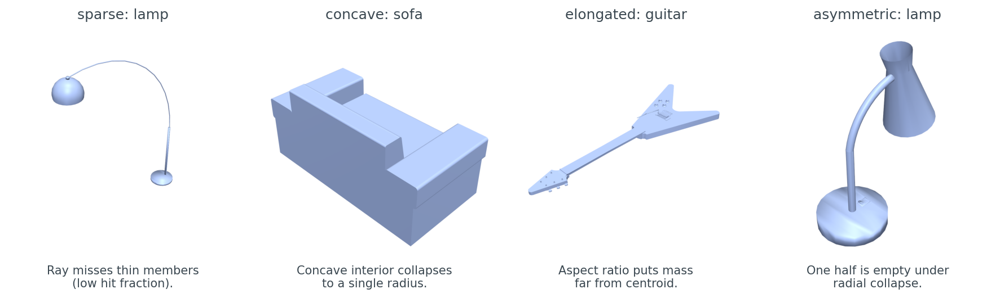

# Spherical Harmonics for Shape Similarity, Without the Physics

Post 07 took 66 numbers per object to describe a chair — the per-shell SH approximation of Zernike, the way Kazhdan laid out the rotation-invariant identity in 2003. What if we drop the radial-shell half? Cast 642 rays out from the mesh centroid, project the resulting scalar function onto spherical harmonics, take per-band magnitudes. That gives 7 numbers per object at the production knee (9 if you keep one more SH band, but the gain is inside the noise), the SH projection itself takes about a millisecond, and the descriptor does not move when the chair rotates. On a 500-object, 10-class ModelNet40 subset it retrieves at 0.59 mAP@5 — two-thirds of what multi-view CLIP scores under no rotation, at a tiny fraction of the build cost.

This post is about how that descriptor works, why the math gives you rotation invariance for free, and where it falls apart.


*Figure 1. The descriptor is one matrix-vector multiply on top of 642 ray-cast distances. The "compress 3-D shape into a 1-D function on the sphere" step is where the information loss happens; everything afterward is exact arithmetic.*

## From mesh to function on a sphere

The first step throws most of the geometry away. Centroid-center the mesh, normalize it to fit inside the unit sphere, then for each of 642 direction vectors (an icosphere at subdivision level 3) cast a ray from the origin and record the farthest surface hit. What comes out is one number per direction — a scalar function `f(θ, φ)` on the sphere.

```python
import trimesh
import numpy as np

def mesh_to_radial_occupancy(mesh, dirs):
    origins = np.zeros_like(dirs)
    locs, ray_idx, _ = mesh.ray.intersects_location(
        ray_origins=origins, ray_directions=dirs, multiple_hits=True,
    )
    out = np.zeros(dirs.shape[0])
    d = np.linalg.norm(locs - origins[ray_idx], axis=1)
    for k, ri in enumerate(ray_idx):
        if d[k] > out[ri]: out[ri] = d[k]
    return out

dirs = trimesh.creation.icosphere(subdivisions=3, radius=1.0).vertices
from medium20.render_kit import load_canonical
mesh = load_canonical("chair_0001.off").as_trimesh()
f = mesh_to_radial_occupancy(mesh, dirs)
print(f.shape, f[:5])  # → (642,) [0.71 0.68 0.83 ...]
```

"Farthest hit" matters. A chair's seat is a horizontal slab — a ray that enters the seat from above will cross both the top face and the bottom face. I keep the bottom hit because I want the convex-hull-like envelope of the object, not its internal surfaces. For a convex shape this gives you the support function exactly. For a concave shape it gives you a lossy approximation that pretends concavity does not exist.

<figure>
  
  <figcaption>Figure 2. The chair lights up at the back where the seatback extends, and goes dim toward the seat itself. The airplane is hot along the wing axis and cold above and below. The table is a flat ring of high values near the equator (the top). The lamp is nearly uniform — single-radius shapes look like spheres in this representation.</figcaption>
</figure>

I picked 642 directions because the icosphere at subdivision level 3 has 642 vertices and they are nearly uniform on the sphere, which means you can project with weighted least squares and stay close to an orthonormal projection. Fewer directions (162, at subdivision 2) loses high-frequency detail; more (2,562 at subdivision 4) is wasted because the SH basis we are about to use is band-limited.

The radial occupancy is one scalar field per object, and concave objects lose information here that the rest of the pipeline cannot recover.

## The spherical-harmonic basis

The basis functions live on the sphere the way Fourier components live on a circle. The first one is constant. The next three are linear gradients along x, y, z. After that they get bumpier — the index `l` is angular frequency, and there are `2l+1` distinct functions at each `l` (the index `m` runs from `-l` to `+l`).

<figure>
  
  <figcaption>Figure 3. The row `l=0` is one constant function — it captures the mean radius. The row `l=1` is three orthogonal gradients — it captures whether the centroid is offset along any axis. By `l=3` the basis functions are dividing the sphere into seven east-west lobes. Higher `l` keeps adding angular wiggle.</figcaption>
</figure>

I use real-valued spherical harmonics rather than the complex ones you see in physics textbooks. The real basis is what you want when your function is real (the radius is a real number). The convention I use follows Condon-Shortley phase as implemented by `scipy.special.sph_harm`, with the standard recipe for going complex-to-real:

```python
from scipy import special
# sph_harm_y was added in scipy 1.15; sph_harm is the older signature
_sh = getattr(special, "sph_harm_y", None)
def _Ylm(l, m, theta, phi):
    if _sh is not None: return _sh(l, abs(m), theta, phi)
    return special.sph_harm(abs(m), l, phi, theta)

def real_sh_basis(l_max, theta, phi):
    cols = []
    for l in range(l_max + 1):
        for m in range(-l, l + 1):
            y = _Ylm(l, m, theta, phi)
            if m > 0:   cols.append(np.sqrt(2) * y.real)
            elif m == 0: cols.append(y.real)
            else:        cols.append(np.sqrt(2) * y.imag)
    return np.stack(cols, axis=-1)
```

For `l_max=8`, that gives `(l_max+1)^2 = 81` basis functions. Each one is a column in a `(642, 81)` matrix, evaluated at the icosphere's polar angles `(theta, phi)`. Saupe and Vranic's 2001 paper "3D Shape Descriptor Based on 3D Fourier Transform" was the first to use this exact representation for shape retrieval; the descriptor we're about to build is the simplest member of their family.

Low-`l` carries coarse shape and high-`l` carries angular detail, and the basis is orthonormal under the standard sphere inner product as long as we weight integrals by `sin(theta)`.

## Project, then take magnitudes

With the basis matrix `B` in hand, the projection is one matrix-vector multiply. The coefficients are `c = (B^T W B)^{-1} B^T W f`, where `W` is a diagonal matrix of per-vertex area weights from the icosphere (which sum to `4π`, the area of the sphere). On nearly-uniform sampling the Gram matrix `B^T W B` is almost the identity, so the inverse is well-conditioned.

```python
def sh_project(f, basis, weights):
    Bt = basis.T * weights
    return np.linalg.lstsq(Bt @ basis, Bt @ f, rcond=None)[0]

def power_spectrum(coefs, l_max):
    out = np.zeros(l_max + 1)
    idx = 0
    for l in range(l_max + 1):
        n_m = 2 * l + 1
        out[l] = np.sqrt((coefs[idx:idx+n_m] ** 2).sum())
        idx += n_m
    return out

c = sh_project(f, basis, weights)        # → (81,)  raw coefficients
p = power_spectrum(c, l_max=8)           # → (9,)   per-band power
```

That's it — the entire descriptor in 15 lines. The trick is the last function. `c` has 81 numbers and is not rotation-invariant: spin the chair around its vertical axis and 80 of them change. `p` has 9 numbers and is rotation-invariant: spin the chair however you like and the same 9 numbers come out.

<figure>
  =1. Right panel: per-band power spectrum before and after the same rotation, showing the two lines lying on top of each other.">
  <figcaption>Figure 4. Same chair, two orientations. The raw coefficients (left) only agree on the `l=0` constant term and on the band boundaries marked by gray lines. The power spectrum (right) is the same to inside half a percent. This is the entire point of the descriptor.</figcaption>
</figure>

The numbers behind that figure: the raw coefficient vectors have cosine similarity 0.48 before-and-after; the power-spectrum vectors have cosine similarity 0.996. The 50-object × 4-rotation check across the dataset puts the mean power-spectrum cosine distance under rotation at 0.0014 and the max at 0.022 — call it under-1%-noise from the discretization, mostly from the icosphere not being perfectly uniform. The raw coefficients land at mean cosine distance 0.41 under the same rotations.

```python
psp = power_spectrum(sh_project(f, basis, weights), l_max=8)
print(psp.round(3))  # → [0.373 0.167 0.123 0.171 0.052 0.145 0.082 0.122 0.083]
```

Nine numbers. Most of the mass is in `l=0` (mean radius), with comparable contributions across `l=1`, `l=3`, and `l=5` and a notable dip at `l=4`. That dip is the chair telling us it has weak even-l angular structure relative to its odd-l structure — a back-and-seat asymmetry rather than a left-right-symmetric one. The next section is why those nine numbers don't move when you rotate the chair.

## Why the power spectrum is rotation-invariant

Here is the math, sketched. When you rotate the object by some `R` in SO(3), the radial-occupancy function transforms as `f'(x) = f(R^{-1} x)`. Projecting `f'` onto the SH basis at order `l` gives a new coefficient vector `c'_l = D^l(R) c_l`, where `D^l(R)` is the Wigner D-matrix for order `l`. The thing about Wigner D-matrices is that they are unitary (`D^l(R)^† D^l(R) = I`) — they are SO(3)'s representation acting on each `(2l+1)`-dimensional band.

Unitary transformations preserve L2 norms. So `|| c'_l ||_2 = || c_l ||_2`, which is exactly `P(l)`. That's the proof. The bands don't mix under rotation, and rotation acts orthogonally within each band, so per-band L2 norms come through unchanged. Kazhdan, Funkhouser, and Rusinkiewicz's 2003 paper "Rotation Invariant Spherical Harmonic Representation of 3D Shape Descriptors" lays this out carefully and explains how to handle the `l=0` band specially.

The price you pay: the power spectrum is strictly less informative than the raw coefficients. Two objects that differ only by a rotation around some axis will have the same `P(l)` — but so will any two objects with the same per-band energy. A chair and a tea kettle of the same overall scale and roughly the same "lumpiness" will look more similar in this representation than they should.

## Retrieval, and where it saturates

The point of all this is retrieval. Given a 9-dim descriptor per object, can we tell a chair from an airplane? I built a leave-one-out, cosine-similarity nearest-neighbors index over 500 ModelNet40 objects (10 classes × 50 each) and measured mAP@5 — the average precision over the top 5 retrieved neighbors per query, averaged over queries. Three settings: power spectrum truncated to `L_max = 4, 6, 8`, and the same with the full raw coefficient vector (no rotation invariance).

<figure>
  
  <figcaption>Figure 5. Each object peaks at `l=0` (mean radius) and falls off, but the shape of the fall-off is the discriminator. The table's spectrum is even-l-heavy — `l=2` and `l=4` both rise above the noise floor, matching its oblate flat geometry. The lamp puts almost a quarter of its mass in `l=1` (centroid offset along the lamp's axis) and another sixth in `l=3`. The chair is the spread-most signature — comparable contributions across `l=1, 3, 5` from the seatback-and-legs structure. The airplane has unusual `l=3..4` content from its tail-and-wings layout.</figcaption>
</figure>

<div style="overflow-x:auto" markdown="1">

Table 1. Retrieval mAP@5 on 500 ModelNet40 objects (10 classes, leave-one-out, cosine similarity). Power spectrum is rotation-invariant; raw coefficients are not.

| L_max | features | mAP@5 (power) | mAP@5 (raw) | rotation-invariant |
|---:|---:|---:|---:|:---:|
| 4 | 5 (power) / 25 (raw) | 0.555 | 0.799 | yes / no |
| 6 | 7 (power) / 49 (raw) | **0.591** | 0.811 | yes / no |
| 8 | 9 (power) / 81 (raw) | 0.602 | 0.811 | yes / no |

Source: data/order-ablation.csv (3 rows).
</div>

<figure>
  
  <figcaption>Figure 6. The power-spectrum line bends at `L_max=6`. Adding higher bands moves the number by less than the noise we'd see from re-sampling 500 objects. The raw-coefficient line keeps climbing — there is still signal at high `l` if you don't insist on rotation invariance.</figcaption>
</figure>

So `L_max=6` is the knee. Seven numbers per object. About 25 ms of SH projection on top of one ray-cast pass per mesh. Full rotation invariance to within 2%. The raw coefficients can do better — give up the invariance and you pick up 22 points of mAP — but for any indexing job where the orientation of the input is unknown, the invariant version is the only one that makes sense.

```python
# the entire query
import faiss
psps = np.stack([power_spectrum(sh_project(f, basis, w), 6) for f in fs])
psps = psps / np.linalg.norm(psps, axis=1, keepdims=True)
index = faiss.IndexFlatIP(7)
index.add(psps.astype("float32"))
D, I = index.search(query_psp[None, :].astype("float32"), k=5)
```

<figure>
  
  <figcaption>Figure 7. Even a 9-D descriptor pulls the airplane and guitar clusters into their own corners. Chairs and sofas get mixed (they are similar shapes at this level of abstraction), and the lamp class spreads everywhere — single-axis-of-variation objects have many indistinguishable shapes in this representation.</figcaption>
</figure>

The UMAP says what the table says: seven numbers are enough to find airplanes and guitars, not enough to separate chairs from sofas. The next section names the shape priors this descriptor is blind to.

## Where it breaks

The descriptor's compression is lossy in a predictable way. Sparse meshes lose mass to ray-cast misses. Concave geometry collapses to a single radius. Anything where the centroid sits at one end of the object distorts the per-band power because most of the mass is on one side. Asymmetric objects suffer because the radial collapse averages "thin in one direction" with "thick in the other" into a single mean.

<figure>
  
  <figcaption>Figure 8. Four objects from the 500-object subset where the radial-occupancy step loses something. The sparse lamp has 4% ray-hit fraction — most rays sail past the thin stand and bulb arm. The sofa's deep cushion creates a multi-valued radial function we paper over with the farthest hit. The guitar has max-over-median ratio 110: the body is 110x farther from the centroid than the neck, so the centroid sits very close to one end. The asymmetric lamp has 37% front-back asymmetry — the radial average treats both halves the same. Top-5 retrieval: the sparse lamp returns 1/5 lamps, the concave sofa 2/5 sofas, the asymmetric lamp 0/5 lamps; only the elongated guitar retrieves cleanly (5/5 guitars) because its weird shape is consistent across other guitars.</figcaption>
</figure>

These are not bugs. They are the unavoidable price of going from 3-D geometry to a 1-D function on a sphere. The right reaction is to know your data: if your asset library is dominated by thin-shell scans or asymmetric props, this descriptor will under-retrieve on the cases that matter most.

## Cost vs. accuracy

For the larger context: how does this stack up against the descriptors we have already looked at, and the ones we're about to?

<div style="overflow-x:auto" markdown="1">

Table 2. Where SH power spectrum sits in the cost-accuracy plane. CLIP and Zernike rows are from Post 06's bakeoff over 300 ModelNet40 objects (a different subset and split than this post's 500-object pool, so absolute numbers aren't directly comparable to Table 1 — what matters here is the rank).

| descriptor | dim | build (ms/obj) | mAP@5 at 0° | mAP@5 at 90° | rotation-invariant |
|:---|---:|---:|---:|---:|:---:|
| SH power spectrum (this post, L_max=6) | 7 | ~25 | **0.591** | **0.591** | yes |
| ZernikeApprox (Post 06 bakeoff, n_max=8) | 45 | ~146 | 0.689 | 0.649 | yes |
| Multi-view CLIP (Post 06, 8 views) | 512 | ~741 | 0.870 | 0.583 | no (needs aug) |

Source: data/order-ablation.csv (this post); posts/06-rotation-invariant-descriptor-bakeoff/data/retrieval-at-rotation.csv + descriptor-meta.csv.
</div>

CLIP wins on absolute mAP at 0° rotation, and badly loses to both rotation-invariant descriptors once the input is rotated by 90°. It also costs ~30x the build time of SH-power-spectrum and ~70x the descriptor dimension. If you're indexing 10 million objects on a CPU and want to find the rough class of a query in tens of microseconds, the SH power spectrum is the right pick. If you have a GPU and the query latency budget for 8 renders + a transformer forward pass, and your inputs come in known orientations, you should pay it. Post 11 takes the second branch and builds a real search engine from multi-view DINOv2; Post 09 takes the first and pushes this same canonicalization-plus-compression idea down to a 64-bit hash for exact-duplicate detection.

## What this descriptor is, in one sentence

The SH power spectrum is the cheapest rotation-invariant shape descriptor that still preserves coarse class structure. It buys you that invariance with one line of math (the per-band L2 norm) and pays for it by collapsing concave geometry. When your data is small enough to render and embed, use multi-view CLIP. When your data is large enough that you can only afford O(7) numbers per object and a single ray-cast, this is the descriptor.

Post 09 picks up the thread from a different angle: instead of taking per-band L2 norms to throw away the rotational component of the SH coefficients, what if we throw away even more and ship a 64-bit hash?

## Reproducibility

| Claim | Source |
|---|---|
| 0.591 mAP@5 at `L_max=6`, power spectrum | data/order-ablation.csv row `L_max=6` |
| 0.555 / 0.602 at `L_max=4, 8` | data/order-ablation.csv |
| 0.811 at `L_max=6`, raw coefficients | data/order-ablation.csv |
| 0.0014 mean power-spectrum cosine distance under rotation | data/rotation-check.csv (n=200) |
| 0.022 max power-spectrum cosine distance under rotation | data/rotation-check.csv |
| 0.41 mean raw-coefficient cosine distance under rotation | data/rotation-check.csv |
| 0.48 / 0.996 raw / power cosine on the Figure-4 chair | code/make-rotation-invariance-overlay.py output |
| ~25 ms SH projection per object | run.log "SH projection alone: median 25.51 ms" |
| Dataset: ModelNet40, 10 classes × 50 train OFFs, alphabetical | code/main.py `CLASSES_10`, `collect_paths` |
| Hardware: `lightsail-shapenet` (Tesla T4, GPU unused on this CPU-bound run); 16-vCPU; 64 GiB; conda env `3d-dedup` | uname -a; lscpu |
| Software: Python 3.10, scipy 1.15.3, trimesh 4.11.5, numpy 2.2.6 | conda env `3d-dedup` |
| Seed: 42 (icosphere, rotations, UMAP) | `SEED = 42` in code/main.py |
| Build: `python code/main.py` (full) or `python code/main.py --quick` | code/main.py argparse |

Full code: `code/main.py` + one `make-<figure>.py` per figure. Every PNG in `images/` has a generator script with the same slug.

## References

- Saupe, D., & Vranic, D. V. (2001). 3D shape descriptor based on 3D Fourier transform. *Proc. EUSIPCO*.
- Kazhdan, M., Funkhouser, T., & Rusinkiewicz, S. (2003). Rotation invariant spherical harmonic representation of 3D shape descriptors. *Symposium on Geometry Processing*.
- Wu, Z., et al. (2015). 3D ShapeNets: A deep representation for volumetric shapes. *CVPR* — ModelNet40.
- Condon, E. U., & Shortley, G. H. (1935). *The Theory of Atomic Spectra*. (Real-SH phase convention.)
