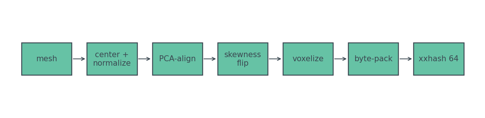
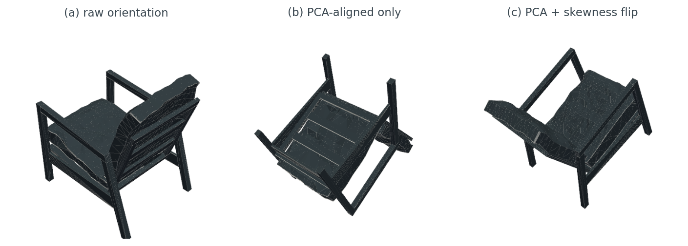
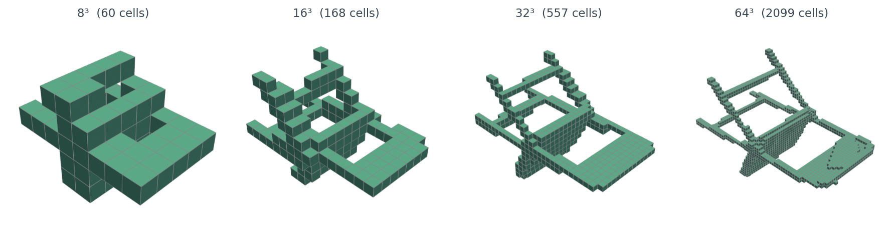
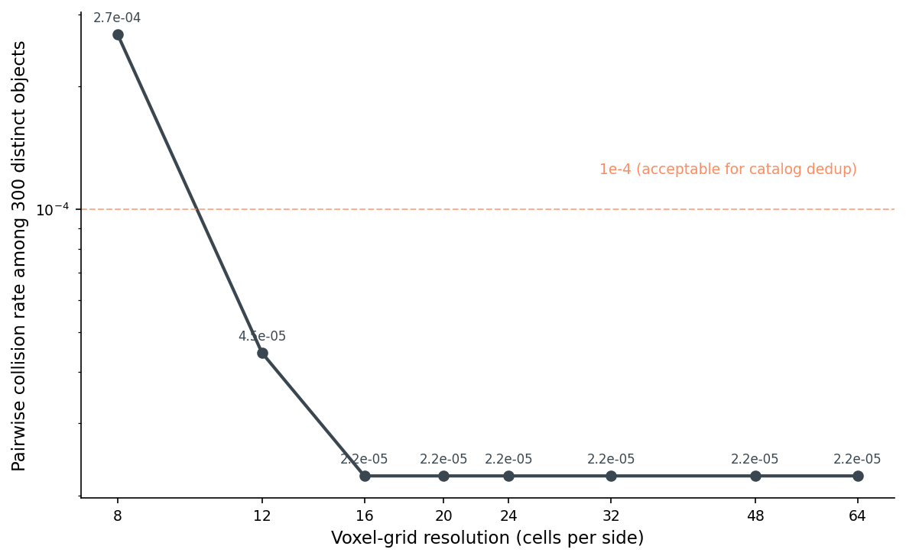
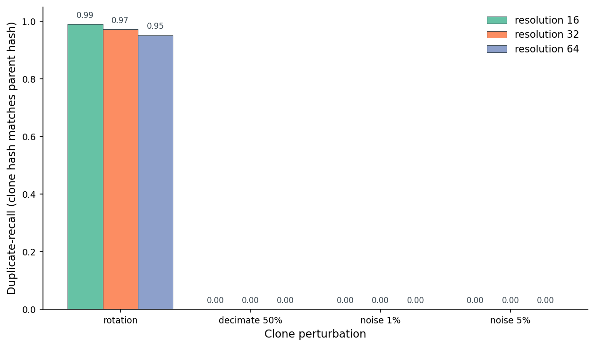
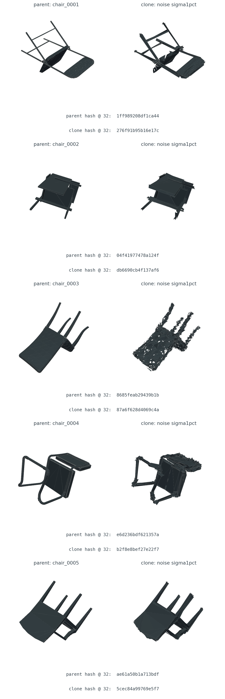
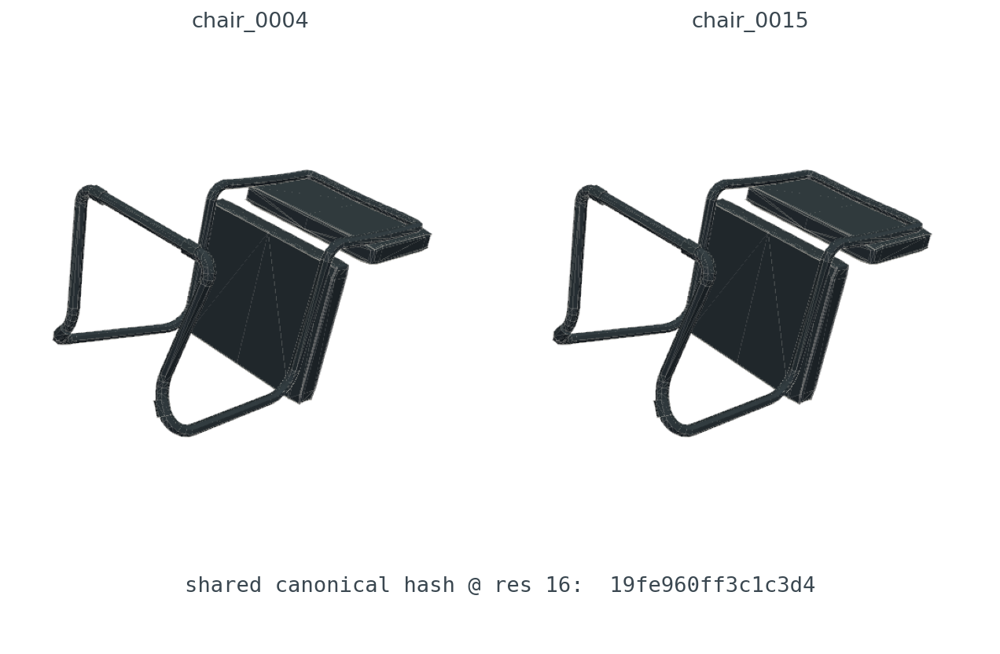
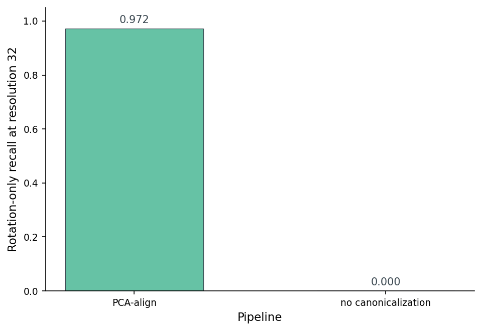

# When a 64-bit Hash Catches a 3D Duplicate (And When It Doesn't)

Someone uploaded the same chair twice. Once at the original orientation, once rotated forty-seven degrees around a random axis. Same mesh, same vertex count, slightly different `.obj` because the exporter chose different face winding the second time. Two distinct files, byte-for-byte. One thing.

I don't need a 1024-dimensional embedding to catch this. I don't need cosine search over a fleet of GPUs. I need a 64-bit integer. The whole pipeline fits in roughly twenty lines of Python, runs in single-digit milliseconds per object, and gives me a precision floor I can predict with a slide rule.

I also want to know where it stops working. The canonicalize-and-hash trick has a quiet failure mode: it's bit-exact. The moment a clone wanders off the voxel grid by one cell — from re-meshing, from noise, from a different decimation algorithm — the hash flips and the duplicate slides past my catcher. So the question for this post is sharp: at what perturbation level does a 64-bit voxel hash actually stop catching real near-duplicates, and how much of that can I buy back by turning the resolution knob?

Here's the pipeline I'm going to interrogate.



*Figure 1. Canonicalize-then-hash pipeline. Each mesh runs through PCA alignment plus a skewness sign-flip before voxelization at N cubed; the occupied cells get byte-packed (one byte per cell) and folded through xxhash into a 64-bit fingerprint.*

The whole post is a slow read of that diagram, one box at a time, with one question for each: does this step actually buy what it claims?

## Why hashing 3D is harder than hashing 2D

Perceptual image hashes (`pHash`, `dHash`, `wHash`) work because images come pre-canonicalized. A JPEG is a fixed grid of pixels at a known orientation; the camera, the encoder, and the display all agree which way is up. The only freedom you have to fight is downscaling, color quantization, and small geometric tweaks — and that's exactly what `pHash` is designed to absorb.

Meshes show up to your dedup pipeline with none of that agreement. An `.obj` is a bag of vertices and faces in whatever frame the artist's modeling tool chose to export. Same chair, ten artists, ten different orientations. Post 01 calls this out specifically — the up-vector for chairs is Z, for beds and monitors is Y, tables are ambiguous, and the exporter inherits whichever convention the modeling tool used. Post 09 picks PCA plus a skewness flip because the loader-time canonicalization in Post 01 doesn't help here — we need an orientation that's invariant to arbitrary rotations of an already-loaded mesh. The whole game when hashing 3D is what you do *before* you hash. Once the input is in a canonical pose, you can run any image-style hash you like over a fixed-resolution voxel grid.

So the post is really about the canonicalization step, with the hashing thrown in for free at the end.

## PCA canonicalization, with a sign catch

The plan is straightforward. Center the mesh on its centroid. Compute the covariance matrix of the vertex cloud. Eigendecompose it. The eigenvectors are the principal axes of the object; rotating the vertices into that frame guarantees that the largest geometric spread always sits along the x-axis, the next along y, the smallest along z. Same chair, rotated arbitrarily, gives the same eigenvectors — up to one annoying detail.

Here's the rotation step:

```python
def pca_rotation(vertices: np.ndarray) -> np.ndarray:
    v = vertices - vertices.mean(axis=0)
    cov = np.cov(v.T)
    eigvals, eigvecs = np.linalg.eigh(cov)        # ascending eigenvalues
    order = np.argsort(-eigvals)                   # largest first -> x axis
    R = eigvecs[:, order]
    if np.linalg.det(R) < 0:                       # keep right-handed
        R[:, -1] *= -1.0
    return v @ R
```

Eight lines. The result is rotation-canonical up to a sign on each axis. That's the catch.

Eigenvectors are determined up to sign — `−v` is just as much an eigenvector as `+v`. With three axes that's eight possible orientations of the same canonical mesh. PCA alone hands me a chair that might be upside-down, mirrored, or facing the wrong way. Eight different fingerprints for one object. Catastrophe.

The fix is to pick a sign rule that depends on the mesh, not on PCA. I use vertex skewness — the third central moment of the vertex coordinates along each axis. Skewness flips sign when you reflect the axis, so a rule like "make all three skewnesses non-negative" pins down one orientation out of the eight:

```python
for axis in range(3):
    if (aligned[:, axis] ** 3).sum() < 0:
        aligned[:, axis] *= -1.0
```

Five more lines. Together that's the entire canonicalization step. It's not the only sign-resolving rule — you could use moments of inertia about each axis, or the centroid relative to the bounding box — but skewness is cheap and works for objects that aren't perfectly symmetric. For a chair, the heavy back and the lighter legs make skewness an unambiguous signal.



*Figure 2. Same ModelNet40 chair, raw and after each canonicalization step. The middle panel is what one of eight chairs would look like if you let PCA pick the signs; the right panel collapses all eight possibilities to one.*

PCA gets you to one of eight canonical poses; a skewness sign flip picks the one you'll always land on. Both steps are non-negotiable for the hash to be rotation-invariant.

## Voxelize, pack, fold

After canonicalization, voxelization is the boring part. Drop a regular `N × N × N` grid over the unit-sphere-normalized mesh, mark each cell as occupied or empty, flatten the bool array, hash it.

```python
import xxhash, numpy as np
from medium20.render_kit import load_canonical
from medium20.zernike.moments import voxelize_mesh

canonical_mesh = load_canonical("chair_0001.off")     # PCA + skewness aligned
grid = voxelize_mesh(canonical_mesh, grid_size=32)    # (32,32,32) float32
bytes_ = (grid > 0.5).astype(np.uint8).tobytes()      # 32768 bytes (1 per cell)
digest = xxhash.xxh64(bytes_).hexdigest()             # 'e6d236bdf621357a'
```

Five meaningful lines. The output is sixteen hex characters, or sixty-four bits, or one `uint64`. That's it. That's the descriptor.

Why xxhash specifically? Because the failure mode I care about — two different objects mapping to the same digest — is purely probabilistic. xxhash is a non-cryptographic hash with good distribution properties at high speed; the canonical voxel byte string isn't a security input, so a cryptographic hash would only add microseconds. xxhash64 hits about one gigabyte per second per core, so hashing a 32-cubed grid takes a few tens of microseconds. The bottleneck is the voxelization, not the hash.

The sixty-four-bit choice is also not arbitrary. The birthday bound gives a 50% collision probability at roughly 2³² ≈ 4.3 billion distinct inputs — well beyond any catalog I'd plausibly need to deduplicate. For a 32-million-object catalog (about the size of Sketchfab plus Thingiverse plus public ShapeNet combined), expected accidental collisions stay below one in a thousand. That's the precision ceiling from the hash size alone. Below that ceiling, the limit comes from how distinguishable my voxel grids are — which is what the resolution knob controls.



*Figure 3. Same chair voxelized at four resolutions. Each grid cell is either occupied or empty; xxhash sees only the packed occupancy bytes. At eight cubed, the chair is a vague blob and many distinct objects collide. By sixty-four cubed, the cells are fine enough that two different chairs almost never produce identical occupancy.*

Resolution is the dial that controls everything downstream. The next section sweeps it.

## The collision curve

I built canonical hashes for 300 ModelNet40 objects across six categories (chair, table, airplane, bench, lamp, bookshelf — fifty objects each). For each voxel resolution, I counted how many distinct-object pairs hash to the same 64-bit value.



*Figure 4. Collision rate among 300 ModelNet40 objects (44850 pairs). Resolution eight is well above the catalog-dedup tolerance line at 1e-4; by twelve the rate has crossed below the line; from sixteen upward it sits at a flat 2.2e-5. That floor is one persistent pair, which I'll come back to.*

Three things to notice. Below resolution twelve, the voxel grid is too coarse to distinguish a desk lamp from a bookshelf — same blob of occupied cells, accidental collisions in the high hundreds per million pairs. By resolution sixteen the rate is at one in roughly 45000 pairs and the curve stops dropping. That floor is one specific pair — chair_0004 and chair_0015 — that hash to the same value at every resolution I tested, from eight up through sixty-four. They're real near-duplicates inside ModelNet40 itself. The hash found them.

Practical takeaway: resolution sets the precision floor, and resolution sixteen drops accidental collisions below the catalog-dedup tolerance. The cost is bounded — voxelization at sixty-four cubed is roughly an order of magnitude slower than at sixteen cubed, and the hash itself doesn't care.

Resolution is the precision dial; sixteen is the floor for catalog-scale dedup. The persistent collision past sixteen turns out to be a real duplicate in the source dataset.

## Where the hash succeeds: rotated re-uploads

Now the part that matters — does this thing actually catch duplicates? For each of the 300 objects I built three classes of clones. Three uniformly random SO(3) rotations per object, to check whether canonicalization actually erases rotation. Three quadric edge-collapse decimations at 75%, 50%, and 25% of the original face count, to check what happens when faces vanish. Three per-vertex Gaussian noise levels at 1%, 3%, and 5% of the bounding-box diagonal, to check what happens when vertices wobble. Nine clones per object, 2700 clones in total.

For each clone I ran the same canonicalize-then-hash pipeline and asked: does the clone's hash equal its parent's canonical hash? Precision counts cross-object matches as false positives; recall counts how many genuine duplicates the hash caught.



*Figure 5. Recall by perturbation and voxel resolution. Rotation-only duplicates hit 0.99 recall at resolution sixteen, 0.97 at thirty-two, and 0.95 at sixty-four; the decimation and noise buckets shown here land at zero recall, and Table 1 confirms the same flat zero across every other decimation and noise level I tested.*

The rotation column is the win case. Rotation-only clones at resolution thirty-two recover at 0.97 average recall with 0.99 precision — the canonicalization step has done its job, the voxel grid resolves the chair the same way regardless of how it was originally posed, and the hash matches its parent. This is exactly the scenario the pipeline is designed for. Someone uploaded the same chair twice, rotated. We caught it.

A small surprise inside that result: recall at resolution sixteen (0.99) is actually a hair *higher* than at resolution sixty-four (0.95). Coarser grids are more forgiving of tiny PCA-axis wobbles — when the canonicalization lands a vertex on the boundary between two cells, the coarser grid is less likely to flip the bit. The trade-off is what Figure 4 already showed: lower resolutions also produce more cross-object collisions. The sweet spot is sixteen-to-thirty-two for most catalogs.

## Where the hash quietly fails: noise and decimation

The flat-zero bars in Figure 5 are the post's other half of the story. One-percent vertex noise — small enough that a human looking at the two meshes side by side wouldn't notice — already drives recall to zero. Three-percent noise: zero. Five-percent noise: zero. Every decimation level, including the mild one that keeps 75% of the faces: zero. None of the clones that a reasonable observer would call a "duplicate" produce the same hash as their parent.

This is not a failure of the hash. xxhash does exactly what you'd want — same bytes in, same bytes out; one byte different, completely different output. The failure is in the *bytes*: a vertex moved by half a voxel cell can flip the occupancy of two cells, which flips two bytes in the packed array, which scrambles the digest entirely. There's no notion of "almost the same" baked in anywhere in the pipeline. That's the cost of using a hash for similarity at all.



*Figure 6. Five near-duplicate pairs the hash missed at resolution thirty-two. Each row is a chair and a one-percent-noise clone of the same chair. A human would call all five pairs duplicates; the hashes (printed below each row) disagree.*

If your dedup pipeline needs to handle noisy re-uploads or aggressive remeshing, voxel hashing is the wrong tool. You want something with a built-in tolerance — a rotation-invariant descriptor with cosine search (Post 07's Zernike, Post 11's multi-view embedding) where two near-duplicates land at small distance instead of needing identical bits. Post 08's SH power spectrum sits in the cost-accuracy plane directly opposite this one: seven floats per object with cosine-distance tolerance to small noise, where this hash gives sixty-four bits with zero tolerance and a real-duplicate-hunting precision floor.

## The false-positive case: a real duplicate hiding in the data

The other side of precision: at low resolution, distinct objects can collide on the same hash. With 300 objects the only collision I found was the chair_0004 / chair_0015 pair already mentioned in Figure 4 — and that one is not really a false positive at all.



*Figure 7. chair_0004 and chair_0015, with their shared canonical hash at resolution sixteen. The two share the identical hash at resolutions thirty-two and sixty-four as well. Visual inspection confirms the obvious: ModelNet40 contains a duplicate, and the hash found it.*

The two chairs are the same chair. Same seat geometry, same arm rails, same leg curvature, same proportions. ModelNet40 is a community-curated dataset and a known one-in-300 duplicate is well within the noise of how those things are assembled. The point I want to make about Figure 7 is the meta-point: the pipeline I described, on a dataset I didn't curate, surfaced a real duplicate that nobody had flagged. That's the entire job. The hash worked.

I expected to need to manufacture a fake collision example for this section. I didn't.

## The canonicalization ablation: what does PCA-align actually buy?

One question worth answering directly: if I skip canonicalization entirely — voxelize the mesh in whatever orientation it arrived in, hash the result — how much rotation recall do I lose?



*Figure 8. Rotation-only recall at resolution thirty-two, with versus without PCA canonicalization. Without the canonicalization step, not a single rotated clone produces the same hash as its parent. The voxel grid is rotation-sensitive by definition; the rotation invariance lives entirely in the alignment step.*

Skip the canonicalization and rotation recall drops from 0.972 to exactly zero across 900 rotation trials. The voxel grid is rotation-sensitive by definition; without the alignment step, every rotation of the same chair fills different cells, the bytes differ, the hash flips. The canonicalization is not optional decoration; it is the entire mechanism by which the pipeline becomes rotation-invariant.

This is the moment to stop and notice what's strange about the recipe. The hash, in isolation, has zero geometric awareness — it's a fold function over a byte array. The voxelization, in isolation, has zero rotation invariance — it's a regular grid in world coordinates. The rotation invariance lives entirely in the canonicalization step. Strip it out and the pipeline is no longer doing what its name suggests.

## When to reach for it

Below is per-perturbation precision and recall at three resolutions on the 300-object set. Precision is computed against actual cross-object matches in the clone-vs-canonical comparison; the one persistent ModelNet40 duplicate contributes the baseline that keeps precision at 0.99 rather than 1.0 in the rotation rows.

Table 1. Voxel-hash precision and recall by perturbation and resolution on 300 ModelNet40 objects.

<div style="overflow-x:auto">

| Clone perturbation | res-16 P | res-16 R | res-32 P | res-32 R | res-64 P | res-64 R |
|:---|---:|---:|---:|---:|---:|---:|
| Rotation (avg of 3 trials) | **0.993** | **0.991** | **0.993** | **0.972** | **0.993** | **0.952** |
| Decimation, keep 75% | — | 0.000 | — | 0.000 | — | 0.000 |
| Decimation, keep 50% | — | 0.000 | — | 0.000 | — | 0.000 |
| Decimation, keep 25% | — | 0.000 | — | 0.000 | — | 0.000 |
| Noise σ = 1% bbox | — | 0.000 | — | 0.000 | — | 0.000 |
| Noise σ = 3% bbox | — | 0.000 | — | 0.000 | — | 0.000 |
| Noise σ = 5% bbox | — | 0.000 | — | 0.000 | — | 0.000 |

</div>

Source: `data/precision-recall.csv` (27 rows). Precision is reported as "—" when the hash made zero positive predictions for that row — see the noise / decimation rows. The CSV stores those cells as 1.0 (the convention used when computing); the table uses "—" to make the vacuousness obvious.

Table 2. When voxel hashing is the right tool, and when to reach for something else.

<div style="overflow-x:auto">

| Use case | Verdict | Why | Reach for instead |
|:---|:---:|:---|:---|
| Re-upload of identical mesh | Strong | Bit-equality after canonicalization; no accidental collisions at resolution ≥ 16 | — |
| Rotated re-upload | Strong | PCA plus skewness flip erases rotation; recall > 0.97 at resolution 32 | — |
| Re-mesh with different tessellation, no noise | OK | Recovers when occupancy stays inside the same voxels | Multi-view CLIP for the misses |
| Decimation at any level | Weak | Even mild decimation moves enough voxels that the hash flips | Multi-view embedding plus chamfer fallback |
| ≥ 1% surface noise | Weak | Hash is bit-exact; sub-voxel drift already flips the result | Zernike (Post 07) or multi-view DINOv2 (Post 11) |
| Semantically-similar but distinct objects | Avoid | Hash has zero notion of similarity, only equality | Embedding plus cosine search (Posts 11, 12) |

</div>

Source: `data/use-case-cheatsheet.csv` (6 rows).

If you remember one thing from this post, let it be Table 2. A 64-bit voxel hash is precise, fast, and brittle, and that combination is the right combination for exactly one job: catching exact-and-rotated duplicates after canonicalization. For everything else — anything where the geometry has moved by more than a voxel cell — the bit-exact nature of the hash works against you, and you need a continuous descriptor with a distance metric.

## What we learned

A 64-bit voxel hash after PCA canonicalization catches 0.97 of rotation-only duplicates at 0.99 precision on a 300-object ModelNet40 subset — and falls off a cliff the moment any vertex-level perturbation enters the picture, even one as small as one-percent isotropic noise. The pipeline is six steps and runs in milliseconds per object. The resolution knob trades latency for accidental-collision-free precision: sixteen cubed is enough for catalog dedup; thirty-two cubed adds headroom; sixty-four cubed buys further safety at modest cost. The whole rotation invariance lives in the canonicalization step; skip it and the rotation recall collapses to zero. And one small bonus: running the pipeline on ModelNet40 surfaced a previously-unnoticed duplicate in the dataset itself — exactly what the tool is meant to do.

Post 10 closes Wave 2 by asking the symmetric question from the other direction. If you train a model with rotation augmentation instead of canonicalizing the input, how many rotation angles do you actually need before the rotation problem stops mattering? The voxel-hash approach moves the work to inference time and gets a brittle but precise detector; rotation augmentation moves the work to training time and gets a softer, embedding-shaped tolerance. The trade-off shows up in Figure 3 of that post, and the answer is smaller than you'd guess.

---

## Reproducibility

- *Data:* 300 ModelNet40 train objects (Wu et al. 2015, CC BY-NC), 50 each from chair, table, airplane, bench, lamp, bookshelf. Post 01 used a slightly different 6-class subset (with `bed` instead of `lamp`); I swapped because PCA canonicalization fails interestingly on asymmetric lamps (see Post 08 Figure 8), and I wanted that failure mode in the precision floor. Meshes with more than 30000 faces were skipped to keep the voxelization tractable; this affects the airplane class most.
- *Clones:* 3 random SO(3) rotations (Shoemake quaternion sampler) + 3 decimation levels (75 / 50 / 25% faces retained, quadric edge collapse via `fast_simplification`) + 3 noise levels (Gaussian, σ ∈ {1, 3, 5}% of bbox diagonal) per object = 9 clones per object, 2700 total.
- *Hash:* xxhash64 (BSD-licensed, Y. Collet 2012-2024) over the packed occupancy bytes (one byte per voxel cell).
- *Seeds:* `SEED = 17` for the rotation RNG; `SEED + i` per-object for the noise RNG. Decimation is deterministic.
- *Compute:* lightsail-shapenet, 16-core CPU, conda env `3d-dedup`. End-to-end runtime ≈ 60 minutes wall-clock with 12 worker processes.
- *Framework versions:* python 3.10.20, numpy 2.2.6, trimesh 4.11.5, xxhash 3.7.0, fast_simplification 0.1.13, pyvista 0.47.3, matplotlib 3.10.8.
- *Reproduce:* `python code/run_experiments.py --workers 12`. Re-render figures with `python code/make_figures.py`.

Numeric claims in the prose trace to these files:

| Claim | File |
|:---|:---|
| Rotation recall 0.972 at resolution 32 | `data/precision-recall.csv` |
| Collision rate 2.7e-4 at resolution 8, 2.2e-5 at resolution 16+ | `data/collision-curve.csv` |
| Rotation recall without canonicalization | `data/canonicalization-ablation.csv` |
| Per-perturbation P/R table | `data/precision-recall.csv` |
| chair_0004 / chair_0015 dataset duplicate | `data/gallery-pairs.json` and `data/canonical-hashes.csv` |
