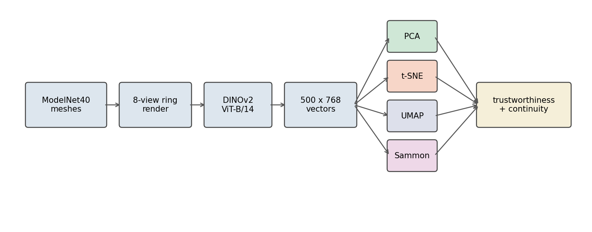
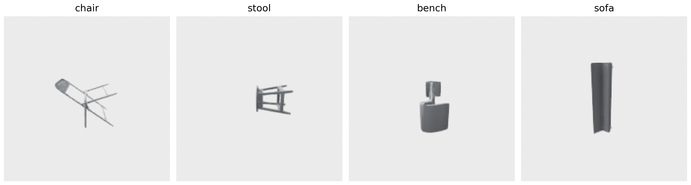

# When t-SNE Lies About Your 3D Embeddings (And Sammon Tells the Truth)

I have a folder of 500 ModelNet40 objects — 25 each of chairs, stools, sofas, beds, cars, planes, twenty classes in total. (Twenty rather than the 10 I used in Post 05 — I wanted enough colours in the legend for the t-SNE class-merging behaviour to actually show up.) I rendered each from 8 angles, ran every render through DINOv2 ViT-B/14, and mean-pooled the views down to one 768-dimensional vector per object. Five hundred vectors, twenty classes, the kind of pool you'd build before asking "are these two chairs near-duplicates?"

Then I projected those vectors to 2D four ways: PCA, t-SNE, UMAP, and Sammon mapping. The same 500 vectors. Four pictures.




Three of the four panels are seductive. t-SNE in particular looks like it knows something — clean blobs, clear separations, an honest legend. The Sammon panel looks worse. Less structure, more overlap, fewer of those crisp visual islands.

Now read the next sentence carefully: of the four projections, Sammon is the one preserving the most information about the original 768-D distances. The t-SNE picture is prettier *because* it's hiding the truth.

## The controlling question

When you stare at a 2D plot of a high-dimensional space, how much of what you're seeing is the embedding's structure, and how much is the projection algorithm's lie? Specifically: if you ask "is chair A closer to chair B than to sofa C?" in the embedding, can you read the answer off the picture?

The answer depends on the algorithm, and the gap is much bigger than most readers think.

## What "preserves the metric" actually means

Two numbers will do most of the work in this post. The first, *trustworthiness*, asks: of the k nearest neighbours that points have in the 2D projection, how many were also close in the original 768-D space? If you draw a low-D circle around a point and rope in some new neighbours that weren't there before, those are false neighbours, and trustworthiness penalizes them. It ranges from 0 to 1; 1 means every low-D neighbour is a real high-D neighbour. The exact form is in the sklearn docs and the [Venna and Kaski 2001 ICANN paper](https://doi.org/10.1007/3-540-44668-0_68); the gist is "no new lies in the picture."

*Continuity* is the symmetric question: of the k nearest neighbours in the original space, how many survived into the projection? If two points were truly close in 768-D but got smeared apart in 2D, continuity penalizes that. Also 0 to 1, also higher is better.

The two are not the same. Trustworthiness keeps you honest about visual proximity (no false friends). Continuity keeps you honest about distance (no missed friends). t-SNE optimizes for the first; PCA and Sammon optimize for the second. UMAP splits the difference. So your projection is implicitly answering a different question than your retrieval pipeline asks. That's the source of every weird "the t-SNE plot looks great but my recall is terrible" thread on Stack Overflow.

A third sanity check: take 1000 random pairs of objects, compute their distance in 768-D, compute their distance in 2D, and correlate. If your projection preserved the metric, that correlation is high. If your projection just preserved cluster structure, it's much lower.

Here are those numbers for the four projections, on the same 500 vectors:

Table 1. Metric preservation by projection. Trustworthiness and continuity at k=10; pair-distance Spearman over 1000 random pairs; runtime on a single CPU. Best in each column in bold. Sammon highlighted as the recommended choice for any claim that depends on distance.

<div style="overflow-x:auto">

| Projection | Trust @ k=10 | Continuity @ k=10 | Pair-distance Spearman | Runtime (s) |
|:---|---:|---:|---:|---:|
| PCA       | 0.857 | 0.930 | 0.762 | **1.05** |
| t-SNE     | **0.977** | 0.967 | 0.727 | 1.63 |
| UMAP      | 0.971 | **0.972** | 0.651 | 23.01 |
| **Sammon** | 0.882 | 0.939 | **0.813** | 11.46 |

Source: data/trust-continuity.csv (20 rows), data/pair-distance-correlation.csv (4 rows), data/projection-runtime.csv (4 rows).

</div>

t-SNE wins on local trustworthiness — its top-10 neighbours in 2D really are top neighbours in 768-D. That's what t-SNE was designed to do. It loses on the metric question: only 0.73 Spearman between 2D distance and 768-D distance. Sammon wins the metric question by 9 points of Spearman over t-SNE and 16 over UMAP. Its trust@10 is 10 points behind t-SNE, and its continuity@10 is about 3 points lower than UMAP's best. And on continuity at k=100 (not in the table — see Figure 3) Sammon is the highest of the four. That's the trade you're making: t-SNE for "what's nearest", Sammon for "how far".

The runtime numbers matter too. Sammon costs more than t-SNE on this 500-object set (11s vs 1.6s), but less than UMAP (23s). On 5,000 objects the gap widens — Sammon is O(n² per iter) — but for the scale of pools you'd actually plot, it's affordable.

## The four projections at a glance

Figure 2 at the top of the post is the headline. The trust-continuity curves tell you what to look at:


The four curves separate cleanly into two pairs. t-SNE and UMAP start near 1.0 at small k and decay; that decay rate is what gets ignored when people screenshot a single number. PCA and Sammon start lower and stay flatter — by k=100, Sammon's continuity (0.934) edges past every other curve. PCA's curve is the most boring; it's a linear projection and what you see is what you get, no matter the scale.

There's a Bartosz Ciechanowski-style intuition for why t-SNE behaves this way. t-SNE models local pairs as Gaussian probabilities in the source space and Student-t in the target, then minimizes the KL divergence between them. The Student-t kernel has heavier tails. The optimization is happy to push faraway points to *any* faraway 2D position, because all faraway positions look equally bad under a heavy-tailed kernel. That's why t-SNE clusters look so dramatic — the algorithm only cares about local geometry, and the global layout is essentially random. UMAP is structurally similar but uses a slightly different repulsion term, which is why its plots look related but slightly less exaggerated.

Sammon doesn't do any of that. It just tries to make 2D distances numerically match 768-D distances, weighted so small distances matter more than large ones. No kernel, no probability, no perplexity. The picture is the closest 2D match to the actual metric — which is why it looks "boring" compared to t-SNE. Boring is honest.

## The five-seed test

The other widely-known t-SNE complaint is that different random seeds produce different pictures. I ran t-SNE on the same 500 vectors with seeds 0 through 4 and tracked the per-class centroids:

![Figure 5. t-SNE seed instability, two panels. Left: 5 raw t-SNE runs of the same 500 vectors, stacked. Without alignment the per-class centroids drift visibly — each colour shows the centroid moving across runs. Right: after Procrustes alignment (rotation, reflection, scale to seed 0) the same centroids collapse to almost a single point per class. The seed lottery is mostly about rotations and reflections, not real geometry changes. Drift values for the top 6 most-unstable classes are annotated on the right panel; even the worst (cone, 0.52) is small at the scale of the plot.](images/fig-05-tsne-seed-drift.png)

Mean centroid drift across all 20 classes is 0.22 t-SNE units. On axes that span about 50 units, that's under half a percent — nothing. The worst class (cone) drifts 0.52 units; the best (desk) only 0.075. Once you Procrustes-align the runs (the rotation, reflection, and scale that t-SNE leaves arbitrary), seed-to-seed variation is small.

This is a folklore-vs-data moment. The popular wisdom — "t-SNE plots flip wildly across seeds, never trust one" — is technically true at the pixel level. After alignment it mostly evaporates. The real risk of t-SNE is not what the next seed will do. It's what the *current* seed is already doing.

## The headline: zoomed-in class merging

Here is where t-SNE gets caught lying. I picked four classes from ModelNet40 that are all "seats you sit on": chair, stool, bench, sofa. In the original 768-D DINOv2 space these classes are linearly separable — you can build a 1-vs-rest logistic regression that hits ~0.9 per-class AUC. They are *not* the same thing in the embedding. Anchor what they look like:



Now look at where those classes land in each projection:


In the t-SNE panel, sofa (pink), chair (green), bench (purple), and stool (orange) overlap so completely that if you handed me a single point, I could not tell you its class. The four classes form one continuous blob. The blob is real — those classes are genuinely close in 768-D — but it's a lie in that it visually erases the within-blob separability the embedding actually has. Sammon mixes them too (they're close, after all) but you can see distinct regions for chair and sofa. PCA spreads them along the second principal axis. UMAP sits in between, with one tight stool cluster and chair/sofa/bench drifting together.

Here's the practical consequence. If you build a t-SNE plot of your 3D-embedding space and then make a decision based on which classes "cluster well," you will overestimate the model's struggle with chair-vs-sofa. The plot makes them look identical. The embedding doesn't. The mistake isn't t-SNE's — it's reading t-SNE plots as if they were faithful maps.

## Sammon in twenty-five lines

Sammon mapping is from 1969. It is a single page of math. Here is the entire algorithm, in real code:

```python
def sammon_2d(X, n_iter=500, lr=0.3):
    from scipy.spatial.distance import pdist, squareform
    n = len(X)
    D = squareform(pdist(X))              # high-D pairwise distances
    D_safe = D + np.eye(n) * 1e-12
    c = D[np.triu_indices(n, k=1)].sum()  # normalizer

    Y = pca_2d(X)                         # PCA init
    Y *= pdist(X).mean() / pdist(Y).mean()  # rescale to high-D mean

    def stress(Y):
        d = squareform(pdist(Y))
        return ((D - d) ** 2 / D_safe)[np.triu_indices(n, 1)].sum() / c

    step = lr
    for _ in range(n_iter):
        d = squareform(pdist(Y)) + np.eye(n) * 1e-12
        inv = 1.0 / (D_safe * d);  np.fill_diagonal(inv, 0.0)
        Y_diff = Y[:, None, :] - Y[None, :, :]
        grad  = -2/c * (inv * (D - d))[:, :, None] * Y_diff
        first = grad.sum(axis=1)
        # backtracking line search: halve step until stress decreases
        cur = stress(Y)
        for _ in range(10):
            Y_new = Y - step * first
            if stress(Y_new) < cur:
                Y, step = Y_new, min(lr, step * 1.05)
                break
            step *= 0.5
    return Y
```

The math reads like minimum-distortion regression. The cost function `E = sum_{i<j} (D_ij - d_ij)^2 / D_ij` is the squared discrepancy between input and output distances, weighted inversely by the input distance. That 1/D weighting is the only "magic" in Sammon and what makes the algorithm prioritize preserving small distances. (Big distances are supposed to compress when you go from 768D to 2D; small distances should be exact.)

The full implementation in `code/main.py` keeps Sammon's pseudo-Newton step (divide gradient by the diagonal Hessian); the snippet shows just first-order gradient descent for the cleanest read. Either works; the second-order step converges in fewer iterations.

The init matters. Sammon is locally convergent — wrong start, wrong local minimum. PCA init plus the rescale-to-target-mean-distance keeps the gradient magnitudes sane. Without the rescale, on unit-normalized 768-D vectors the first iteration of the Newton step blows up the stress from 0.18 to 5.9 and the algorithm never recovers. I learned this the hard way; the first version of this script produced Sammon plots that were random noise and I spent an hour wondering why before noticing the stress was 940 at the final iteration.

The line search at the bottom is a small concession to numerical reality. Sammon's original paper assumed well-scaled inputs and a fixed step size. Modern embeddings sit on the unit sphere with all pairwise distances near √2, and the second-order step regularly tries moves that increase stress. The backtracking halves the step until stress decreases, with a small recovery factor so it doesn't shrink forever. It costs nothing — most iterations accept the full step on the first try.


## Pair-distance preservation, head to head

The cleanest way to compare projections is to plot pairwise distances directly. Take 1000 random pairs of objects, compute the distance in 768-D, compute the distance in each projection's 2D space, scatter them:


This is the picture that should convince you. Sammon's scatter cloud has visible structure — embeddings-distance up means 2D-distance up. t-SNE's is fuzzier and shows a characteristic compression band at high distances: many pairs that are far apart in 768-D land in the same 2D-distance bucket, because t-SNE compresses outliers. That's "t-SNE doesn't preserve global structure" stated as data, not folklore.

UMAP looks similar to t-SNE here (Spearman 0.65, even worse). PCA does fine on linear correlations (Spearman 0.76) but at the cost of trustworthiness — it spreads close points apart along axes that capture variance not similarity.

## The decision matrix

You can use t-SNE *and* you can use Sammon. They answer different questions. Here is how I think about the choice when I open a new notebook:

Table 2. When to use which projection. "Yes" means the projection is fit for purpose; "with caveat" means it works but you should be wary of a specific failure mode; "no" means use something else. Sammon highlighted as the recommended choice for distance and structure questions; bold cells call out the columns where it wins outright.

<div style="overflow-x:auto">

| Projection | Visual triage of clusters | Comparing distances | Claiming class separation |
|:---|:---:|:---:|:---:|
| PCA       | with caveat (linear only) | yes | with caveat (rotation-sensitive) |
| t-SNE     | yes | no | no (merges nearby classes) |
| UMAP      | yes | with caveat | with caveat |
| **Sammon** | with caveat (less crisp) | **yes** | **yes** |

Source: synthesized from data/trust-continuity.csv, data/pair-distance-correlation.csv, and Figure 4.

</div>

"Visual triage" — looking at the plot to spot which classes the model groups together — is exactly the question t-SNE was designed for, and it's good at it. Use it for that. Just don't read the cluster *shapes* as anything other than a rough cartoon.

"Comparing distances" is the question retrieval pipelines actually ask. Whatever your nearest-neighbour code does at query time, your projection should preserve enough of that to make the plot informative about real recall behaviour. Sammon does this. t-SNE and UMAP do not.

"Claiming class separation" is the one that goes wrong most often. You make a t-SNE plot, you see two classes overlapping, you say "the model can't separate them." Maybe — but maybe the embedding *does* separate them and t-SNE just collapsed them into the same blob for kernel reasons. Always cross-check with a Sammon plot or a per-pair distance histogram before you publish.

## UMAP, briefly

UMAP sits between t-SNE and Sammon in every number I've shown. Higher trust than Sammon, lower than t-SNE; lower pair-distance correlation than Sammon, similar to t-SNE; visually somewhere between blobs and a continuum. That's not a failing — UMAP's design goal was exactly "preserve local structure like t-SNE but more global than t-SNE," and on this data it does. If you only have one tool, UMAP is a reasonable default. It just isn't the *correct* tool for either of the two clean questions above.

## What I learned

Two things, both small enough to fit on a sticky note.

The first: every 2D projection of a high-dimensional space is a projection of the *question you're asking it*. t-SNE asks "what are the local neighbours" and answers beautifully. Sammon asks "what are the distances" and answers honestly. Picking the wrong one produces convincing pictures of false stories. The picture is the trap — the cleaner it looks, the more it's hiding.

The second: Sammon mapping is twenty-five lines and almost no one runs it. It costs 7× more than t-SNE for n=500 and grows quadratically — n=1500 takes about 90 seconds, n=3000 closer to six minutes. On the scale of pools you'd actually plot, that's still affordable. You can spend that budget. You should.

The next post calibrates a similarity threshold for the same DINOv2 embedding, using rotation-perturbation pseudo-positives instead of human labels — and you'll see exactly why "the threshold I read off the t-SNE clusters" is the wrong threshold.

## Reproducibility

Run `python code/main.py` from this post's directory after installing `code/requirements.txt`. The script renders 500 ModelNet40 objects, embeds them with DINOv2 ViT-B/14, projects four ways, and writes:

- `data/embeddings-500.npy` — the 500×768 DINOv2 vectors used by all four projections.
- `data/projection-{pca,tsne,umap,sammon}.npy` — the 2D output of each.
- `data/trust-continuity.csv` — Table 1 numbers (rows 6, 8, 14, 18 are the k=10 row used in the table).
- `data/pair-distance-correlation.csv` — Spearman / Pearson per projection (Table 1 last column).
- `data/projection-runtime.csv` — runtime per projection (Table 1 last column).
- `data/sammon-stress-by-iter.csv` — the Sammon stress curve in Figure 7 (353 rows, final stress 0.110).
- `data/tsne-seed-instability.csv` — per-class centroid drift across 5 seeds (mean 0.22 units).
- `data/pair-distances.npz` — the 1000 high-D and 2D distances scattered in Figure 6.

Everything ran on `lightsail-shapenet` (Tesla T4, conda env `3d-dedup`, 8 CPU cores); DINOv2 encoding takes ~30 seconds, the four projections take 37 seconds combined, total wall-clock is ~25 minutes including renders. Dataset: ModelNet40 (Wu et al. 2015, CC BY-NC) — [Princeton CAD database](https://modelnet.cs.princeton.edu/), OFF format. Pinned versions: trimesh 4.11.5, Open3D 0.19.0, torch 2.11.0+cu126, transformers 5.6.1, scikit-learn 1.7.2, scipy 1.15.3, numpy 2.2.6.
