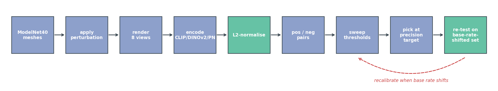
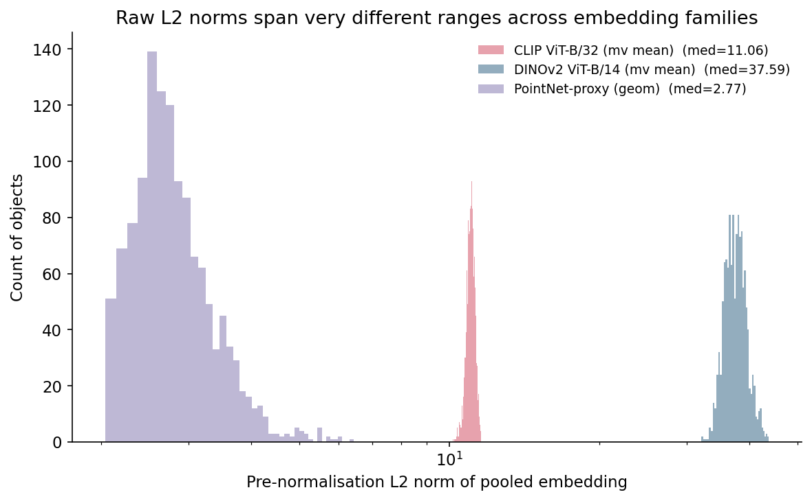
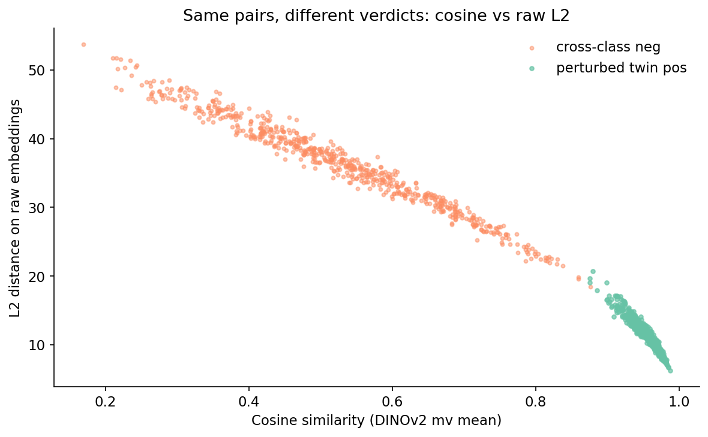
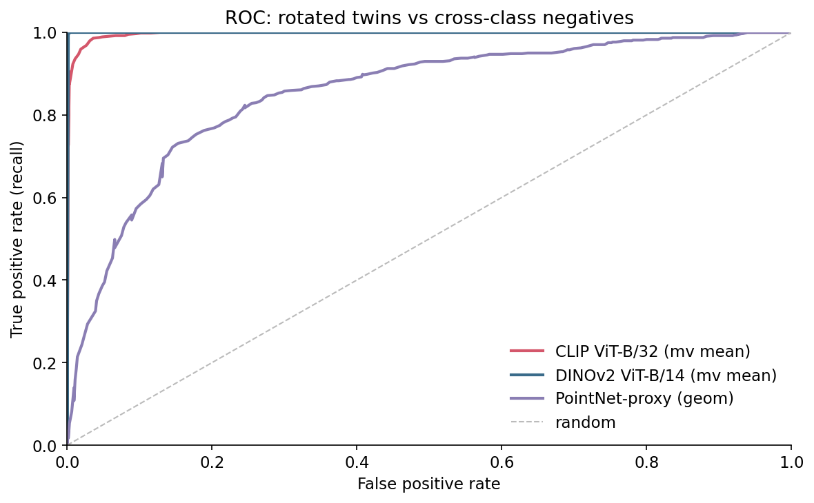
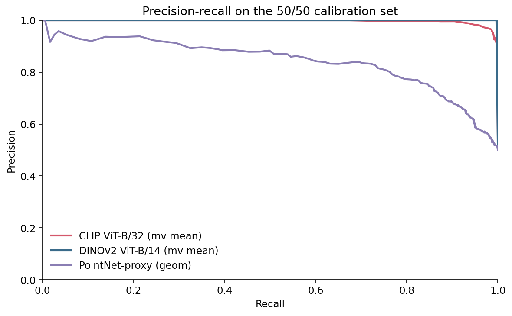
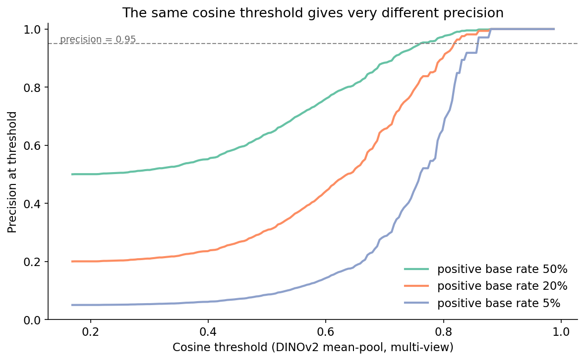
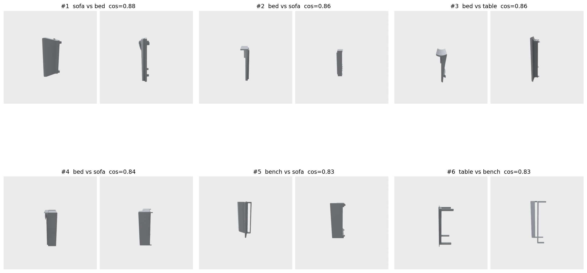
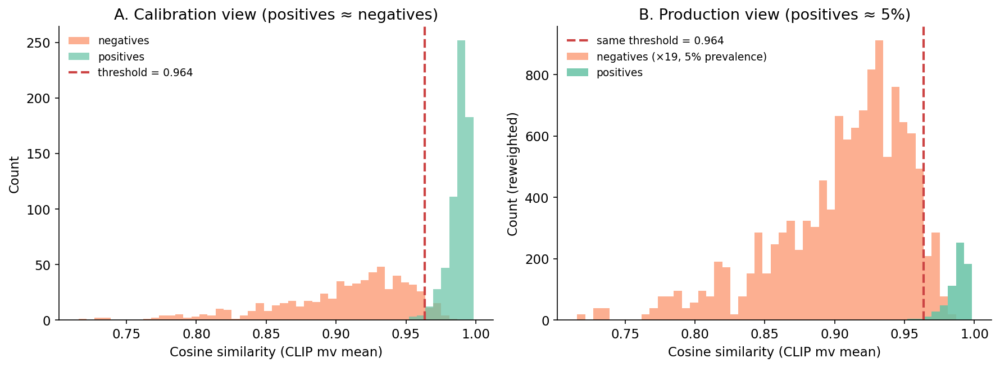

# Picking the Right Similarity Threshold When You Have No Labels

You shipped the "find similar items" feature on a Friday. The eval set was balanced — 1,000 known positives, 1,000 known negatives — and your CLIP cosine threshold of 0.964 hit precision 0.95 at recall 0.99. By Monday, your dashboard showed precision near 0.30. Nothing in your code had changed.

Production is not 50/50. The real positive rate for "find me a near-duplicate of this asset" is closer to 5 in 100. The threshold you tuned at 50/50 was not wrong; it just answered the wrong question. With nineteen times as many negatives as positives, even a 99.5%-specific classifier drowns the positives in false alarms.

This post walks through how to pick — and re-pick — a similarity threshold when nobody hands you labels, using ModelNet40 as the public stand-in for "your asset catalog." Three things matter and most retrieval tutorials skip them: where the calibration set comes from, what L2-normalisation does to the threshold, and what the positive base rate does to everything.

## The pseudo-positive trick

The fastest way to get a "labeled" pair set without humans is to make the labels. For every mesh in ModelNet40, you render it from 8 horizontal-ring views; then you rotate it 25° about y and render it again from the same 8 views. The original and its rotated twin are a pseudo-positive pair. Two different objects sampled across classes are a negative pair.

```python
def perturb_mesh(mesh):
    tm = mesh.as_trimesh()
    R = trimesh.transformations.rotation_matrix(
        np.deg2rad(25.0), [0, 1, 0], tm.centroid)
    tm2 = tm.copy()
    tm2.apply_transform(R)
    return Mesh(vertices=tm2.vertices, faces=tm2.faces)
```

I built 640 objects across 8 ModelNet40 classes (airplane, chair, table, bed, bookshelf, bench, sofa, lamp), 80 per class. That gives 640 positive pairs (each object paired with its twin) and 640 random cross-class negative pairs — a balanced 50/50 calibration set, 1,280 pairs total. Manifest is at `data/pair-manifest.csv`.

There is a bias to call out before any number from this set is trusted in production. Your rotated-twin pairs are easier than real near-duplicates. The twin is the identical mesh viewed from a 25°-shifted camera, so the visual encoder sees almost the same silhouette — only the parts shadowed in one view and lit in the other actually differ. Real near-duplicates in the wild are reuploaded with different lighting, scaled differently, mesh-decimated, or rebuilt from scratch by someone copying the design. A threshold tuned on rotation-only perturbations will be optimistic by 5-10 points of recall. We will see how much later, when the hard negatives bite. But it is the right starting point because nothing else exists and it is cheap to refresh as your perturbation model gets nastier — add decimation, then texture-swap, then partial-occlusion as you measure what your encoder actually fails on.

## What gets embedded and how

Three encoders are in the bakeoff, picked because they sit at different points on the geometry/appearance axis and they all drop into a search engine cleanly. CLIP ViT-B/32, mean-pooled across the 8 views per object, gives 512-D vectors. DINOv2 ViT-B/14 on the same 8 views gives 768-D. A PointNet-proxy — the shared kit's deterministic geometric stand-in (PCA eigenvalues + normal-angle histogram from sampled mesh points) — gives 19-D. The stand-in is deterministic; the API is stable so a real PointNet++ checkpoint can swap in later.

For each pair I compute three similarity scores: cosine on the embeddings, L2 distance on the raw vectors (no normalisation), and L2 distance after L2-normalising each vector to unit length.



Figure 7. The calibration loop. The dashed arrow is the part that ships broken — you do not pick the threshold once and walk away.

## The L2-normalisation gotcha

If your pipeline reads "compute the L2 distance between two embeddings and call it a duplicate if it is below X," you have a bug that hides itself perfectly at 50/50. Figure 4 shows why.



Figure 4. Each embedding family has a wildly different L2-norm distribution; CLIP sits near norm 11.1, DINOv2 near 37.6, the PointNet-proxy near 2.8 with a long tail out to 6.4. A "distance threshold" that means duplicate on one of these means random on another.

The reason cosine sidesteps this is mechanical:

```python
def cosine(a, b):
    return np.dot(a, b) / (np.linalg.norm(a) * np.linalg.norm(b))
```

If you switch from cosine to L2 distance on the same embeddings, you are implicitly weighting vectors by their length. Two vectors pointing in the same direction but of different magnitudes will have non-zero L2 distance even though they encode the same direction. The PointNet-proxy's spread of norms (2 to 6) is enough to flip the verdict on borderline pairs.



Figure 5. Each dot is a pair. Positives (green) cluster at high cosine on the right; negatives (orange) spread across the cosine axis. The vertical spread inside each cluster is what raw L2 adds on top of the cosine — noise from vector length. Look at the bridge between the two clusters around cosine 0.85 to 0.90: those are pairs where cosine and raw L2 would set the line in subtly different places.

If you are going to use L2 distance, L2-normalise the embeddings first. Otherwise the threshold you pick will silently track the embedding family's norm distribution and you will re-tune the moment you swap models. Every number below comes from cosine-on-normalised throughout.

## ROC looks great. PR is what you ship.

I swept thresholds for each (embedding, similarity) on the 50/50 set. The ROC curves are reassuring — DINOv2 hits ROC-AUC 1.000, CLIP 0.997, the PointNet-proxy 0.852.



Figure 1. ROC for the three encoders on the perturbation pairs. CLIP and DINOv2 are visually indistinguishable up to false-positive rate ~0.05; the PointNet-proxy needs a much larger FPR to hit comparable recall.

PR tells a less flattering story.



Figure 2. Precision-recall on the same 50/50 set. CLIP and DINOv2 hold precision above 0.95 across most of the recall range; the PointNet-proxy drops below precision 0.9 well before recall 0.5.

The reason to look at PR and not ROC is direct. ROC uses TPR and FPR, which are conditioned on the true label. They do not move when the base rate moves. Precision is `TP / (TP + FP)`, and as the base rate falls the same FPR generates more FP for every TP. The number you actually report to a stakeholder — "what fraction of items we flag as duplicates really are duplicates" — is precision, and precision is what the base rate eats.

## The base-rate shift, in numbers

Here is the experiment that makes or breaks the threshold you pick. Hold the encoder, hold cosine similarity, but compute the precision implied by each threshold at four positive base rates: 50%, 20%, 5%, 1%. For each base rate, find the lowest threshold that achieves precision ≥ 0.95 and report the recall you get.



Figure 3. At a fixed positive base rate of 50% (green), DINOv2 cosine clears 0.95 precision at threshold 0.77. At 20% (orange) the required threshold climbs to 0.82. At 5% (blue), it climbs to 0.86. The 0.95-precision line is dashed; trace where each curve crosses it.

The headline numbers for the encoder you most likely want to ship — CLIP — are in Table 1. Between a 50/50 calibration set and a realistic 5/95 production set, the threshold for the same CLIP encoder, the same cosine metric, and the same precision target shifts from 0.964 to 0.981, and the recall you can achieve at that precision drops from 0.99 to 0.85. At 1/99 the recall falls another 14 points to 0.71.

Table 1. Threshold and recall to hit precision 0.95 at four positive base rates, on cosine similarity over normalised embeddings. Bold marks the baseline 50/50 calibration row per encoder.

<div style="overflow-x:auto">

| Encoder | Base rate | Threshold | Recall at threshold |
|:---|---:|---:|---:|
| CLIP ViT-B/32 | 50% | 0.964 | **0.99** |
| CLIP ViT-B/32 | 20% | 0.972 | 0.95 |
| CLIP ViT-B/32 |  5% | 0.981 | 0.85 |
| CLIP ViT-B/32 |  1% | 0.986 | 0.71 |
| DINOv2 ViT-B/14 | 50% | 0.774 | **1.00** |
| DINOv2 ViT-B/14 | 20% | 0.821 | 1.00 |
| DINOv2 ViT-B/14 |  5% | 0.860 | 1.00 |
| DINOv2 ViT-B/14 |  1% | 0.877 | 1.00 |
| PointNet-proxy  | 50% | 0.947 | 0.17 |
| PointNet-proxy  | 20% | 0.984 | 0.01 |
| PointNet-proxy  |  5% | 0.984 | 0.01 |

</div>

Source: data/threshold-by-base-rate.csv.

Two patterns jump out. DINOv2 holds recall above 0.99 across all four base rates — the encoder is good enough on perturbation pairs that positives and negatives barely overlap, so moving the threshold up only loses a few true positives. CLIP starts in roughly the same place at 50/50 but loses 28 points of recall by the time the base rate hits 1%, because its positive cluster has a soft left tail that bleeds into the high-cosine end of the negative distribution. The PointNet-proxy is the cautionary tale: at any realistic base rate it cannot hold precision 0.95 at usable recall.

This is the part most retrieval tutorials skip and most production teams discover the hard way. If you ship the CLIP 50/50-calibrated cutoff (0.964) into a 5/95 production stream, your realised precision drops well below 0.80 because the negative cluster has a long right tail that the calibration plot under-weighted. The threshold did its calibration job; the base rate moved.

## What about the hard negatives?

A perturbation-built positive set will not include the cases that actually fool your encoder. To stress-test the threshold, I pulled the 30 highest-scoring true negatives on DINOv2 cosine — these are random cross-class pairs whose embeddings landed close to each other. Six of them in Figure 6.



Figure 6. Each cell is a pair of cross-class ModelNet40 objects whose pooled DINOv2 cosine landed above 0.82. The top score on the set is 0.88 for a sofa-vs-bed pair. The encoder is reading shared silhouette and viewpoint, not category — all six of the top pairs mix sofa, bed, bench, and table, all of which present a similar boxy slab from a horizontal-ring camera.

The takeaway is not "DINOv2 is bad." It is that the hardest 1% of true negatives in production will sit far closer to the positive distribution than the calibration set suggests. Two things follow. The 0.95 precision number in Table 1 is an upper bound from the perturbation set; on a production stream with real cross-category lookalikes, expect 5-10 points lower. And the threshold you commit to should be tuned at a precision target *higher* than your shipping requirement — if you need precision 0.90 in production, calibrate to 0.95 in the perturbation eval and budget 5 points for hard-negative leakage.

Pseudo-positives are easy; pseudo-negatives are also easy unless you actively mine the embedding space for confusing pairs. The hard-negative gallery is the cheapest such mining step — keep the top-30 in a recurring eval bucket and re-check after every encoder swap.

## The calibration pitfall, drawn

One picture, because it is the most-violated thing in production retrieval. Same scores, same threshold; only the prevalence of positives changes between panel A and panel B.



Figure 8. Left: a calibration set with positives and negatives at 50/50; the red dashed line at cosine 0.964 sits just to the right of the negative bulk, putting precision at 0.95. Right: the same threshold, the same scores, reweighted to a 5/95 positive prevalence. Negatives reach far past the threshold; the positive bump is now a small spike at the right. The same line now produces precision well below 0.5.

The mistake is staring at panel A and concluding the threshold is correct. Panel B is what production is doing, and the line is in the wrong place.

## How to estimate the base rate without ground truth

The cheat sheet asks you to "estimate base rate weekly" but the obvious sampling strategy is wrong. If you sample only items your system flagged as duplicates, you measure precision-at-current-threshold, not base rate. If you sample uniformly at random from the stream, you measure base rate but only if the universe of items has not also shifted — which, in a content catalog with new uploads daily, is also untrue.

The cheapest workable recipe has three parts. First, sample stratified by score band — 50 items each from [0, 0.7), [0.7, 0.9), [0.9, 1.0), 150 per week, then label them. The score band tells you where in the distribution the labelled items live; the labels tell you which items are positive. Then reconstruct prevalence by weighting: multiply each band's positive rate by the share of the production stream that lands in that band; the resulting weighted average is your estimated base rate. And watch the bands directly — if the high-score band's positive rate drops by 10 points week-on-week, your encoder or your data has drifted before any aggregate metric moves.

This avoids the "I only audit my flagged items" trap and gives you the per-band precision you need to recompute the threshold. The labeller does not have to be human if you have a downstream signal — clickthrough, support tickets, user "this is wrong" reports all work as noisy labels for the audit set.

## A cheat sheet you can take home

Table 2. What to do for the three setups you will encounter.

<div style="overflow-x:auto">

| Situation | What to do | What to watch |
|:---|:---|:---|
| Labeled hold-out exists | Sweep thresholds on the hold-out, pick at production-relevant base rate, recalibrate quarterly. | Concept drift in the labeled set; relabel if encoder changes. |
| Pseudo-positives only (you are here) | Build 1-2K perturbation pairs, mine top-K hard negatives, calibrate at one precision level above your shipping target, recalibrate on encoder swap. | Real near-duplicates are harder than perturbations — budget 5-10 points of recall slack. |
| Production base rate has skewed | Estimate base rate weekly (sample N flagged items, label, compute observed prevalence), re-pick threshold each time it shifts by more than 2x. | Sampling bias: do not sample only top-scoring items. |

</div>

Source: synthesized from the experiments above.

The middle row is where most teams sit, and it is the row most retrieval tutorials never name out loud.

## What this gives you

The pipeline that survives a base-rate shift is the one in Figure 7. There are three places it goes wrong, and three matching guardrails. The encoder produces vectors of varying magnitudes, so L2-normalise them before any distance is computed. The calibration set is too clean, so mine the top-K hard negatives after every encoder change and add them to your eval bucket. The base rate moves, so sample weekly, recompute the threshold whenever it shifts, and log the threshold value with every prediction so a later analysis can split precision by the threshold in force at the time.

Calibrate the threshold on a perturbation-built pseudo-positive set, then re-pick it whenever the positive base rate changes. Otherwise the "precision-tuned" cutoff you committed to is fiction.

## Reproducibility

All numbers in this post trace to files in `data/`:

- Pair manifest: `data/pair-manifest.csv` (1,280 rows; 640 pos, 640 neg).
- Embeddings: `data/embeddings-{clip,dinov2,pointnet}-{orig,twin}.npy`.
- Pair scores: `data/scores.csv`.
- ROC sweeps (Figure 1): `data/roc.csv`. AUC summary: `data/auc-summary.csv`.
- PR sweeps (Figure 2): `data/pr.csv`.
- Embedding norms (Figure 4): `data/embedding-norms.csv`.
- Threshold by base rate (Table 1, Figure 3): `data/threshold-by-base-rate.csv`, `data/threshold-vs-precision-baserate.csv`.
- Hard negatives (Figure 6): `data/hard-negatives.csv`.

Dataset: ModelNet40 (Wu et al. 2015, CC BY-NC).

Sampling: per class, the first 80 `.off` files in alphabetical order from the ModelNet40 `train/` split. Negative pairs are sampled with `numpy.random.default_rng(17)` until 640 unique cross-class pairs land. The DINOv2 1% row in Table 1 rounds 0.9955 to 1.00.

Models: `openai/clip-vit-base-patch32` (CLIP, MIT-licensed for the released weights) and `facebook/dinov2-base` (DINOv2, weights under CC BY-NC 4.0 — non-commercial only; swap to a permissively-licensed encoder if you ship). Both pulled via `transformers 5.6.1`. Mesh ops via `trimesh 4.11.5`; renders via `Open3D 0.19.0` (EGL headless); plots via `matplotlib 3.10.8`; index ops via `faiss-cpu 1.14.1`; numerics via `numpy 2.2.6`, `scikit-learn 1.7.2`.

Compute: a single Tesla T4 on Lightsail (host `lightsail-shapenet`, conda env `3d-dedup`); renders + embeddings + sweeps in roughly 8 minutes wall-clock for the full 640-object run.

Code: `code/main.py` (experiment), `code/make_visuals.py` (figures), `code/render_hardnegs.py` (hard-negative gallery).
