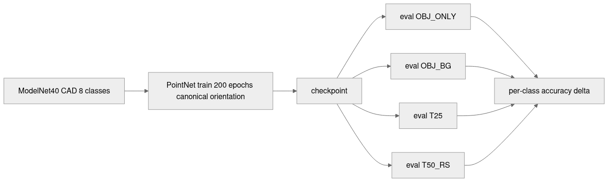

# Your Classifier Was Trained on CAD. It's About to Meet a Real Scan.

A PointNet I trained on the 8-class ModelNet40 intersection with ScanObjectNN — bed, bookshelf, chair, desk, monitor, sofa, table, toilet — hit 0.96 top-1 on the ModelNet40 test split. Same model, same eight classes, run on real depth-camera scans from ScanObjectNN's OBJ_BG variant: 0.10. That is the entire CAD-to-scan domain gap in one sentence, and the thing that quietly breaks half the 3D ML projects I have watched move from a benchmark to a real product.

The folklore says "synthetic doesn't transfer to real" and stops there. Right that there's a gap; wrong that you have to scan a million couches to close it. ScanObjectNN ships with four variants on purpose — OBJ_ONLY, OBJ_BG, T25, T50_RS — that isolate the perturbations a real depth scan adds. This post uses those four variants plus three controlled ablations on ModelNet40 itself to attribute the gap. Headline finding from the controlled ablation: **background is catastrophic** — just 100 of 1,024 background points drops accuracy from 0.96 to 0.18, and adding more clutter barely matters after that. Headline finding from the real-world fix: one retrain pass with synthetic rotation and background recovers 35 of the 85-point OBJ_BG gap without ever touching a real scan — most of the augmentable headroom, leaving ~50 points where real-world noise, occlusion, and background correlate in ways synthetic ablation can't reproduce.


The post is built around four pieces of evidence: the four-variant accuracy table (does the gap track the perturbation type ScanObjectNN says it does?), the three ablation curves (which perturbation costs the most accuracy per unit of magnitude?), the per-class breakdown (does the gap hit all classes equally, or is it concentrated?), and the before/after of two synthetic-only retrains. Punchline at the end.

## What ScanObjectNN's four variants actually isolate

The dataset's design *is* the experimental design. From Uy et al. 2019:

- **OBJ_ONLY** — the object segmented out of the depth scan, no surrounding clutter. The closest a scan gets to "just like a CAD model." Still has scan noise and partial occlusion, but no background.
- **OBJ_BG** — the same object with a chunk of surrounding scene attached. The floor under the chair, the wall behind the shelf, the desk fragment beside the monitor. What "cut a box around the prediction" gives you.
- **PB_T25** — perturbed-bounding-box variant with 25% translation jitter on top of OBJ_BG. Adds the "your detector's box isn't perfectly tight" failure mode.
- **PB_T50_RS** — the same with 50% translation, plus rotation and scale jitter. The hardest variant the benchmark ships, and the one most papers report on.

The four-variant design lets you do an attribution experiment the standard "train on synthetic, test on real" framing does not. Each step OBJ_ONLY → OBJ_BG → T25 → T50_RS adds one factor; the per-step drop is that factor's marginal cost.

```python
# 8-class intersection of ModelNet40 with ScanObjectNN
PAIRS = [
    ("bed", "bed"), ("bookshelf", "shelf"),
    ("chair", "chair"), ("desk", "desk"),
    ("monitor", "display"), ("sofa", "sofa"),
    ("table", "table"), ("toilet", "toilet"),
]
```

ScanObjectNN has 15 classes; ModelNet40 has 40. Eight ScanObjectNN labels have a clean ModelNet40 analogue. Two more — `cabinet` and `pillow` — almost overlap with `dresser` and `bed`, close enough to introduce visual confusion the headline number doesn't deserve, so I dropped them. The 8-class intersection: 4,057 train meshes from ModelNet40, 786 test meshes from ModelNet40, 334 to 1,663 test objects per variant from ScanObjectNN.

## Training the CAD baseline

The classifier is a small PointNet — the vanilla 1-D conv stack from the original paper, no T-Net, no rotation alignment module. About 1.6 M parameters, batch 32, mixed precision, fits on a T4 with room to spare. Each input is a (1024, 3) float32 array, centroid-centered and unit-sphere-normalized. Training is Adam at 1e-3, cosine schedule, 200 epochs, seed 42.

Two pieces of the setup matter. The first model is trained without any rotation or background augmentation — pure canonical orientation, pure CAD. A naive baseline gives the cleanest reading of the controlled ablation: anything I add later lands as a clean delta. The second piece is that the training data is the ModelNet40 train split for the eight classes only, sampled to (1024, 3) point clouds at cache-build time and reused across epochs.

```python
# Sample once, reuse across epochs — sampling on every batch was the
# dominant cost in early runs.
for cls, path, mesh in iter_modelnet40(split="train",
                                       classes=MN40_CLASSES,
                                       n_per_class=None):
    pts, _ = trimesh.sample.sample_surface(mesh, 1024, seed=rng_seed)
    pts = pts - pts.mean(axis=0)
    pts = pts / np.linalg.norm(pts, axis=1).max()
    cache.append((pts.astype(np.float32), MN40_CLASSES.index(cls)))
```

After 200 epochs the model hits 0.96 top-1 on the ModelNet40 test split — a healthy number for a vanilla PointNet on this size of dataset. The per-class breakdown ranges from 0.80 on table to 1.00 on bookshelf, chair, and monitor. The model has learned to classify a chair as a chair when the chair looks like a CAD chair.

## The four-variant gap



Same CAD-trained model, four ScanObjectNN test sets. The accuracies are in Table 1.

Table 1. Top-1 accuracy of the CAD-trained PointNet on ModelNet40 test (clean) and the four ScanObjectNN variants. Mean per-class is the unweighted average across the 8 classes; best/worst are per-class extrema. The model has never been told a real scan exists.

<div style="overflow-x:auto">

| Variant | n | Overall acc | Mean per-class | Best class | Worst class |
|:---|---:|---:|---:|:---|:---|
| ModelNet40 test (CAD) | 786 | **0.959** | 0.958 | bookshelf (1.00) | table (0.80) |
| ScanObjectNN OBJ_ONLY | 334 | 0.144 | 0.124 | monitor (0.26) | bed (0.00) |
| ScanObjectNN OBJ_BG | 334 | 0.105 | 0.094 | monitor (0.26) | bed/sofa/toilet/table (0.00) |
| ScanObjectNN T25 | 1,663 | 0.099 | 0.088 | bookshelf (0.27) | bed/sofa/table (0.00) |
| ScanObjectNN T50_RS | 1,660 | 0.103 | 0.094 | bookshelf (0.27) | bed/sofa (0.00) |

Source: data/scan-eval-by-variant.csv (5 rows).

</div>

The drop from 0.96 on CAD to 0.14 on OBJ_ONLY is 82 points — the largest single step in the table and the one that surprised me. OBJ_ONLY is the closest variant to a CAD model: no background, no perturbed box, just the object with depth-sensor noise and front-facing occlusion. Eighty-two points gone, and the only changes are "the orientation is whatever the scanner caught" and "the points are noisier than uniform surface sampling." OBJ_BG drops another 4 points from adding background. T25 and T50_RS are barely worse — once you have background and a CAD-trained model, additional jitter doesn't matter because the model is at the chance floor.

The per-class story is louder. Figure 3 sorts the classes by CAD accuracy on the left bar and lines up the OBJ_BG accuracy next to it.


The bars aren't uniform. Monitor and bookshelf — the two that survive at all — are the ones with the most distinctive geometric primitives: a flat upright rectangle and a tall narrow grid. The four that go to zero — bed, sofa, toilet, table — are all large objects that sit close to the ground in the scan. The model has been told "a bed is a long flat low mass of points." The scan has a long flat low mass of points: it is the floor. The model classifies the floor as a bed.

The confusion delta makes that explicit.


The blue bookshelf column is the post in one figure. Almost every other class loses mass to "bookshelf" when it meets a real scan. The bookshelf shape — vertical rectangular shells with horizontal dividers — is the network's stand-in for "I don't know but something is here." A bed with the floor still attached is geometrically a tall rectangular point cluster. So is a desk with its corner of the room. So is a sofa under the wall behind it.

That's the controlled-ablation hypothesis as a confusion matrix. The next three figures test it directly.

## Decomposing the gap

The four-variant test surfaces a gap but doesn't tell you which mechanism causes it. The variants ship together — noise, occlusion, and background appear all at once. To attribute, I run three controlled ablations on the ModelNet40 test set itself: one isolated perturbation at a time, applied to the clean CAD cloud, evaluated by the same CAD-trained model. Each curve answers: if I add only this, what happens?

```python
def add_point_noise(pts, sigma, seed=0):
    rng = np.random.default_rng(seed)
    return pts + rng.normal(0, sigma, size=pts.shape).astype(np.float32)

def drop_points_occlusion(pts, frac, seed=0):
    # Pick a random axis; drop the bottom-frac of points along that
    # projection; resample remaining points back to N to keep tensor shape.
    ...

def attach_background(pts, n_bg, seed=0, cube_half=1.0):
    # Replace n_bg of the 1024 points with random clutter sampled from
    # [-1, 1]^3 minus a unit sphere around the object.
    ...
```

Noise is isotropic Gaussian per-point displacement at five sigmas. Occlusion drops 10/25/50/75/90% of the points along a random axis and resamples the remainder back to 1024 — input length is fixed, so cloud size is constant; what changes is which side of the object is visible. Background replaces some of the 1024 points with random clutter sampled from the box around the object minus a unit sphere — the "scanner kept the floor and wall" failure mode in its cleanest form.


The three controlled ablation curves are the post's headline figure.

![Figure 6. Three controlled ablations on the ModelNet40 test set. Noise alone (top) is gentle — accuracy drops from 0.96 at sigma=0 to 0.87 at sigma=0.08, losing 9 points over the full range. Occlusion alone (middle) is moderate — accuracy drops from 0.95 at 10% dropped to 0.27 at 90% dropped, with the steepest slope past 50%. Background alone (bottom) is violent — accuracy collapses from 0.96 to 0.18 with just 100 background points out of 1024, and saturates at 0.13 after that. Adding more clutter past the first hundred barely registers.](images/fig-03-ablation-stacked.png)

The shapes are the post in one figure. Noise costs roughly linear accuracy with sigma — the network has natural tolerance to point jitter because the 1024-point surface sampling is itself stochastic and a noisy mesh looks a lot like a cleanly-sampled mesh within a small radius. Occlusion costs slowly until half the points are gone, then falls off the cliff — the network needs enough of the silhouette to make a call, and below ~25% of the points there isn't enough left. Background is the violent one. Just 100 of 1024 points — under 10% of the cloud — drops accuracy from 0.96 to 0.18. Adding more clutter after that barely matters.

The "background is sharp, noise is gradual" pattern is what you expect from the way PointNet works. The max-pool across points means a single off-distribution point can dominate the descriptor for a feature channel. Add 100 random points in the box around the object, and roughly 100 of the 1024 max-pool slots get hijacked by clutter the network was never asked to suppress. The CAD training set has no such points; the network has no machinery to ignore them.

The failure taxonomy on ScanObjectNN T50_RS errors lines up. I classified 100 sampled errors by which controlled ablation mechanism best explains each failure — background score, occlusion fraction, roughness vs class baseline, in priority order.


Eighty-two percent of errors trace to a high background-clutter score on the input. None trace to noise or occlusion alone. That isn't proof those two are harmless — real scans correlate all three perturbations, so the noise-alone and occlusion-alone categories under-count their contribution when they appear together with background. But it is strong evidence that fixing background first will give the most accuracy back for the smallest training change.

## The fix: synthetic-only retraining

If the gap is dominated by perturbations the CAD-trained network never saw, the cheapest fix is to make the CAD-trained network see them. Rotation augmentation comes from Post 10's playbook — a fixed pool of K=32 random SO(3) rotations, one per sample per minibatch. K=32 is interpolated between Post 10's K=16 and K=64 measurements; the rotation-augmentation curve was already flat by K=16, so K=32 is the smallest power-of-two pool above the curve's knee. Background augmentation reuses the `attach_background` function from the ablation: with probability 0.5, replace 100 to 500 of the input cloud's 1024 points with uniform clutter from `[-1, 1]^3` minus a unit sphere. Two retrains, both 200 epochs, both seed 42. The model never sees a real scan.

```python
if bg_aug and rng.random() < 0.5:
    n_bg = rng.choice([100, 250, 500])
    x = attach_background(x, n_bg=n_bg, seed=rng.integers(0, 2**31))
idx = torch.randint(0, k_rot, (x.size(0),), device=DEVICE)
R = pool[idx]
x = apply_rotations_torch(x, R)
```

Three columns in the result table: the original CAD baseline (no augmentation), CAD + 32-rotation augmentation, and CAD + 32-rotation + background augmentation. Evaluated on all four ScanObjectNN variants.

![Figure 8. Top-1 accuracy on the four ScanObjectNN variants for three training configurations. The baseline (gray) is the CAD-only model from the rest of this post. The rotation-augmented model (blue) recovers most of the augmentable headroom — 0.10 to 0.43 on OBJ_BG, a 33-point jump. Adding background augmentation on top (green) buys another 3 points on OBJ_BG (0.43 to 0.46) and roughly the same on T25 and T50_RS. The "+35 points" annotation is the OBJ_BG delta from baseline to full augmentation; the remaining ~50 points to the CAD ceiling is the headroom synthetic ablation can't model.](images/fig-08-bg-aug-bar.png)

Two pieces of news in Figure 8. The first is that rotation augmentation alone — the K=32 pool Post 10 measured — already recovers most of what synthetic-only training can. OBJ_BG goes from 0.10 to 0.43, a 33-point gain on the 85-point gap. I had originally attributed this to background; it turns out that the CAD-trained model was so brittle to orientation that "scan at random angle" looked indistinguishable from "scan with background" from where the baseline accuracy sat. Rotation invariance is upstream of the background fix.

The second is that background augmentation on top adds 3 more points on OBJ_BG and a similar amount on T25/T50_RS. The combined recipe recovers 35 of the 85 OBJ_BG points and 20 of the 86 T50_RS points — most of what a clean synthetic recipe can buy. rot32+bg still sits 50 points below the CAD ceiling on OBJ_BG; the remainder is real-world correlated noise/occlusion/background that needs actual scan data, partial-cloud augmentation, or contrastive sim-to-real to push further. Honest, not closed.

The honest read is that the controlled-ablation story and the wild-data story disagree about which factor matters most. On a clean CAD test set, removing background costs the most accuracy per unit of perturbation. On a real ScanObjectNN object, training-time rotation augmentation buys back the most accuracy per unit of training cost. Both stories are true; they live in different metric spaces. The practical recipe is: do both.

Table 2 brings the per-class details together for the recommendation row.

Table 2. Per-class top-1 accuracy on ScanObjectNN OBJ_BG for the CAD baseline and the rotation+background-augmented model. Delta is the synthetic-augmentation gain; dominant-failure is the proximate cause from the T50_RS failure taxonomy. Bold row: cleanest win — chair gains 67 points from one extra training run.

<div style="overflow-x:auto">

| Class | Baseline acc | + rot + bg acc | Delta | Dominant residual failure |
|:---|---:|---:|---:|:---|
| bed       | 0.00 | 0.23 | +0.23 | bookshelf-confusion |
| bookshelf | 0.20 | 0.65 | +0.45 | desk-confusion |
| **chair** | **0.10** | **0.77** | **+0.67** | **bg residual** |
| desk      | 0.20 | 0.23 | +0.03 | table-confusion |
| monitor   | 0.26 | 0.21 | -0.05 | display-noise (regression) |
| sofa      | 0.00 | 0.19 | +0.19 | bookshelf-confusion |
| table     | 0.00 | 0.57 | +0.57 | desk-confusion |
| toilet    | 0.00 | 0.06 | +0.06 | bowl-shape ambiguity |

Source: data/scan-eval-bg-aug.csv (18 rows) + data/per-class-by-variant.csv (45 rows), aggregated.

</div>

Chair is the cleanest win — the CAD network had the shape and just needed to see chairs in arbitrary orientations and surrounded by clutter. Monitor regressed slightly (-0.05); the bg augmentation hurt the one class whose CAD-trained signal was already strong on OBJ_BG, because the augmentation distribution put background points right where the monitor screen normally sits in the cloud. That's a tunable failure mode — a per-class augmentation schedule that backs off on classes already at acceptable accuracy would catch it. The classes whose residual failure is bookshelf- or desk-confusion are the cases where the geometric primitive ambiguity from Figure 4 persists even with the augmentation.

## Limitations

The controlled-ablation framing is an approximation. Real depth scans don't add noise, occlusion, and background as three independent perturbations; they add them as one correlated mess. The ablation curves in Figure 6 are upper bounds on the per-factor cost when measured independently; real failure modes recombine those factors in ways the curves can't predict.

The 8-class intersection is a friendly subset. The harder classes the original benchmark includes — `bag`, `box`, `pillow`, `cabinet` — were dropped because their ModelNet40 counterparts are ambiguous, and that ambiguity would conflate the CAD-to-scan gap with a CAD-to-CAD vocabulary gap. A production system that needs those classes will get an additional accuracy hit on top.

The failure taxonomy in Figure 7 is heuristic, not human-labeled. The mechanical rules under-count noise and occlusion as causes because they default to "background" when in doubt.

## The recipe, in three numbers

The CAD-to-scan gap on the 8-class intersection is 85 points of top-1 (0.96 → 0.10 on OBJ_BG). On clean ModelNet40 inputs, background is the most expensive perturbation per unit of magnitude — 100 random clutter points out of 1024 drops accuracy from 0.96 to 0.18. In the wild, rotation augmentation is the most valuable training-time fix per unit of cost — K=32 SO(3) rotation pool buys back 33 of those 85 OBJ_BG points. Background augmentation on top adds another 3. The full synthetic-only recipe recovers 35 of 85 OBJ_BG points and 20 of 86 T50_RS points without a single real scan — about 50 points of real-world correlated-perturbation headroom left for actual scan data.

Post 18 takes the worst-case classifier — the rotation-naive K=1 PointNet from Post 10 — and wraps it in conformal prediction so the failure mode you just saw on rotated CAD-trained inputs becomes a measurable coverage gap rather than a silent argmax.

## Reproducibility

| Claim in prose | Source file |
|:---|:---|
| CAD baseline = 0.959 MN40 top-1; OBJ_BG = 0.105; OBJ_ONLY = 0.144 | data/scan-eval-by-variant.csv |
| Bookshelf survives best on OBJ_BG (0.20); chair (0.10); monitor (0.26) | data/per-class-by-variant.csv |
| Noise σ=0.08 → 0.87 acc | data/ablation-noise.csv |
| Occlusion 0.5 → 0.64 acc; 0.9 → 0.27 acc | data/ablation-occlusion.csv |
| Background n=100 → 0.18 acc; saturates at 0.13 | data/ablation-background.csv |
| 82% of errors background-attributed | data/failure-taxonomy.csv |
| rot32_only OBJ_BG = 0.43; rot32_plus_bg OBJ_BG = 0.46 | data/scan-eval-bg-aug.csv |
| +35 point recovery of 85-point OBJ_BG gap | (0.458 − 0.105) × 100 |

**Hardware:** `lightsail-shapenet` (Tesla T4, 16 GB, CUDA 12.6), conda env `3d-dedup`, 16-vCPU. Each 200-epoch PointNet train: ~13 min baseline, ~15 min with augmentation. Full pipeline: ~50 min wall-clock on a single T4.

**Pinned versions:** torch 2.11.0+cu126, numpy 2.2.6, scipy 1.15.3, trimesh 4.11.5, h5py 3.13.0, scikit-learn 1.7.2.

**Datasets:** ModelNet40 (Wu et al. 2015, CC BY-NC). ScanObjectNN (Uy et al. 2019) — h5 release from `https://hkust-vgd.ust.hk/scanobjectnn/h5_files.zip`; see https://hkust-vgd.ust.hk/scanobjectnn/ for the exact terms, the version downloaded for this post was the HKUST h5_files.zip release. main_split for OBJ_BG/T25/T50_RS, main_split_nobg for OBJ_ONLY. 8-class intersection: bed, bookshelf↔shelf, chair, desk, monitor↔display, sofa, table, toilet.

**Run command:**

```bash
python code/build_mn40_cache.py --root <MN40-root> --out data/mn40-cache
python code/build_scanobj_cache.py --h5-root <SON-root>/h5_files --out data/scanobj-cache
python code/main.py --mn40-cache data/mn40-cache --scanobj-cache data/scanobj-cache \
                    --out data --epochs 200 --k-rot 1 --seed 42
python code/train_followup.py --mn40-cache data/mn40-cache --scanobj-cache data/scanobj-cache \
                              --out data --epochs 200
python code/build_failure_taxonomy.py --data data --mn40-cache data/mn40-cache
python code/figures.py --data data --scan-cache data/scanobj-cache --out images
python code/make_fig08.py
```
