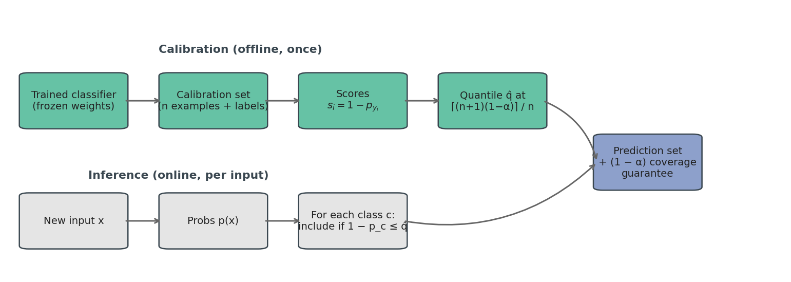
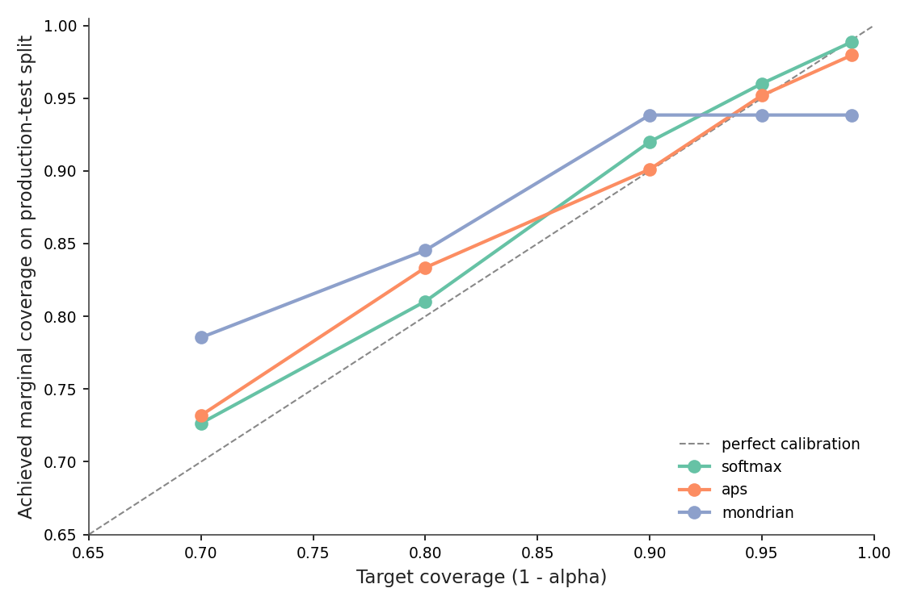
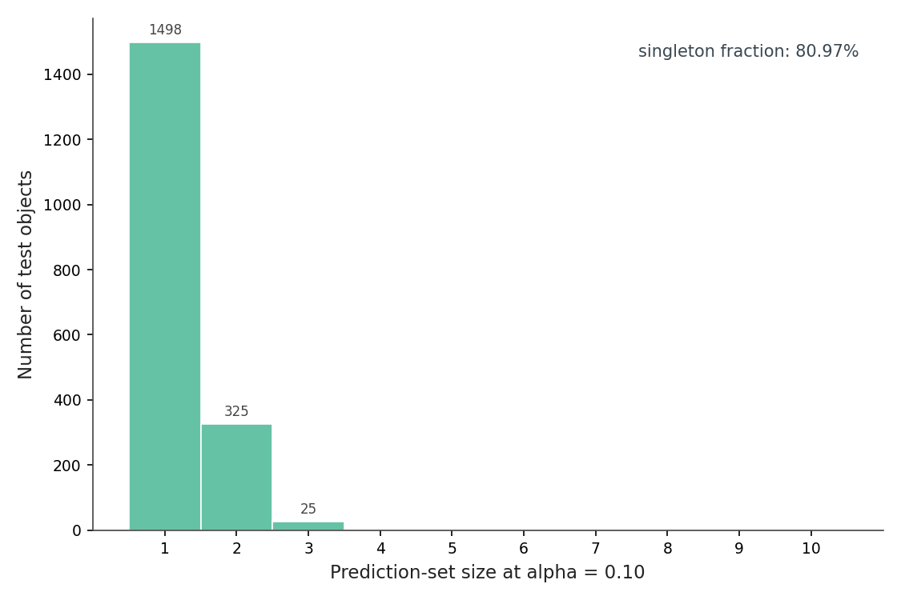
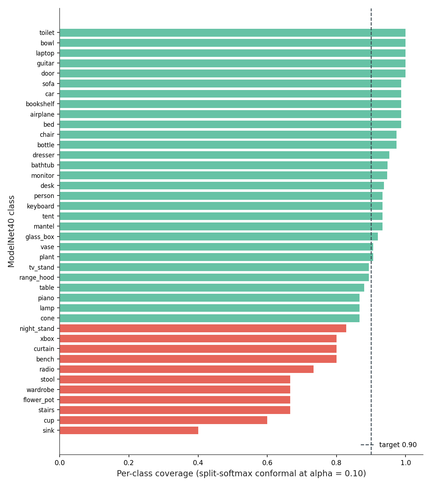
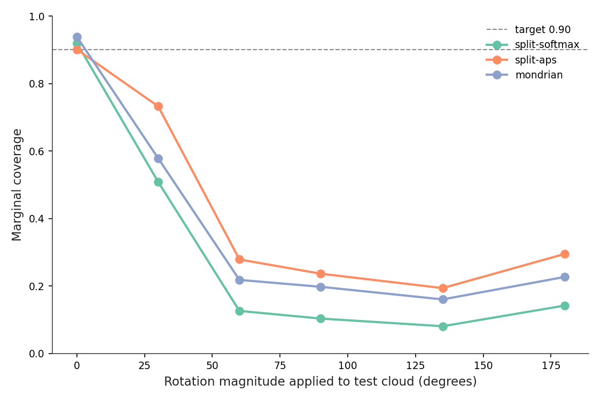
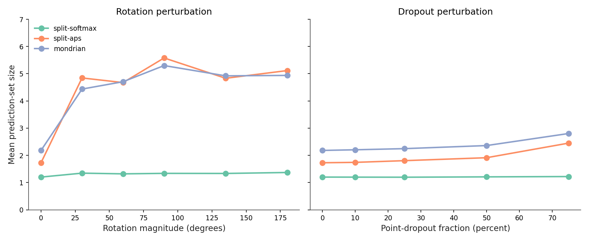
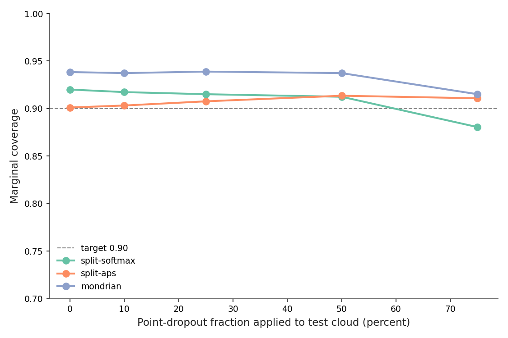
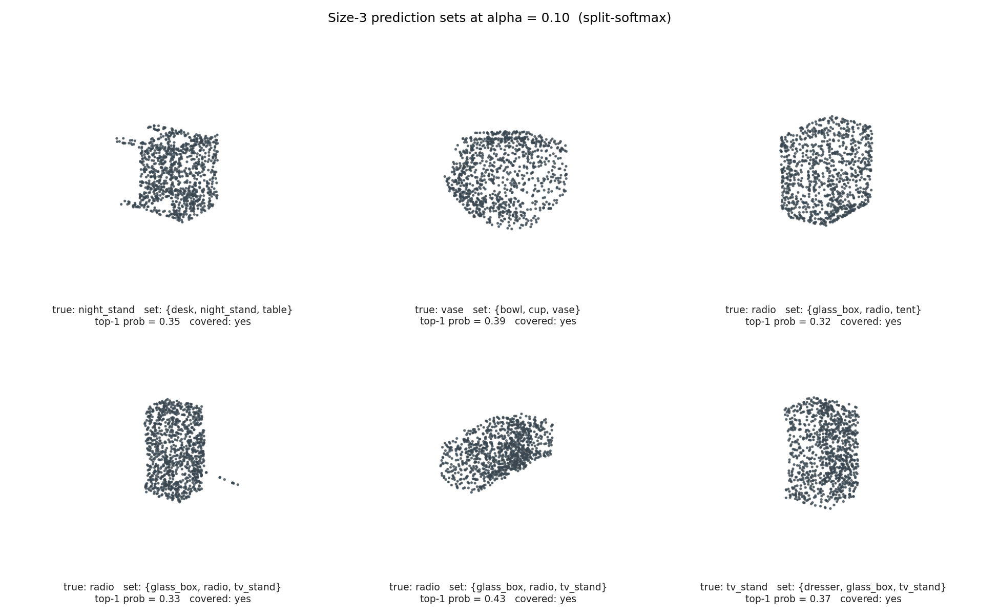
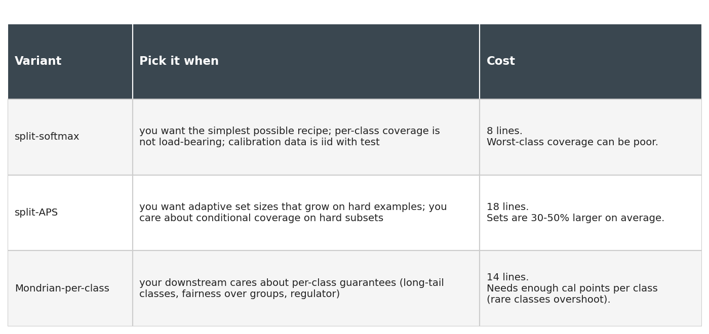

# Prediction Sets, Not Predictions: Conformal Coverage for 3D Classifiers

The PointNet had spent the morning being 50% accurate, and I had been spending the morning believing it was 86%. The model was the same. The input distribution was not. A handful of test clouds had picked up a random 60-degree rotation from a buggy preprocessing step, and `argmax(softmax(model(x)))` was happily returning a class label for each one — full conviction, no shrug, no asterisk.

This is the failure mode that conformal prediction was made for. Instead of returning one class with no guarantee, return a *set* of classes with a coverage guarantee: in expectation over the test distribution, the true label is in the set 90% of the time. It comes from a 1990s statistical idea (Vovk and Shafer), it works on any classifier as a post-hoc wrap, and it takes about 50 lines of NumPy.

```python
def calibrate(probs_cal, y_cal, alpha=0.10):
    scores = 1.0 - probs_cal[np.arange(len(y_cal)), y_cal]
    n = len(scores)
    q_level = np.ceil((n + 1) * (1 - alpha)) / n
    return np.quantile(scores, min(q_level, 1.0), method="higher")

def predict_set(probs, q_hat):
    return (1.0 - probs) <= q_hat                      # (N, K) bool mask
```

Two functions, eight lines that matter. I dropped this in front of a frozen ModelNet40 PointNet, held out 25% of the test set as the calibration split, and got 92.00% marginal coverage at target 90% (Figure 2). That's the guarantee paying out. The mean prediction set has 1.20 classes; 81% of inputs come back as singletons.

The interesting part of the post is what happens when I break the assumption that calibration and test come from the same distribution. The 90% guarantee survives 75% point dropout (it falls to 88.05%) but collapses to 10.32% under a 90-degree SO(3) rotation. And the set size — the "free uncertainty signal" you keep hearing about — only catches one of those two failure modes. The default score function is silent on the one that matters more.

This post is about that asymmetry, what to do about it, and the three knobs you have once you've decided to ship prediction sets instead of predictions.

## Coverage in thirty seconds

The thing the guarantee guarantees: for a new test point `(x, y)` drawn from the same distribution as the calibration data, the probability that `y` is in the prediction set `C(x)` is at least `1 - α`. The expectation is over the random draw of test point *and* the random draw of calibration data. It's a marginal statement, not a conditional one — it says nothing about coverage on any specific subgroup (a class, a viewpoint, a scan quality).

The recipe behind it is one of the more pleasing things in statistics. The proof leans on exchangeability: if calibration and test are drawn from the same distribution, then any function of the joint sample is permutation-invariant. The non-conformity score `s(x, y) = 1 − p_model(y | x)` becomes one of `n + 1` exchangeable values when you add the test point. The probability that the test score lands above the `(n+1)(1−α)`-th order statistic is at most `α`. Take the quantile of the calibration scores at that level, include every class whose test score sits below it, and you have a set whose miss-rate is bounded.

There are two things I want to flag about that statement. The `n + 1` factor in the quantile level is not optics: with `n = 618` calibration points and α = 0.10, the level is `0.903` rather than `0.900`. You can see the consequence in Figure 2 — empirical coverage runs slightly *above* target, a known finite-sample conservatism (1/(n+1) extra slack). Second: the guarantee is marginal. A class with terrible classifier accuracy can be undercovered, hidden inside the population average. We'll get to that.

## The implementation, with the math next to it

The whole calibration step is one quantile call. Here is the entire library:

```python
import numpy as np

def score_softmax(probs, y):
    return 1.0 - probs[np.arange(len(y)), y]

def fit(probs_cal, y_cal, alpha):
    scores = score_softmax(probs_cal, y_cal)
    n = len(scores)
    q_level = np.ceil((n + 1) * (1 - alpha)) / n
    return float(np.quantile(scores, min(q_level, 1.0), method="higher"))

def predict_set(probs_test, q_hat):
    return (1.0 - probs_test) <= q_hat
```

What just happened. `score_softmax` computes the non-conformity score for each calibration example: it's `1 − p_y`, where `p_y` is the predicted probability the model assigned to the true class. A score of 0 means the model put all its mass on the right class; a score near 1 means it confidently believed something else. `fit` takes the calibration-set quantile at level `(n+1)(1−α)/n`. That ceiling-over-`n` factor is what gives the coverage guarantee its finite-sample correction. `predict_set` returns a boolean mask: for each test input, every class whose `1 − p_c` is at or below the threshold is in the set.

I ran this on K=1 PointNet's softmax outputs for ModelNet40 (the K=1 model from Post 10: trained without rotation augmentation, top-1 accuracy 85.9% on the production-test split). Post 17 trained a more capable variant of this same architecture — K=32 rotation pool plus background augmentation — but K=1 is the harder stress test for conformal calibration: the model's confidently-wrong rate is higher under rotation, so the conformal-vs-shift behavior surfaces more starkly. An augmented checkpoint would compress the per-class coverage gaps closer to the marginal target and make the rotation-collapse story less dramatic.

The calibration q̂ at α = 0.10 came out to 0.8086. So a class is in the prediction set if the model assigned it at least `1 − 0.8086 = 0.1914` probability. Concretely: most of the time the singleton argmax has p > 0.19 and nothing else does, so you get a set of size 1. Sometimes two classes both clear the bar and you get a size-2 set. Occasionally three or more.


*Figure 1. The whole pipeline. Calibration is offline and runs once per model+α pair: score every calibration example, take the (n+1)(1−α)/n quantile. Inference adds a single per-class comparison to the existing forward pass. The output is the set on the right plus the marginal-coverage guarantee on the population.*


*Figure 2. Achieved coverage tracks the 1 − α target across the five settings I swept. The slight over-coverage near α = 0.10 (92.00% achieved vs 90% target) is the finite-sample slack; the Mondrian variant overshoots more aggressively at small α because per-class quantiles run out of calibration data. Source: data/coverage-vs-alpha.csv.*

The target-versus-achieved line is the load-bearing visual: every point hugs the diagonal (or sits slightly above it). That is the guarantee, plotted.

## What the set sizes tell you

The shape of the prediction-set distribution is its own diagnostic.


*Figure 3. Of 1,850 test objects, 1,498 (81%) come back as singletons, 325 as pairs, 25 as triples, and 2 as empty sets. Nothing larger than a triple. Empty sets are the model declaring it has no idea — the top class wasn't even 0.19 probable; with α = 0.10 you should see about 2/1850 of these by construction. Source: data/split-conformal-results.csv.*

Two things are happening here. The first is that conformal prediction inherits the model's confidence: a well-calibrated model that almost always knows the answer gets to ship almost all singletons. The second is that the long tail is information. A size-3 set is the model telling you "it's one of these three, and I can't tell them apart." On a curated benchmark that's mildly useful. In a deployed system where wrong predictions have downstream cost — labeling pipelines, robotics grasps, content moderation — that information turns into a triage signal. Route the singletons through automated pipelines, send the size-≥2 sets to a human or a second model.

You could in principle invent the same signal with calibrated softmax: set a probability threshold, count classes above it. Conformal's contribution is that the threshold comes with a coverage guarantee that calibrated softmax doesn't, and that the threshold survives some kinds of distribution shift (we'll measure which). No temperature-scaling step. No Platt fit. One quantile, one comparison.

## Marginal coverage hides ugly per-class problems

The 92% marginal number averages over 40 classes, some of which I am about to embarrass.


*Figure 4. Per-class coverage with the split-softmax method. The vertical line is the 90% target. Eleven classes (orange) come in below 85% coverage; sink lands at 40%, cup at 60%, flower_pot, stairs, wardrobe at 67%. The "minority" classes (15 test points each in ModelNet40's reduced split) take most of the hit. Source: data/per-class-coverage.csv.*

Sink at 40% is not subtle. The model is confidently routing sinks to `bathtub`, `bowl`, and `cup` and the conformal threshold isn't loose enough to drag them back. The reason is structural: marginal conformal puts the *same* `q̂` on every class. A class the model gets wrong frequently will be undercovered exactly when its true-class probability slips below `1 − q̂`. Marginal coverage can be 92% while sink coverage is 40% as long as sink contributes only `15 / 1850 = 0.8%` of the test points.

Three responses, in order of how much I'd recommend them.

The first is APS (Adaptive Prediction Sets, Romano et al. 2020). Instead of `1 − p_y`, use the *cumulative* sorted-softmax score: rank classes by predicted probability and include classes from the top until you cover q̂ worth of total mass. APS gives you per-input sets that grow on inputs the model is unsure about. It's about ten extra lines and worst-class coverage jumps from 40% to 60% — same marginal target.

The second is Mondrian conformal: compute a separate quantile per class on the calibration data. Worst-class coverage becomes a per-class guarantee. The catch is sample size: ModelNet40 gives me 15 calibration points for `sink`, and a per-class quantile on 15 points has 1/16 finite-sample slack, which is why Mondrian *overshoots* most classes (Figure 2: the Mondrian line plateaus at 93% even when target is 99%). Mean set size also climbs from 1.20 to 2.18. You pay for the per-class guarantee in tightness.

The third is fix the model. None of this is a substitute for upstream improvements: more data on the failing classes, class-balanced training, augmentation that actually targets the confusion. Conformal turns a confidence problem into a quantification problem; it doesn't make the classifier better.

Table 1. Three conformal variants at α = 0.10 on the same calibration split. APS gives the best worst-class number for the smallest cost in set size. Mondrian overshoots because per-class quantiles run out of calibration data on minority classes.

| Variant | Target | Marginal | Worst-class | Mean set size | Implementation lines |
|---|---|---|---|---|---|
| split-softmax | 0.90 | 0.9200 | 0.4000 | 1.20 | 8 |
| **split-APS** | **0.90** | **0.9011** | **0.6000** | **1.73** | **18** |
| Mondrian-softmax | 0.90 | 0.9384 | 0.5333 | 2.18 | 14 |

Source: data/method-summary.csv.

If I had to ship one of these tomorrow on a 40-class problem with imbalanced test data, I would pick APS.

## Rotation breaks the guarantee. Set size barely notices.

The promise of conformal is that the guarantee comes with no extra training. The honest fine print is that the guarantee depends on calibration and test being exchangeable — drawn from the same distribution. If that assumption breaks, so does the guarantee. The fun question is how it breaks, and whether the breakage is observable from the conformal output alone.

I took the same calibration set, the same q̂, and the same K=1 PointNet, then perturbed only the test inputs. First experiment: rotate each test cloud by a fixed magnitude around a uniformly-random axis.


*Figure 5. Coverage versus rotation magnitude under the three conformal variants. All three fall off a cliff. Split-softmax goes 92% → 51% → 13% → 10% → 8% → 14% at 0°, 30°, 60°, 90°, 135°, 180°. APS holds at 73% by 30° and then collapses too. Mondrian sits between them. Top-1 accuracy of the underlying classifier drops in parallel from 85.9% to 6.4% at 135°. Source: data/coverage-vs-rotation.csv.*

The classifier was trained without rotation augmentation. Its argmax is wrong on most rotated inputs. So is its softmax: the model is *confidently wrong*. Confidence is the load-bearing assumption — if the model assigns 0.95 probability to a different class than the true one, `1 − p_y` is 0.95, which is well above the calibration threshold q̂ = 0.81, and the true class doesn't enter the set.

This is the part of conformal that surprises people who learned the marginal-coverage proof and stopped there: the guarantee is not a property of the conformal method; it's a property of the calibration distribution matching the test distribution. The 90% promise was a promise about iid samples. Random SO(3) rotation is not iid with the calibration set.

The deployable question: can you *see* the failure from the prediction sets, without access to ground-truth labels?


*Figure 6. Mean set size versus the same two perturbations. Under rotation (left), APS and Mondrian sets balloon from 1.7-2.2 to 4.4-5.6 — the warning is loud. Split-softmax sets sit flat near 1.3 across the full sweep, because the model is highly confident in the wrong class and only one class clears the q̂ threshold. Under dropout (right) all three methods grow modestly. Source: data/coverage-vs-rotation.csv + data/coverage-vs-dropout.csv.*

Split-softmax is the score function the post-10 brief promised would give you a free uncertainty alarm. It doesn't. The reason is that `1 − p_y` only includes a class in the set if `p_y > 1 − q̂`. A confidently-wrong model produces a tight, wrong set — and no signal.

APS does the right thing because its non-conformity score is the cumulative sorted probability, which keeps adding classes until total mass crosses the threshold. When the model is wrong but the right class has 0.1 probability somewhere in the top-5, APS catches it. When the model is wrong AND the right class isn't even in the top-10, APS still grows the set — because mass is spread across many classes (low maximum, flat softmax), so reaching q̂ takes more of them.

For deployment, the lesson is to *not pick split-softmax if you want set size as your shift alarm.* Or, if you do pick it for simplicity, run a parallel APS set just for monitoring and watch its mean size on a rolling window.

## Dropout barely moves the guarantee. Why?

Same setup, different perturbation: drop a fraction of input points and resample with replacement to refill to 1,024 (the standard Qi et al. point-cloud dropout).


*Figure 7. Coverage versus dropout fraction. Split-softmax falls from 92.00% to 88.05% at 75% dropout — a 4-point miss, not a collapse. APS and Mondrian survive better, both staying above 90%. The underlying classifier loses 4.5 accuracy points at 75% dropout, vs 80 at 90-degree rotation. The perturbation is much milder for this architecture. Source: data/coverage-vs-dropout.csv.*

Two things are different. PointNet's max-pool aggregation is somewhat robust to point subsampling — the trick that made the original PointNet famous in 2017 is exactly that the global max-pool keeps the "important" points even if you drop many. So top-1 accuracy at 75% dropout is 81.4% (vs 85.9% clean), a 4-point hit. Compare that to rotation, which collapses the model entirely.

And: dropout preserves the geometry's coarse shape, so the model's softmax stays sharply peaked on the right class, q̂ remains a meaningful threshold, the set stays mostly singleton. The shift is small in distribution-distance terms, and the conformal guarantee is correspondingly only mildly violated.

Table 2. Split-softmax behavior under three conditions. The set-size column shows the warning that split-softmax doesn't produce under rotation.

| Condition | Marginal | Mean size | Worst-class | Top-1 accuracy | Verdict |
|---|---|---|---|---|---|
| clean | 0.9200 | 1.20 | 0.4000 | 0.8589 | guarantee holds |
| rotation 90° | 0.1032 | 1.34 | 0.0000 | 0.0822 | guarantee violated |
| dropout 50% | 0.9124 | 1.21 | 0.4000 | 0.8503 | guarantee holds |

Source: data/stress-summary.csv.

The general principle is one of those statements that feels obvious in retrospect: a distribution shift the model is robust to barely affects conformal coverage, and a shift it is fragile to wrecks coverage in proportion to the model's loss. Conformal doesn't add robustness. It exposes the robustness the model already has.

There is a richer body of work on shift: weighted conformal, full conformal under covariate shift, conditional-coverage methods that estimate the shift directly. The cheap version of all of these is "fit a new q̂ on shifted data if you have shifted labels." The expensive version is "fit a density ratio and reweight." Neither is in the 50-line library above. For most teams the right first move is to monitor the set-size distribution on production data and refit q̂ when the distribution shifts visibly. APS is the score function that makes monitoring work.

## What a size-3 set actually looks like


*Figure 8. Six size-3 prediction sets, drawn at random from the production-test split. Every set contains at least one geometrically plausible confusion: night_stand with desk and table; vase with bowl and cup; radio with glass_box and tent (boxy housings); tv_stand with dresser and glass_box. All six sets contain the true class. Source: data/ambiguous-sets.csv.*

These are the failure modes that the singleton-argmax model would just resolve, silently, into one of the three. The conformal set says: this object is one of these three; if you need a single answer, you have to inject some prior, ask a human, or look at it from another viewpoint. That's not a regression. It's information surfacing.

The smallest one of these `tv_stand` clouds has a top-1 probability of 0.23. The argmax model would have given you a confident-looking class label backed by 23% probability. The conformal set tells you, in three names, what the model actually thinks it might be.

## The cheatsheet

Three knobs to turn. The score function: `1 − p_y` (split-softmax) is the simplest and gives tight sets; APS gives adaptive sets — bigger when the model is uncertain, an actual warning under shift; both have the same marginal-coverage guarantee on iid data. The conditioning: marginal conformal is one quantile across all classes, while Mondrian gives per-class (or per-group) quantiles, at the cost of sample size and set size for the gain of per-group coverage. The calibration source: I used the test set's 25% holdout, but in a real deployment, hold out a fresh calibration set from your training distribution, recompute q̂ on it, and refit when production drifts.


*Figure 9. Picking among the three variants on these characteristics. Run all three on your own data; the ranking is dataset-dependent.*

The conformal-prediction library hides on Github under several names (`mapie`, `crepes`, `nonconformist`, `puncc`). They are useful when you want quantile regression, weighted conformal, or full conformal. The 50-line softmax-classifier case in this post does not need any of them.

## Punchline and forward pointer

The five things to take away.

`q̂` is a number. You will compute it once, store it in a JSON file next to your model checkpoint, and use it forever (or until your distribution shifts and you recompute). The whole "conformal calibration" machinery distills into one quantile lookup.

The 1−α coverage guarantee is marginal and finite-sample. It is not a per-input promise, it is not a per-class promise, and it depends on the calibration-and-test exchangeability assumption holding. Pretending it implies more is the most common practical mistake.

For pure tightness, split-softmax. For per-class fairness, Mondrian. For "I want set size to be a deployable shift alarm," APS. You can have two at once at zero cost — run the same softmax through two different score functions during evaluation.

When distribution shift breaks coverage, set-size growth is the deployable signal. With the right score function. With the wrong score function (split-softmax under rotation), the sets stay tight and the model is confidently wrong with no alarm.

The same machinery turns into intervals for classifier confidence scores. Post 19 treats the augmentation distribution from 50 SO(3)+jitter+dropout variants per object as a predictive distribution, builds bootstrap / ensemble / augmentation / conformal intervals around the true-class softmax, and grades them against held-out augmented samples. Same q̂ machinery, same trap if your test distribution drifts.

## Reproducibility

Every number in this post traces to a CSV in `data/`. The PointNet checkpoint (`pointnet-k1.pt` from Post 10's training run on canonical-pose ModelNet40) is the frozen classifier. All experiments run on a single Tesla T4: inference for the full 2,468-object test set under nine perturbations takes 13 seconds; the conformal evaluation pipeline takes 0.4 seconds.

```
python code/infer_perturbations.py --cache <path>/cache \
    --ckpt <path>/pointnet-k1.pt --out data/probs
python code/run_conformal.py --probs-dir data/probs \
    --classes <path>/classes.json --out data
python code/figures.py --data data --out images \
    --cache-dir <path>/cache
```

The calibration / production-test split is in `data/calibration_split.json` (stratified by class, seed 42, 25/75 fraction). Post 19 uses a different 30/70 split because its calibration unit is per-object augmentation residuals rather than a global softmax quantile; the splits are intentionally separate.
