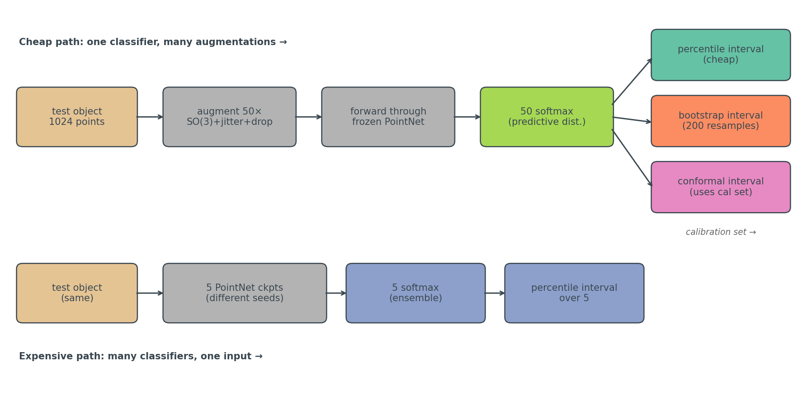
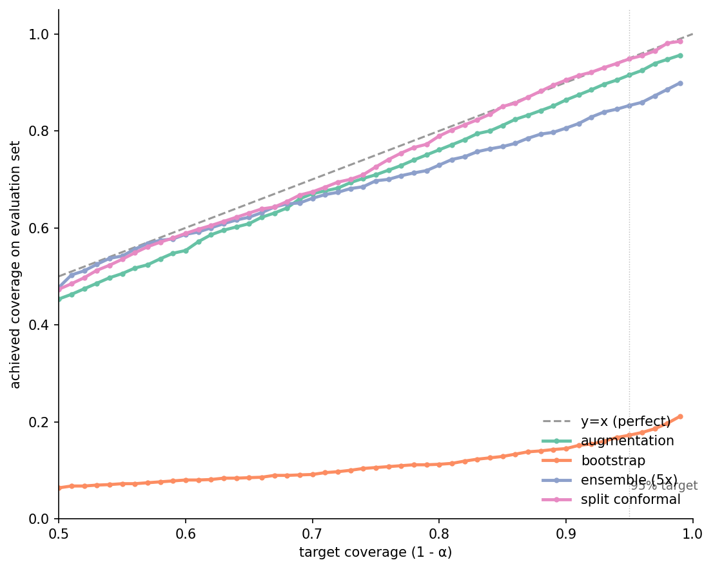
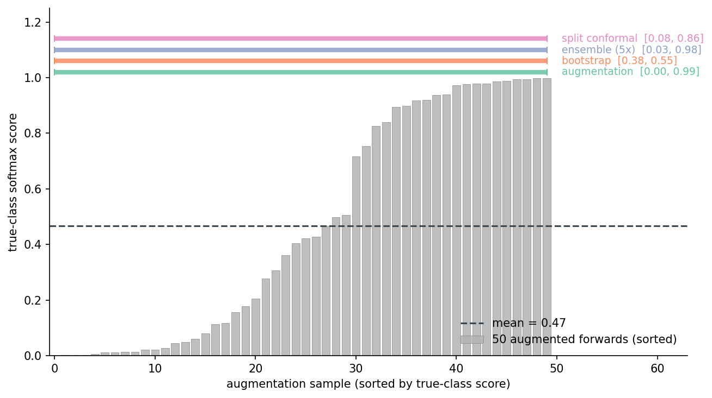
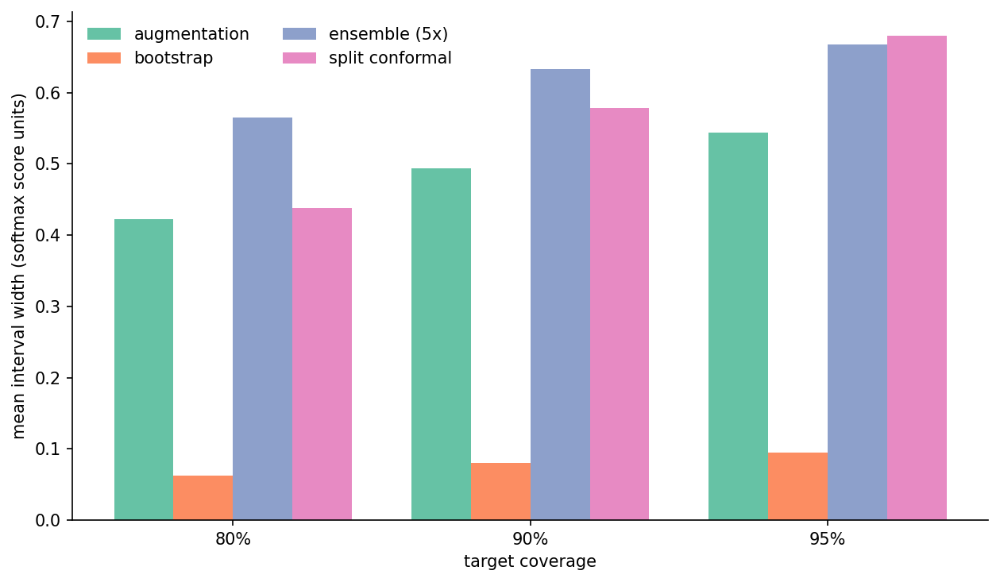
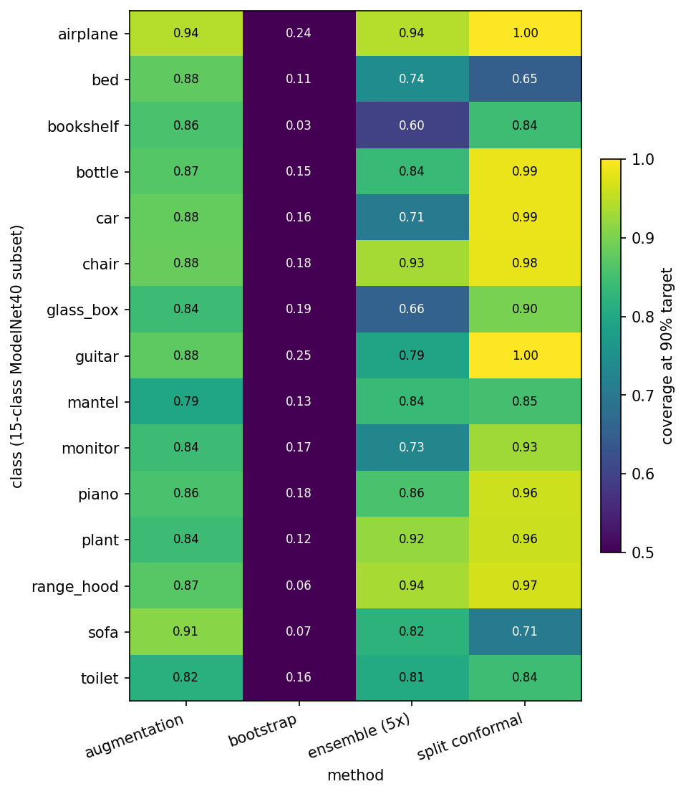
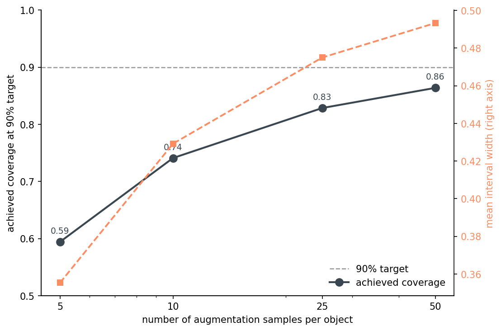
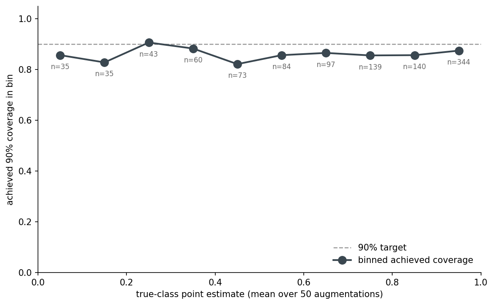
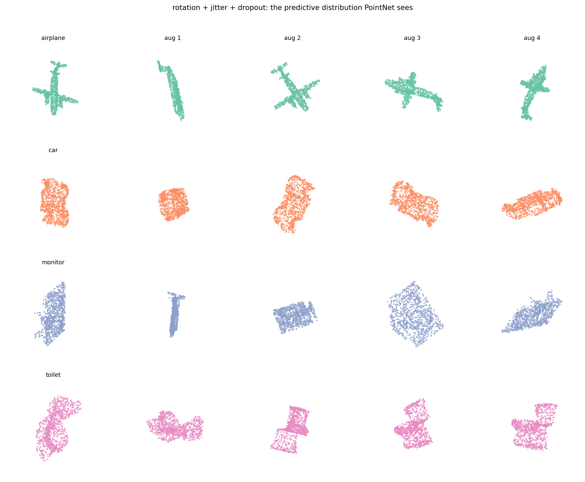

# Confidence Intervals for Classifier Scores, Borrowed From Forecasting

I ran the same chair through PointNet 50 times under random rotations and got 50 different softmax scores. Not slightly different. The lowest score for the "chair" class on that one chair was 0.003. The highest was 0.997. The mean was 0.47.

Weather forecasters call that a predictive distribution. They generate it by running their physics model with perturbed initial conditions and treating the spread as the forecast uncertainty. Then they grade themselves on whether their 80% prediction interval actually contained the realized temperature 80% of the time.

Vision classifiers usually skip that second step. They output one softmax per input and call it a day. This post takes the forecasting move seriously: 50 augmented views per object, treat the spread of softmax scores as a predictive distribution, build an interval around it, and ask whether the interval contains the realized score the percentage of times it claims to.

It mostly does. It's also wrong in a specific, instructive way that no plug-in scalar score can tell you about.

## The setup, in one paragraph

ModelNet40, 15 classes (the ones with the most test samples), PointNet trained with rotation augmentation (the k=64 checkpoint from the rotation-augmentation post). For each test object I generate 100 augmented variants — random SO(3) rotation, light per-point jitter, 5% point dropout. The first 50 go to interval construction. The other 50 are held out: one of them, picked deterministically, is the "ground truth" the interval is graded against. This split matters and I'll come back to it.

That predictive distribution then feeds four interval methods I want to compare:

The augmentation interval is the cheap one: take the 50 softmax scores for the true class, sort them, return the 5th and 95th percentile for a 90% interval. Done. The bootstrap interval works on the same 50 samples but asks a different question — it resamples 200 times from those 50 predictions, takes the mean of each resample, returns the 5/95 percentiles of the bootstrap distribution of means. The deep ensemble interval ignores the augmentations and instead forwards the unperturbed point cloud through 5 separately trained PointNets (here the K∈{1, 4, 16, 64, 256} rotation-augmentation checkpoints from Post 10 — same architecture, different training conditions). This is not the textbook deep ensemble — that's 5 seeds of one recipe — it's a stronger diversity probe because the training distributions themselves differ, and the checkpoints already exist so the extra training cost is zero. Take percentiles over the 5 softmax scores. Split conformal does something else again: hold out 30% of the test set as a calibration set, compute the per-augmentation residual of each calibration object's score against its own augmentation mean, take the 1−α quantile of those residuals, then build the test interval as `(mean ± q̂)` clipped to [0, 1]. This is Post 18's conformal machinery — same (n+1)(1−α)/n quantile, same exchangeability assumption — with the class-set output replaced by a per-object score interval. The four methods compared here are all variants of "build an interval from a finite predictive sample."

The forecasting analogy isn't a stretch. Ensemble weather forecasts perturb initial conditions; the augmentation predictive distribution perturbs object orientation. The statistical move — sample a distribution by perturbing inputs, build an interval from the spread — is the same. Conformal is the version that swaps the implicit population assumption for a finite-sample guarantee. Bootstrap is the version that asks "how confident am I about my point estimate" rather than "where is the next observation likely to land". These are different questions, and the answer to one is not the answer to the other. This is going to matter.

## What honest grading actually requires

Before showing any numbers I have to say one thing that took me an embarrassing amount of debugging. If you build an interval from 50 samples and then grade yourself against the mean of those same 50 samples, you will achieve 100% coverage at every target. This is not because your method is great. It's because you measured your own ruler with itself.

The first version of these experiments did exactly that. Every method overcovered at every target. I caught it because the bootstrap-of-the-mean, which I knew should be very narrow, was reporting 100% — that's the smell.

The fix is to grade against an *independent* realization. Specifically: build the interval from the first 50 augmentations of each object, then grade against a single held-out augmentation (a draw from the same predictive distribution, but not in the training set for the interval). This is exactly what a forecaster does — the prediction interval is built from a model ensemble, then graded against the realized temperature, which is one draw from the population the ensemble is approximating.

It also reframes what the interval is claiming. The augmentation interval at 90% says: "if you draw one more augmented view of this object and run it through PointNet, the score will fall in this range 90% of the time." That is a *predictive* interval, not a *confidence* interval on the mean. Bootstrap-of-the-mean answers a different question entirely.

## The reliability diagram

This is the headline figure. For each target coverage on the x-axis, what fraction of test objects had their realized held-out score fall inside the interval? Perfect calibration is the y=x diagonal.

Split conformal sits on the diagonal — 0.79 / 0.90 / 0.95 at targets 0.80 / 0.90 / 0.95. That's the guarantee in action: marginal coverage under exchangeability, and exchangeability is satisfied here because the held-out augmentation is generated from the same SO(3)+jitter+dropout distribution as the calibration augmentations. Augmentation tracks well at the 80% target (0.76, a touch under) and at the 90% target (0.86), but by the time you ask for 95% it returns 0.92. The interval is getting wider as α shrinks, just not fast enough. Empirical percentiles of 50 samples can't reliably estimate the tail of the predictive distribution; the 2.5th percentile of 50 samples is a noisy thing.

Bootstrap is on the floor — 17% coverage at the 95% target. That's not a bug. Bootstrap-of-the-mean asks "where is the mean of the predictive distribution" and answers with an interval of width about 0.08. The held-out single draw has the spread of the *full* predictive distribution, which is about 0.4 wide. Of course it falls outside the bootstrap-of-the-mean interval more often than not. The bootstrap interval is technically correct for the question it's answering. It is also entirely the wrong tool for grading whether a single new prediction is plausible. The 5-member ensemble lands under augmentation across the range — five points are too few to estimate tail percentiles, and the interval is wider on average (median 0.76 at the 90% target, vs. 0.54 for augmentation) but the percentile estimates are noisy, so coverage suffers anyway. Five members is what most published deep ensembles use; we live with it.

## What this looks like for one specific object

Reading reliability diagrams is dry. Here's what's happening for one randomly chosen test object — a 50-augmentation distribution, plus each method's [lo, hi] interval drawn on top:

This object has a mean true-class score of 0.47 — the model is uncertain about it. The augmentation interval at 90% is [0.00, 0.99]. That's nearly the whole [0, 1] range, but it correctly reflects that the predictive distribution is bimodal: some rotations get the model to high confidence, some don't. The conformal interval is [0.08, 0.86], a tighter band around the mean with the guarantee carrying the slack. The bootstrap interval is [0.38, 0.55] — a clean confidence band on the mean, useless for "where will the next prediction land."

The takeaway here is not which interval is "right." It's that the question shapes the interval. If you're going to threshold downstream on a single score, you want augmentation or conformal. If you want to report the model's average confidence, bootstrap is fine. They are not interchangeable.

## Width is the price of guarantee

Coverage isn't free. Tighter intervals have lower coverage; wider intervals have more. What does "wider" cost you?

At the 90% target, median widths are: augmentation 0.54, conformal 0.58, ensemble 0.76, bootstrap 0.08. Conformal pays for its guarantee with intervals about 8% wider than augmentation. Ensemble pays a 41% premium and *still* undercovers — five members is just too noisy a tail estimator. Bootstrap is narrow because, again, it's measuring something else.

The interesting number here is conformal vs. augmentation. If you can spend the calibration set (30% of the test pool in this experiment) you get marginal coverage at the cost of ~8% wider intervals. If you can't, augmentation is 8% tighter and undercovers by 3–4 percentage points at the 90% target. That's a fair trade depending on whether the downstream system can tolerate the slack.

## Per-class: same classes break for every method

The reliability numbers are averages. Some classes are harder than others, and any plug-in coverage estimate hides that.

The per-class story is more aligned across methods than you'd hope. Bed, bookshelf, mantel, and toilet show up below target for augmentation, ensemble, and conformal — all three. Bed is the most striking: augmentation 0.88, ensemble 0.74, conformal 0.65 — below target for everyone, badly so for conformal. The hard classes are hard for *all* coverage methods, which means whatever is going wrong in the predictive distribution for these classes is structural, not a flaw of any specific interval construction.

This is a known pathology of marginal-coverage methods. Conformal guarantees coverage averaged over the test population, but says nothing about coverage on a slice. If 5% of your downstream use cases are mantels and you need to make a guarantee per-class, you'd want a class-conditional conformal variant — at the cost of N-times more calibration data.

## How many augmentations do you need?

The augmentation interval has one practical knob: how many samples to draw per object. More samples mean a better empirical CDF and (eventually) better tail estimation. They also cost forward passes.

Coverage climbs from 0.59 at n=5 to 0.86 at n=50 — and is still climbing. Width grows monotonically too, because more samples find more outliers. The curve hasn't flattened by n=50, which is the unflattering thing the data shows: even at 50 augmentations the percentile interval is undercovering by 4 points at the 90% target.

If I were tuning this for a deployment, I'd run the curve past 50 and find the inflection — somewhere around n=100–200 the empirical percentile should be stable enough that the interval matches its target. But the practical message is: 50 is what most people pick by default, and 50 leaves you a few points short. Either go higher, or layer conformal on top to absorb the gap.

## Tail coverage doesn't concentrate where I expected

I had a theory going in: the augmentation interval undercovers worst when the model is *uncertain*, because the predictive distribution is wider there and 50 percentiles can't catch the tails. The binned figure says I was approximately wrong.

The undercoverage is roughly uniform across confidence bins, around 0.82–0.88 everywhere. The low-confidence bins (point estimate < 0.5) are no worse than the high-confidence bins. So the augmentation interval isn't broken specifically on uncertain cases — it's slightly miscalibrated everywhere. That's actually a better diagnosis: the fix is more samples (or conformal), not a heuristic for which objects to flag.

The 4-point undercoverage is structural in 50-sample percentile estimation. It's not a property of the model. It would persist if I swapped PointNet for a transformer.

## What predictive distributions actually look like

A reminder of what the model is being shown. Each row is one test object; the first column is the canonical orientation, the next four are augmented variants the model also classifies:

This is not adversarial noise. These are reasonable views of the same object under reasonable real-world transformations. Any deployment of this classifier will see inputs like these — different camera angles, slight scan noise, dropped points. The variance in the output is real variance in the world, not a quirk of the augmentation choices.

## Recommendation table

The full comparison at the 90% target.

Table 1. Comparison of four interval methods at the 90% coverage target. Recommended row (conformal) in bold.

| Method | Coverage @ 90% | Median width | Worst-class coverage | Cost per object | Use when |
|---|---|---|---|---|---|
| augmentation | 0.86 | 0.54 | 0.79 | 50 forwards | default; cheap, competitive |
| bootstrap | 0.15 | 0.08 | 0.03 | 50 forwards + 200 means | you want a CI on the mean, not a prediction interval |
| ensemble (5×) | 0.81 | 0.76 | 0.60 | 5 forwards (different models) | you have multiple trained models anyway |
| **conformal** | **0.90** | **0.58** | **0.65** | 50 forwards + 1 mean + calibration set | you need a marginal-coverage guarantee |

Bold is the recommended row when you need a coverage guarantee. If you don't — if a few points of undercoverage is acceptable — augmentation is cheaper and you skip the calibration set entirely. The thing not to do is grade bootstrap-of-the-mean intervals against single new predictions: they answer a different question (where is the mean), and applying them to predictive coverage will look like a method failure when it's a category error.

*Source: `data/coverage-by-method.csv`, `data/width-by-method.csv`, `data/per-class-coverage.csv`.*

## What I'd build next

The augmentation interval undercovers structurally. Conformal closes the gap but uses a calibration set you don't always have. The natural next move is a *conformalized augmentation interval*: use the augmentation percentiles as the prediction, then conformalize the residual on a small calibration set to absorb the 3–4 point gap. That should give you near-conformal coverage at near-augmentation width, with the calibration set only needing to be a few hundred objects. I haven't run it. If you do, let me know what coverage you get at the 95% target — that's where the empirical-percentile estimator runs out of samples and conformal earns its keep.

The other obvious extension is *class-conditional* conformal — separate calibration per class — for cases where the per-class coverage gap (bed conformal sitting at 0.65 while airplane sits at 1.00) matters. Same idea, more bookkeeping.

The forecasting analogy I opened with isn't just rhetorical. Forecasters have been building and grading prediction intervals against realized observations for decades; the literature on calibration, reliability, and probabilistic scoring rules is mature. Vision people who want to start outputting intervals — for thresholds, for downstream decisions, for honest customer-facing uncertainty — have a thirty-year head-start to crib from. The hard part isn't the math. It's deciding that one number per prediction is no longer enough.

---

*Datasets: ModelNet40 (Wu et al. 2015, CC BY-NC) — Princeton CAD database, OFF format. PointNet checkpoints reused from Post 10; the K-rotation-pool ensemble (K ∈ {1, 4, 16, 64, 256}) is the same set of checkpoints from that post. Pinned versions: torch 2.11.0+cu126, numpy 2.2.6, scipy 1.15.3, scikit-learn 1.7.2, trimesh 4.11.5. Hardware: `lightsail-shapenet` (Tesla T4, 16 GB, CUDA 12.6), conda env `3d-dedup`. Full pipeline: ~3 minutes wall-clock (50-aug forward pass dominates). Code: `posts/19-forecast-confidence-intervals-vision/code/`.*

*Post 20 closes the series by profiling a real million-image scoring job and finding that the JPEG decoder, not the GPU, is the load-bearing optimization — the operational counterpart to the calibration story this post made for the model's confidence.*
